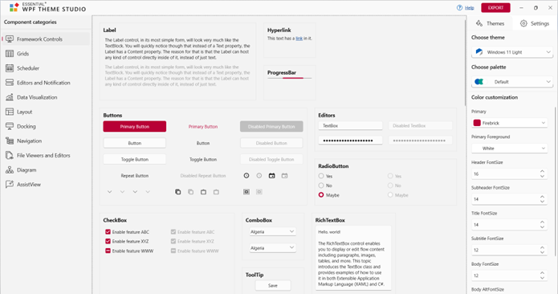
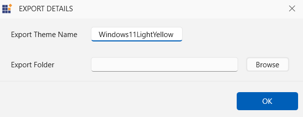

# Theme Studio in WPF Themes (Themes and Appearance)

The Theme Studio helps users to transform their visual presentation into a new theme in minutes. End users can select an appropriate base theme, change its primary color, preview and export it as a theme project, and utilize it in their applications for a rich user interface experience.

## Supported themes

The WPF Theme Studio comes with the following set of themes:

* Fluent Light

* Fluent Dark

* Material Light

* Material Dark

* Material Light Blue

* Material Dark Blue

* Office 2019 Colorful

* Office 2019 Black

* Office 2019 White

* Office 2019 Dark Gray

* Office 2019 High Contrast

* Office 2019 High Contrast White

* System Theme

## Supported Palettes

The WPF Theme Studio comes with various set of palettes for each theme variant.

<table>
<tr>
<th>Theme variant</th>
<th>Palette list</th>
<th>Supported themes</th>
</tr>
<tr>
<td>Fluent</td>
<td>
<ul>
<li>PinkRed</li>
<li>Red</li>
<li>RedOrange</li>
<li>Orange</li>
<li>Green</li>
<li>GreenCyan</li>
<li>Cyan</li>
<li>CyanBlue</li>
<li>Blue</li>
<li>BlueMegenta</li>
<li>Megenta</li>
<li>MegentaPink</li>
</ul>
</td>
<td>
<ul>
<li>FluentLight</li>
<li>FluentDark</li>
</ul>
</td>
</tr>
<tr>
<td>Office 2019</td>
<td>
<ul>
<li>Red</li>
<li>Blue</li>
<li>Green</li>
<li>RedOrange</li>
<li>Violet</li>
<li>DeepGreen</li>
<li>DeepViolet</li>
<li>RedBrown</li>
<li>GreenCyan</li>
<li>DeepGreenCyan</li>
<li>LightViolet</li>
<li>MarinerBlue</li>
<li>DeepBlue</li>
<li>LightBlue</li>
</ul>
</td>
<td>
<ul>
<li>Office2019Colorful</li>
<li>Office2019Black</li>
<li>Office2019White</li>
<li>Office2019DarkGray</li>
</ul>
</td>
</tr>
<tr>
<td>High Contrast</td>
<td>
<ul>
<li>Red</li>
<li>Blue</li>
<li>Green</li>
<li>RedOrange</li>
<li>Violet</li>
<li>DeepGreen</li>
<li>DeepViolet</li>
<li>RedBrown</li>
<li>GreenCyan</li>
<li>DeepGreenCyan</li>
<li>LightViolet</li>
<li>MarinerBlue</li>
<li>DeepBlue</li>
<li>LightBlue</li>
</ul>
</td>
<td>
<ul>
<li>Office2019HighContrast</li>
<li>Office2019HighContrastWhite</li>
</ul>
</td>
</tr>
<tr>
<td>Material</td>
<td>
<ul>
<li>Red</li>
<li>Pink</li>
<li>Purple</li>
<li>DeepPurple</li>
<li>Indigo</li>
<li>Blue</li>
<li>LightBlue</li>
<li>Cyan</li>
<li>Green</li>
<li>Orange</li>
</ul>
</td>
<td>
<ul>
<li>MaterialLight</li>
<li>MaterialDark</li>
<li>MaterialLightBlue</li>
<li>MaterialDarkBlue</li>
</ul>
</td>
</tr>
</table>

## Creating custom theme

### Customizing theme color from theme studio

In theme studio utility, each theme has a unique common variable list. When user changes the common variable color code value, it will be reflected in all the Syncfusion WPF controls. All Syncfusion WPF control styles are derived from these theme-based common variables. This common variable list is handled inside the theme studio application for customizing theme-based colors. 

Let's now see the step-by-step procedure to launch and work with the theme studio utility below.

**Step 1:**

On installing the `Syncfusion WPF` suite, launch and select `Theme Studio` from the start-up panel.

**Step 2:**

The theme studio application has been divided into two sections: the controls preview section on the right, and the theme customization section on the left.

**Step 3:**

To apply predefined themes, select the appropriate themes from Themes List Dropdown available in the top left corner. 

**Step 4:**

Use the built-in **color picker** in the theme customization section to select the desired solid or gradient color.

**Step 5:**

The Syncfusion WPF controls will be rendered with the newly selected colors in the preview section, after selecting the desired color. 

N> The WPF Theme Studio groups both Syncfusion and framework controls under different tabs for a quick preview of the UI on color change.

### Exporting theme project
 
Let's see the step-by-step procedure for exporting theme project from theme studio.

**Step 1:**

Click the `Export` button in the top right corner, below the exit of the theme studio application. 

**Step 2:**

Now the Export dialog appears with the option to select either the entire controls or just the desired control(s). This option is useful only for selective list of Syncfusion WPF controls in the application. The theme studio will filter only the selected controls and customize the final output for those controls alone. 

**Step 3:**

Provide the theme name in which the theme should be exported and select the required folder for Theme Export to be selected. When exporting, the download theme will come as a theme project that contains color codes for the selected Syncfusion WPF controls.

### Generating theme assembly

Let's see the step by step procedure for ensuring generating theme assembly for exported theme project.

**Step 1:**

The following exported theme project should be attached for corresponding target frameworks used in the WPF application.

<table>
<tr>
<th>
Target Framework</th><th>
Solution Project</th></tr>
<tr>
<td>
.Net Framework 4.6</td><td>
Syncfusion.Themes.MaterialDarkYellow.WPF_2015.csproj</td></tr>
<tr>
<td>
.Net Framework 4.5.1</td><td>
Syncfusion.Themes.MaterialDarkYellow.WPF_2013.csproj</td></tr>
<tr>
<td>
.Net Framework 4.5 </td><td>
Syncfusion.Themes.MaterialDarkYellow.WPF_2012.csproj</td></tr>
<tr>
<td>
.Net Framework 4.0</td><td>
Syncfusion.Themes.MaterialDarkYellow.WPF_2010.csproj</td></tr>
<tr>
<td>
.Net Core 3</td><td>
Syncfusion.Themes.MaterialDarkYellow.WPF_NETCore.csproj</td></tr>
</table>

**Step 2:**

The exported theme project should be rebuild in `Release` mode to generate theme assembly.

The export theme project has default `ThemeStudio.snk` key pair. If it is not required, use the private key pair which is already created by referring it to the export theme project inside the application properties or [Create a new key pair](https://docs.microsoft.com/en-us/dotnet/standard/assembly/create-public-private-key-pair) through Visual Studio if the private key pair is not created externally.

Ensure whether the `Sign the assembly` checkbox is clicked, to use the private key pair for generating theme assembly.

### Integrating custom theme to application

The [SfSkinManager](https://help.syncfusion.com/cr/wpf/Syncfusion.SfSkinManager.SfSkinManager.html) control helps to apply the built-in themes to the Syncfusion UI controls for WPF.

Let's see the step by step procedure for adding exported theme project as assembly(.dll) and witness the custom theme set for Docking Manager.  

**Step 1:**

Now add the exported theme project as an assembly (.dll) from the `Release` folder of the export theme project into the WPF application.

**Step 2:**

Add reference of **Syncfusion.SfSkinManager.Wpf.dll** to the WPF application and import **SfSkinManager** namespace in Main window.




    <Window
    xmlns="http://schemas.microsoft.com/winfx/2006/xaml/presentation"
    xmlns:x="http://schemas.microsoft.com/winfx/2006/xaml"
    xmlns:syncfusionskin="clr-namespace:Syncfusion.SfSkinManager;assembly=Syncfusion.SfSkinManager.WPF"
    xmlns:syncfusion="http://schemas.syncfusion.com/wpf"/>




**Step 3:**

The appearance of any Syncfusion UI controls for WPF can be customized by using [Theme](https://help.syncfusion.com/cr/wpf/Syncfusion.SfSkinManager.SfSkinManager.html#Syncfusion_SfSkinManager_SfSkinManager_ThemeProperty) attached property of the [SfSkinManager](https://help.syncfusion.com/cr/wpf/Syncfusion.SfSkinManager.SfSkinManager.html). 

Now, register the instance of generated MaterialDarkYellow (`Syncfusion.Themes.MaterialDarkYellow.WPF`) assembly from exported theme project for demonstration purpose using [RegisterTheme](https://help.syncfusion.com/cr/wpf/Syncfusion.SfSkinManager.SfSkinManager.html#Syncfusion_SfSkinManager_SfSkinManager_RegisterTheme_System_String_Syncfusion_SfSkinManager_SkinHelper_) method and pass the exported custom theme name and respective theme assembly instance as parameters.





string style = "MaterialDarkYellow";
SkinHelper styleInstance = null;
var skinHelpterStr = "Syncfusion.Themes." + style + ".WPF." + style + "SkinHelper, Syncfusion.Themes." + style + ".WPF";
Type skinHelpterType = Type.GetType(skinHelpterStr);
if (skinHelpterType != null)
    styleInstance = Activator.CreateInstance(skinHelpterType) as SkinHelper;
if (styleInstance != null)
{
    SfSkinManager.RegisterTheme("MaterialDarkYellow", styleInstance);
}





**Step4:**

Now, set the `SfSkinManager` attached property `Theme` as `MaterialDarkYellow;MaterialDark` for the Docking Manager control since the MaterialDarkYellow (`Syncfusion.Themes.MaterialDarkYellow.WPF`) assembly has been generated from the exported theme project for demonstration purpose.

N> Custom theme name is provided in this format: `CustomTheme1;BaseThemeName` where `CustomTheme1` denotes the custom theme name and `BaseThemeName` denotes the theme name from which it is derived. For example `MaterialDarkYellow;MaterialDark`.




    <syncfusion:DockingManager x:Name="SyncDockingManager" UseDocumentContainer="True"
    PersistState="True">
                           
    <ContentControl x:Name="SolutionExplorer" syncfusion:DockingManager.Header="Solution Explorer"
    syncfusion:DockingManager.SideInDockedMode="Right"/>

    <ContentControl x:Name="ToolBox" syncfusion:DockingManager.Header="Toolbox"
    syncfusion:DockingManager.State="AutoHidden" />
    
    <ContentControl x:Name="Output" syncfusion:DockingManager.Header="Output"
    syncfusion:DockingManager.SideInDockedMode="Tabbed"
	syncfusion:DockingManager.TargetNameInDockedMode="SolutionExplorer"/>

    <ContentControl x:Name="EndPage" syncfusion:DockingManager.Header="End Page"
     syncfusion:DockingManager.State="Document" >
                <TextBlock Text="Any built-in themes can applied to the required control by VisualStyle attached property of the SfSkinManager." />
    </ContentControl>
    <ContentControl x:Name="StartPage" syncfusion:DockingManager.Header="Start Page"
     syncfusion:DockingManager.State="Document" >
                <TextBlock Text="Any built-in themes can applied to the required control by VisualStyle attached property of the SfSkinManager." />
    </ContentControl>
    </syncfusion:DockingManager>




string style = "MaterialDarkYellow";
SkinHelper styleInstance = null;
var skinHelpterStr = "Syncfusion.Themes." + style + ".WPF." + style + "SkinHelper, Syncfusion.Themes." + style + ".WPF";
Type skinHelpterType = Type.GetType(skinHelpterStr);
if (skinHelpterType != null)
    styleInstance = Activator.CreateInstance(skinHelpterType) as SkinHelper;
if (styleInstance != null)
{
    SfSkinManager.RegisterTheme("MaterialDarkYellow", styleInstance);
}
SfSkinManager.SetTheme(this, new Theme("MaterialDarkYellow;MaterialDark"));




**Step 4:**

Compile and run the WPF application and witness the custom theme being applied to Docking Manager control at run-time. 

