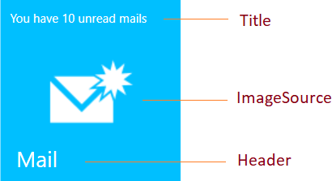
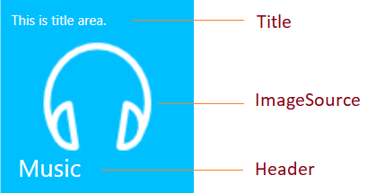

# Getting Started with Hub Tile and Pulsing Tile

This section gives an overview for working with the Hub Tile and Pulsing Tile controls.

## Assembly deployment

Refer [Hub Tile](https://help.syncfusion.com/wpf/control-dependencies#sfhubtile) and [Pulsing Tile](https://help.syncfusion.com/wpf/control-dependencies#sfpulsingtile) control dependencies section to get the list of assemblies or [NuGet package](https://help.syncfusion.com/wpf/visual-studio-integration/nuget-packages) needs to be added as reference to use the Hub Tile and Pulsing Tile control in any application.

## Creating simple application with Hub Tile and Pulsing Tile

In this walk through, a WPF application that contains Hub Tile and Pulsing Tile control can be created. By the following ways, the controls can be added: 

1. [Adding control via Designer](#adding-control-via-designer)
2. [Adding control manually in XAML](#adding-control-manually-in-xaml)
3. [Adding control manually in C#](#adding-control-manually-in-c)

### Adding control via Designer

Hub Tile and Pulsing Tile controls can be added to the application by dragging SfHubTile and SfPulsingTile from toolbox and dropping it in designer view. After dropping the controls in designer view, the assemblies such as **Syncfusion.SfHubTile.WPF** and **Syncfusion.SfShared.WPF** gets added into the project automatically. The following code snippets will also be added to XAML.



<!--For Hub Tile-->
<syncfusion:SfHubTile HorizontalAlignment="Left" VerticalAlignment="Top"/>
<!--For Pulsing Tile-->
<syncfusion:SfPulsingTile Content="SfPulsingTile" HorizontalAlignment="Left" VerticalAlignment="Top"/>



N> "syncfusion" in XAML is an auto generated namespace.

	
### Adding control manually in XAML

In order to add control manually in XAML, follow the below steps:

1. Add the below required assembly references to the project.
	* Syncfusion.SfHubTile.WPF
	* Syncfusion.SfShared.WPF
2. Import Syncfusion WPF schema `http://schemas.syncfusion.com/wpf` or the tile control namespace `Syncfusion.Windows.Controls.Notification` in XAML page.
3. Declare SfHubTile and SfPulsingTile controls in XAML page.




<Window xmlns="http://schemas.microsoft.com/winfx/2006/xaml/presentation"
			xmlns:x="http://schemas.microsoft.com/winfx/2006/xaml"
			xmlns:syncfusion="http://schemas.syncfusion.com/wpf" 
			x:Class="WpfApplication1.MainWindow"
			Title="MainWindow" Height="350" Width="525">
	<Grid>
		  <!--Hub Tile-->
		  <syncfusion:SfHubTile Content="This is a Hub Tile"/>
		  <!--Pulsing Tile-->
		  <syncfusion:SfPulsingTile Content="This is a Pulsing Tile"/>
	</Grid>
</Window>




### Adding control manually in C#

In order to add control manually in C#, follow the below steps:

1. Add the below required assembly references to the project.
	* Syncfusion.SfHubTile.WPF
	* Syncfusion.SfShared.WPF
2. Import the `Syncfusion.Windows.Controls.Notification` namespace.
3. Create SfHubTile and SfPulsingTile controls instance and add it to the window.



<Window xmlns="http://schemas.microsoft.com/winfx/2006/xaml/presentation"
        xmlns:x="http://schemas.microsoft.com/winfx/2006/xaml"
        x:Class="WpfApplication1.MainWindow"
        Title="MainWindow" Height="350" Width="525">
	<Grid x:Name="grid">
	</Grid>
</Window>




using Syncfusion.Windows.Controls.Notification;
namespace SfHubTileSample
{	
	public partial class MainWindow : Window
	{
		public MainWindow()
		{          
			InitializeComponent();
			// Hub Tile
			SfHubTile hubTile = new SfHubTile();
			grid.Children.Add(hubTile);
			//Pulsing Tile
			SfPulsingTile pulseTile = new SfPulsingTile();
			grid.Children.Add(pulseTile);
		}
	}
}




## Setting title, header and image in tile

The title, header and image for the tile can be set by using [Title](https://help.syncfusion.com/cr/wpf/Syncfusion.Windows.Controls.Notification.HubTileBase.html#Syncfusion_Windows_Controls_Notification_HubTileBase_Title), [Header](https://help.syncfusion.com/cr/wpf/Syncfusion.Windows.Primitives.HeaderedContentControl.html#Syncfusion_Windows_Primitives_HeaderedContentControl_Header) and [ImageSource](https://help.syncfusion.com/cr/wpf/Syncfusion.Windows.Controls.Notification.HubTileBase.html#Syncfusion_Windows_Controls_Notification_HubTileBase_ImageSource) properties respectively.

Hub Tile
{:.caption}

Pulsing Tile
{:.caption}

N> The title will be displayed at the top of the tile. The header will be displayed at the bottom of the tile. The image will be displayed at the center of the tile.

## Theme

Hub Tile and Pulsing Tile controls supports various built-in themes. Refer to the below links to apply themes for the Hub Tile and Pulsing Tile,

  * [Apply theme using SfSkinManager](https://help.syncfusion.com/wpf/themes/skin-manager)
	
  * [Create a custom theme using ThemeStudio](https://help.syncfusion.com/wpf/themes/theme-studio#creating-custom-theme)

  
