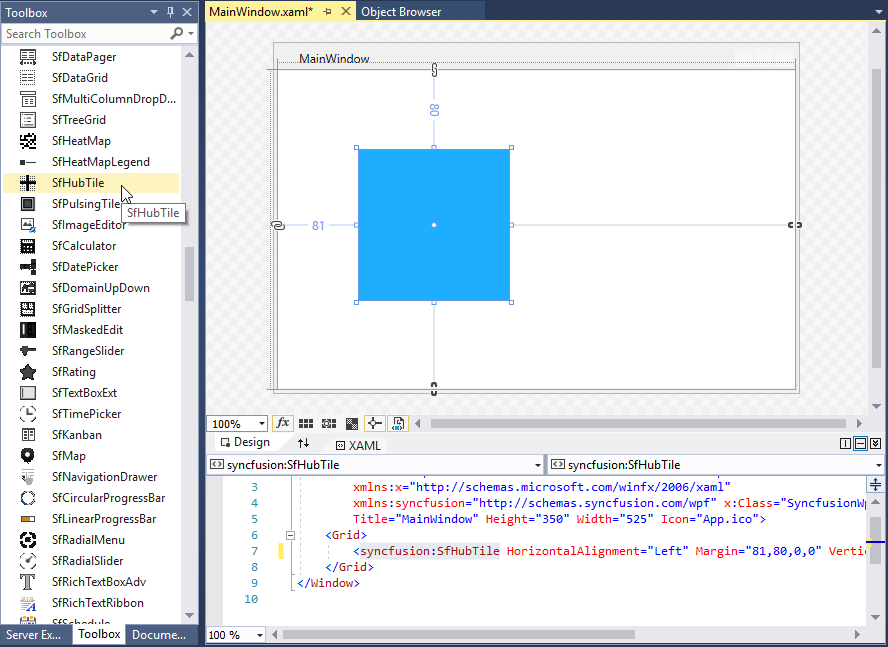
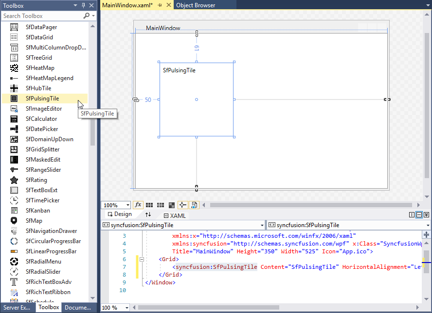
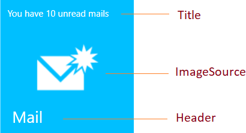
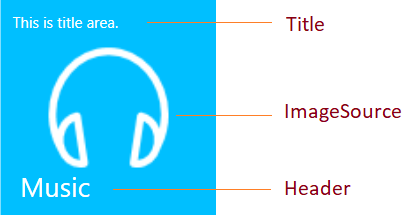

# Getting Started with WPF Tile Control

This section explains how to get started with the Hub Tile and Pulsing Tile controls in a WPF application.

## Assembly deployment

Refer to the [Hub Tile](https://help.syncfusion.com/wpf/control-dependencies#sfhubtile) and [Pulsing Tile](https://help.syncfusion.com/wpf/control-dependencies#sfpulsingtile) control dependencies sections for the list of assemblies and [NuGet package](https://help.syncfusion.com/wpf/installation/install-nuget-packages) required to use these controls in a WPF application.

## Creating a simple application with Hub Tile and Pulsing Tile

In this walkthrough, you will create a WPF application that contains Hub Tile and Pulsing Tile controls.

1. [Adding control via Designer](#adding-control-via-designer)
2. [Adding control manually in XAML](#adding-control-manually-in-xaml)
3. [Adding control manually in C#](#adding-control-manually-in-c)

### Adding control via Designer

You can add the Hub Tile and Pulsing Tile controls to your application by dragging SfHubTile and SfPulsingTile from the Toolbox and dropping them onto the designer surface. When you add the controls through the designer, the required assemblies, such as **Syncfusion.SfHubTile.WPF** and **Syncfusion.SfShared.WPF**, are automatically added to the project. The following XAML code is generated automatically.



<!--For Hub Tile-->
<syncfusion:SfHubTile Content="SfHubTile" HorizontalAlignment="Left" VerticalAlignment="Top"/>
<!--For Pulsing Tile-->
<syncfusion:SfPulsingTile Content="SfPulsingTile" HorizontalAlignment="Left" VerticalAlignment="Top"/>



N> `syncfusion` in XAML is an auto-generated namespace.

	
### Adding control manually in XAML

To add the controls manually in XAML, follow these steps:

1. Add the following required assembly references to the project.
	* Syncfusion.SfHubTile.WPF
	* Syncfusion.SfShared.WPF
2. Import the Syncfusion WPF schema `http://schemas.syncfusion.com/wpf` or the control namespace `Syncfusion.Windows.Controls.Notification` in the XAML page.
3. Add the SfHubTile and SfPulsingTile controls to the XAML page.





<Window xmlns="http://schemas.microsoft.com/winfx/2006/xaml/presentation"
			xmlns:x="http://schemas.microsoft.com/winfx/2006/xaml"
			xmlns:syncfusion="http://schemas.syncfusion.com/wpf" 
			x:Class="WpfApplication1.MainWindow"
			Title="MainWindow" Height="350" Width="525">
	 <Grid x:Name="grid">
    	<!--Hub Tile-->
    	<syncfusion:SfHubTile Content="This is a Hub Tile" HorizontalAlignment="Left"/>
    	<!--Pulsing Tile-->
    	<syncfusion:SfPulsingTile Content="This is a Pulsing Tile" HorizontalAlignment="Right"/>
	</Grid>
</Window>




{{ codesnippet1 | OrderList_Indent_Level_1 }}

### Adding control manually in C#

To add the control manually in C#, follow these steps:

1. Add the following required assembly references to the project.
	* Syncfusion.SfHubTile.WPF
	* Syncfusion.SfShared.WPF
2. Import the `Syncfusion.Windows.Controls.Notification` namespace.
3. Create instances of SfHubTile and SfPulsingTile, and then add them to the layout container.




using Syncfusion.Windows.Controls.Notification;
namespace WpfApplication1
{	
	public partial class MainWindow : Window
	{
		public MainWindow()
		{          
			InitializeComponent();
			// Hub Tile
			SfHubTile hubTile = new SfHubTile();
			hubTile.Content="This is a Hub Tile";
			hubTile.HorizontalAlignment = HorizontalAlignment.Left;
			grid.Children.Add(hubTile);

			//Pulsing Tile
			SfPulsingTile pulseTile = new SfPulsingTile();
			pulseTile.Content="This is a Pulsing Tile";
			pulseTile.HorizontalAlignment = HorizontalAlignment.Right;
			grid.Children.Add(pulseTile);
		}
	}
}



{{ codesnippet2 | OrderList_Indent_Level_1 }}

## Setting Title, Header, and Image in the Tile

Use the [Title](https://help.syncfusion.com/cr/wpf/Syncfusion.Windows.Controls.Notification.HubTileBase.html#Syncfusion_Windows_Controls_Notification_HubTileBase_Title), [Header](https://help.syncfusion.com/cr/wpf/Syncfusion.Windows.Primitives.HeaderedContentControl.html#Syncfusion_Windows_Primitives_HeaderedContentControl_Header) and [ImageSource](https://help.syncfusion.com/cr/wpf/Syncfusion.Windows.Controls.Notification.HubTileBase.html#Syncfusion_Windows_Controls_Notification_HubTileBase_ImageSource) properties to specify the title, header, and image displayed in the tile.

Hub Tile
{:.caption}

Pulsing Tile
{:.caption}

N> The title is displayed at the top of the tile, the header is displayed at the bottom, and the image is displayed in the center.

## Theme

Hub Tile and Pulsing Tile controls support a variety of built-in themes. Refer to the following articles to learn how to apply themes to the Hub Tile and Pulsing Tile controls:

  * [Apply theme using SfSkinManager](https://help.syncfusion.com/wpf/themes/skin-manager)
  * [Create a custom theme using ThemeStudio](https://help.syncfusion.com/wpf/themes/theme-studio#creating-custom-theme)

