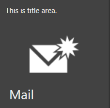
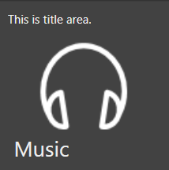

# Themes support in Hub Tile and Pulsing Tile

Hub Tile and Pulsing Tile supports various themes which can be applied using [SfSkinManager](https://help.syncfusion.com/wpf/themes/getting-started) and also provided support to create custom theme using [Theme Studio](https://help.syncfusion.com/wpf/themes/theme-studio). 

## Applying themes using SkinManager

The appearance of Hub Tile and Pulsing Tile control can be customized by using [VisualStyle](https://help.syncfusion.com/cr/wpf/Syncfusion.SfSkinManager.VisualStyles.html) attached property of the [SfSkinManager](https://help.syncfusion.com/cr/wpf/Syncfusion.SfSkinManager.SfSkinManager.html). The list of available themes and assemblies can be referred in the below documentation [link](https://help.syncfusion.com/wpf/themes/getting-started).

Below example explains how to apply blend theme for Hub Tile and Pulsing Tile using `SfSkinManager` in an existing application.

 * Add references like **Syncfusion.SfSkinManager.Wpf.dll** and **Syncfusion.Themes.Blend.Wpf.dll** assembly to the project.

 * Import **SfSkinManager** namespace and set **SfSkinManager.VisualStyle** attached property either to the Window or the Hub Tile. Setting [VisualStyle](https://help.syncfusion.com/cr/wpf/Syncfusion.SfSkinManager.VisualStyles.html) property to the Window will apply blend theme for all controls inside the Window.




<Window x:Class="VisualStylesDemo.MainWindow"
      xmlns="http://schemas.microsoft.com/winfx/2006/xaml/presentation"
	  xmlns:x="http://schemas.microsoft.com/winfx/2006/xaml"   xmlns:syncfusion="http://schemas.syncfusion.com/wpf"
      xmlns:local="clr-namespace:VisualStylesDemo"
      xmlns:skinManager="clr-namespace:Syncfusion.SfSkinManager;assembly=Syncfusion.SfSkinManager.WPF"
      Title="Visual Styles Demo"  Icon="App.ico"
      Width="1200" Height="720"
     WindowStartupLocation="CenterScreen">
<Grid>
<!--SfHubTile-->						 
<syncfusion:SfHubTile x:Name="hubtile"Header="HubTile" skinManager:SfSkinManager.VisualStyle="Blend" Title="This is title area."/>
<!--SfPulsingTile-->						
<syncfusion:SfPulsingTile x:Name="pulsingtile" Header="PulsingTile" skinManager:SfSkinManager.VisualStyle="Blend" Title="This is title area.">
	<Image Source="Assests/PulsingTile.jpg"/>	
</syncfusion:SfPulsingTile>	
</Grid>
</Window>		 
										


    
    SfSkinManager.SetVisualStyle(this, VisualStyles.Blend); 




* Now run the application and can see the blend theme applied for Hub Tile and Pulsing Tile respectively.

## Applying themes using Theme Studio

Hub Tile and Pulsing Tile themes can be customized using theme studio. Refer the documentation [link](https://help.syncfusion.com/wpf/themes/theme-studio) for more information.