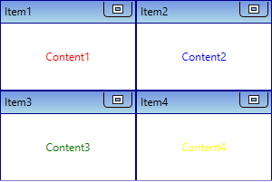
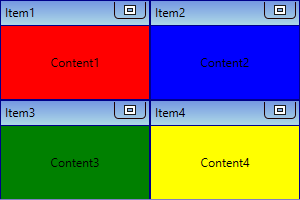
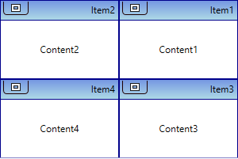
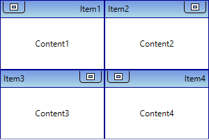

# Appearance in WPF TileViewControl

This section explains different styling, theming options available in [TileViewControl](https://help.syncfusion.com/cr/wpf/Syncfusion.Windows.Shared.TileViewControl.html) control.

## Setting the foreground

You can change the foreground color of the each `TileViewItem` separately by using the `TileViewItem.Foreground` property. The default value of `TileViewItem.Foreground` property is `Black`.




<syncfusion:TileViewControl Name="tileViewControl">
    <syncfusion:TileViewItem Foreground="Red" Header="Item1" Content="Content1"/>
    <syncfusion:TileViewItem Foreground="Blue" Header="Item2" Content="Content2"/>
    <syncfusion:TileViewItem Foreground="Green" Header="Item3" Content="Content3"/>
    <syncfusion:TileViewItem Foreground="Yellow" Header="Item4" Content="Content4"/>
</syncfusion:TileViewControl>




TileViewControl tileViewControl = new TileViewControl();
tileViewControl.Items.Add(new TileViewItem() { Header = "Item 1",
    Content = "Content1", Foreground = Brushes.Red });
tileViewControl.Items.Add(new TileViewItem() { Header = "Item 2",
    Content = "Content2", Foreground = Brushes.Blue});
tileViewControl.Items.Add(new TileViewItem() { Header = "Item 3",
    Content = "Content3",Foreground = Brushes.Green });
tileViewControl.Items.Add(new TileViewItem() { Header = "Item 4",
    Content = "Content4", Foreground = Brushes.Yellow });




N> [View Sample in GitHub](https://github.com/SyncfusionExamples/syncfusion-wpf-tileview-control-examples/blob/master/Samples/Appearance)

## Setting the background

You can change the background color of the each `TileViewItem` separately by using the `TileViewItem.Background` property. The default value of `TileViewItem.Background` property is `White`.




<syncfusion:TileViewControl Name="tileViewControl">
    <syncfusion:TileViewItem Background="Red" Header="Item1" Content="Content1"/>
    <syncfusion:TileViewItem Background="Blue" Header="Item2" Content="Content2"/>
    <syncfusion:TileViewItem Background="Green" Header="Item3" Content="Content3"/>
    <syncfusion:TileViewItem Background="Yellow" Header="Item4" Content="Content4"/>
</syncfusion:TileViewControl>




TileViewControl tileViewControl = new TileViewControl();
tileViewControl.Items.Add(new TileViewItem() { Header = "Item 1",
    Content = "Content1", Background = Brushes.Red });
tileViewControl.Items.Add(new TileViewItem() { Header = "Item 2",
    Content = "Content2", Background = Brushes.Blue});
tileViewControl.Items.Add(new TileViewItem() { Header = "Item 3",
    Content = "Content3",Background = Brushes.Green });
tileViewControl.Items.Add(new TileViewItem() { Header = "Item 4",
    Content = "Content4", Background = Brushes.Yellow });




N> [View Sample in GitHub](https://github.com/SyncfusionExamples/syncfusion-wpf-tileview-control-examples/blob/master/Samples/Appearance)

## Setting the border

You can change the border color of the each `TileViewItem` separately by using the `TileViewItem.BorderBrush` property. You can also change the border thickness by using the `TileViewItem.BorderThickness` property. The default value of `TileViewItem.BorderBrush` property is `Dark Blue` and `TileViewItem.BorderThickness` property is `1`.




<syncfusion:TileViewControl Name="tileViewControl">
    <syncfusion:TileViewItem BorderThickness="3" BorderBrush="Red"
                             Header="Item1" Content="Content1"/>
    <syncfusion:TileViewItem BorderThickness="3" BorderBrush="Blue" 
                             Header="Item2" Content="Content2"/>
    <syncfusion:TileViewItem BorderThickness="3" BorderBrush="Green" 
                             Header="Item3" Content="Content3"/>
    <syncfusion:TileViewItem BorderThickness="3" BorderBrush="Yellow"
                             Header="Item4" Content="Content4"/>
</syncfusion:TileViewControl>




TileViewControl tileViewControl = new TileViewControl();
tileViewControl.Items.Add(new TileViewItem() { Header = "Item 1",Content = "Content1",
     BorderBrush = Brushes.Red, BorderThickness= new Thickness(3)});
tileViewControl.Items.Add(new TileViewItem() { Header = "Item 2", Content = "Content2", 
     BorderBrush = Brushes.Blue, BorderThickness= new Thickness(3)});
tileViewControl.Items.Add(new TileViewItem() { Header = "Item 3", Content = "Content3",
     BorderBrush = Brushes.Green, BorderThickness= new Thickness(3)});
tileViewControl.Items.Add(new TileViewItem() { Header = "Item 4", Content = "Content4", 
     BorderBrush = Brushes.Yellow, BorderThickness= new Thickness(3)});




N> [View Sample in GitHub](https://github.com/SyncfusionExamples/syncfusion-wpf-tileview-control-examples/blob/master/Samples/Appearance)

## Change flow direction

You can change the flow direction of the `TileViewControl` layout from right to left by setting the `TileViewControl.FlowDirection` property value as `RightToLeft`. The default value of `TileViewControl.FlowDirection` property is `LeftToRight`.




<syncfusion:TileViewControl FlowDirection="RightToLeft"
                            Name="tileViewControl" >
     <syncfusion:TileViewItem Header="Item1" Content="Content1"/>
     <syncfusion:TileViewItem Header="Item2" Content="Content2"/>
     <syncfusion:TileViewItem Header="Item3" Content="Content3"/>
     <syncfusion:TileViewItem Header="Item4" Content="Content4"/>
</syncfusion:TileViewControl>




tileViewControl.FlowDirection = FlowDirection.RightToLeft;




N> [View Sample in GitHub](https://github.com/SyncfusionExamples/syncfusion-wpf-tileview-control-examples/blob/master/Samples/Appearance)

### Change flow direction for specific TileViewItem

You can change the flow direction of the specific `TileViewItem` layout from right to left by setting the `TileViewItem.FlowDirection` property value as `RightToLeft`. The default value of `TileViewItem.FlowDirection` property is `LeftToRight`.




<syncfusion:TileViewControl Name="tileViewControl" />
     <syncfusion:TileViewItem FlowDirection="RightToLeft" Header="Item1"
                              Content="Content1"/>
     <syncfusion:TileViewItem Header="Item2" Content="Content2"/>
     <syncfusion:TileViewItem Header="Item3" Content="Content3"/>
     <syncfusion:TileViewItem FlowDirection="RightToLeft" Header="Item4" 
                              Content="Content4"/>
</syncfusion:TileViewControl>




TileViewControl tileViewControl = new TileViewControl();
tileViewControl.Items.Add(new TileViewItem() { Header = "Item 1",
    Content = "Content1", FlowDirection = FlowDirection.RightToLeft });
tileViewControl.Items.Add(new TileViewItem() { Header = "Item 2",
    Content = "Content2" });
tileViewControl.Items.Add(new TileViewItem() { Header = "Item 3",
    Content = "Content3" });
tileViewControl.Items.Add(new TileViewItem() { Header = "Item 4",
    Content = "Content4", FlowDirection = FlowDirection.RightToLeft });




N> [View Sample in GitHub](https://github.com/SyncfusionExamples/syncfusion-wpf-tileview-control-examples/blob/master/Samples/Appearance)

## Theme

TileViewControl supports various built-in themes. Refer to the below links to apply themes for the TileViewControl,

  * [Apply theme using SfSkinManager](https://help.syncfusion.com/wpf/themes/skin-manager)
	
  * [Create a custom theme using ThemeStudio](https://help.syncfusion.com/wpf/themes/theme-studio#creating-custom-theme)

  