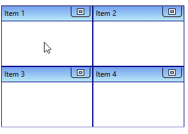
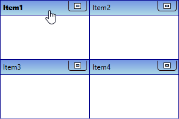
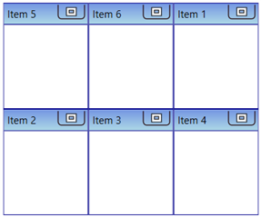
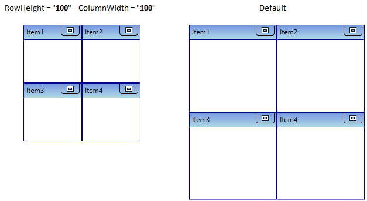
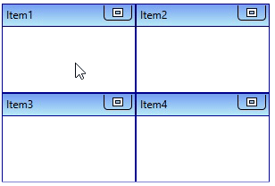
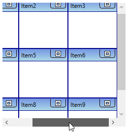
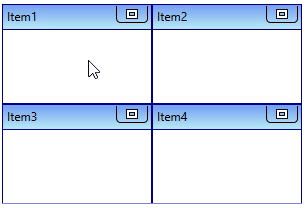

# Arrange TileViewItem in WPF Tile View

This section explains how to arrange and navigate to the TileView item and its alignment functionalities in the [TileViewControl](https://help.syncfusion.com/cr/wpf/Syncfusion.Windows.Shared.TileViewControl.html).

## Rearrange position of TileViewItem

If you want to rearrange the [TileViewItem](https://help.syncfusion.com/cr/wpf/Syncfusion.Windows.Shared.TileViewItem.html) position, drag that item and drop to anywhere you want to place it in the `TileViewControl`.

N> [View Sample in GitHub](https://github.com/SyncfusionExamples/syncfusion-wpf-tileview-control-examples/blob/master/Samples/Arrange-Items)

## Restrict rearranging of TileViewItem

You can restrict the rearranging of `TileViewItem` by setting the [AllowItemRepositioning](https://help.syncfusion.com/cr/wpf/Syncfusion.Windows.Shared.TileViewControl.html#Syncfusion_Windows_Shared_TileViewControl_AllowItemRepositioning) property value as `false`. The default value of `AllowItemRepositioning` property is `true`.




<syncfusion:TileViewControl AllowItemRepositioning="False"
                            Name="tileViewControl">
    <syncfusion:TileViewItem Header="Item 1" />
    <syncfusion:TileViewItem Header="Item 2" />
    <syncfusion:TileViewItem Header="Item 3" />
    <syncfusion:TileViewItem Header="Item 4" />
</syncfusion:TileViewControl>




tileViewControl.AllowItemRepositioning = false;




N> [View Sample in GitHub](https://github.com/SyncfusionExamples/syncfusion-wpf-tileview-control-examples/blob/master/Samples/Arrange-Items)

## Arrange TileViewItem in rows and columns

You can change the number of tileview items displayed in view by setting the value to [RowCount](https://help.syncfusion.com/cr/wpf/Syncfusion.Windows.Shared.TileViewControl.html#Syncfusion_Windows_Shared_TileViewControl_RowCount) and [ColumnCount](https://help.syncfusion.com/cr/wpf/Syncfusion.Windows.Shared.TileViewControl.html#Syncfusion_Windows_Shared_TileViewControl_ColumnCount) properties. The default value of `RowCount` and `ColumnCount` properties is `0`.




<syncfusion:TileViewControl RowCount="6" ColumnCount="1"
                            Name="tileViewControl"  >
    <syncfusion:TileViewItem Header="Item1"/>
    <syncfusion:TileViewItem Header="Item2"/>
    <syncfusion:TileViewItem Header="Item3"/>
    <syncfusion:TileViewItem Header="Item4"/>
    <syncfusion:TileViewItem Header="Item5"/>
    <syncfusion:TileViewItem Header="Item6"/>
</syncfusion:TileViewControl>




tileViewControl.RowCount = 6;
tileViewControl.ColumnCount = 1;




## Arrange TileViewItem in custom order

You can change the order in which the items are displayed in `TileView` control using the [`CurrentItemsOrder`](https://help.syncfusion.com/cr/wpf/Syncfusion.Windows.Shared.TileViewControl.html#Syncfusion_Windows_Shared_TileViewControl_CurrentItemsOrder) list property. By default, the value of `CurrentItemsOrder` property is **null**.

N> `CurrentItemsOrder` property works only when Virtualization is disabled i.e., `IsVirtualizing` property value is **false**.

N> When an item in `TileView` control is maximized, the items in `CurrentItemsOrder` list will be cleared.




<Grid>
    <Grid.DataContext>
        <local:ViewModel />
    </Grid.DataContext>
    <syncfusion:TileViewControl Height="250" CurrentItemsOrder="{Binding CustomItemOrders, Mode=TwoWay}"
                                    Width="300">
        <syncfusion:TileViewItem Header="Item 1"/>
        <syncfusion:TileViewItem Header="Item 2"/>
        <syncfusion:TileViewItem Header="Item 3"/>
        <syncfusion:TileViewItem Header="Item 4"/>
        <syncfusion:TileViewItem Header="Item 5"/>
        <syncfusion:TileViewItem Header="Item 6"/>
    </syncfusion:TileViewControl>
</Grid>




public class ViewModel : NotificationObject
{
    private List<int> customItemOrders;

    public List<int> CustomItemOrders
    {
        get { return customItemOrders; }
        set
        {
            customItemOrders = value;
            this.RaisePropertyChanged(nameof(this.CustomItemOrders));
        }
    }

    public ViewModel()
    {
        CustomItemOrders = new List<int>();
        CustomItemOrders.Add(4);
        CustomItemOrders.Add(5);
        CustomItemOrders.Add(0);
        CustomItemOrders.Add(1);
        CustomItemOrders.Add(2);
        CustomItemOrders.Add(3);
    }
}

N> When an item is maximized, you can add the items for `CurrentItemsOrder` list on runtime in code-behind.

N> When an item is maximized, reordering of TileView items in UI will not be reflected in `CurrentItemsOrder` list property. 




## Change row and column size

By default, `TileViewItem` rows and columns size are allocated based on the control size and number of items in a control. You can change the row and column size of the `TileViewItem` by setting the value to [RowHeight](https://help.syncfusion.com/cr/wpf/Syncfusion.Windows.Shared.TileViewControl.html#Syncfusion_Windows_Shared_TileViewControl_RowHeight) and [ColumnWidth](https://help.syncfusion.com/cr/wpf/Syncfusion.Windows.Shared.TileViewControl.html#Syncfusion_Windows_Shared_TileViewControl_ColumnWidth) properties. The default value of `RowHeight` and `ColumnWidth` properties is `auto`.




<syncfusion:TileViewControl RowHeight="100" 
                            ColumnWidth="100" 
                            Name="tileViewControl">
    <syncfusion:TileViewItem Header="Item1"/>
    <syncfusion:TileViewItem Header="Item2"/>      
    <syncfusion:TileViewItem Header="Item3"/>
    <syncfusion:TileViewItem Header="Item4"/>
</syncfusion:TileViewControl>




tileViewControl.RowHeight = 100;
tileViewControl.ColumnWidth = 100;




N> [View Sample in GitHub](https://github.com/SyncfusionExamples/syncfusion-wpf-tileview-control-examples/blob/master/Samples/Arrange-Items)

## Navigate to TileViewItem

You can navigate from one `TileViewItem` to any other `TileViewItem` by using the mouse click on the specific `TileViewItem`.

## Navigate to hidden items using scroll bar

If you add more items and set the row and column size to place the items that exceeds the control size, then some items are hidden from the view. You can easily navigate to the hidden items by using the scroll bar. You can enable the vertical and horizontal scroll bars by using the [HorizontalScrollBarVisibility](https://help.syncfusion.com/cr/wpf/Syncfusion.Windows.Shared.TileViewControl.html#Syncfusion_Windows_Shared_TileViewControl_HorizontalScrollBarVisibility) and [VerticalScrollBarVisibility](https://help.syncfusion.com/cr/wpf/Syncfusion.Windows.Shared.TileViewControl.html#Syncfusion_Windows_Shared_TileViewControl_VerticalScrollBarVisibility) properties value as `auto` or `Visible`. The default value of `HorizontalScrollBarVisibility` and `VerticalScrollBarVisibility` properties is `Disabled`.




<syncfusion:TileViewControl ColumnWidth="100"
                            RowHeight="100" 
                            HorizontalScrollBarVisibility="Auto"
                            VerticalScrollBarVisibility="Auto" 
                            Name="tileViewControl">
    <syncfusion:TileViewItem Header="Item1"/>
    <syncfusion:TileViewItem Header="Item2"/>
    <syncfusion:TileViewItem Header="Item3" />
    <syncfusion:TileViewItem Header="Item4"/>
    <syncfusion:TileViewItem Header="Item5"/>
    <syncfusion:TileViewItem Header="Item6"/>
    <syncfusion:TileViewItem Header="Item7" />
    <syncfusion:TileViewItem Header="Item8"/>
    <syncfusion:TileViewItem Header="Item9"/>
</syncfusion:TileViewControl>




tileViewControl.RowHeight = 100;
tileViewControl.ColumnWidth = 100;
tileViewControl. HorizontalScrollBarVisibility = Visibility.Auto;
tileViewControl. HorizontalScrollBarVisibility = Visibility.Auto;




N> [View Sample in GitHub](https://github.com/SyncfusionExamples/syncfusion-wpf-tileview-control-examples/blob/master/Samples/Arrange-Items)

## Change built-in animation duration

If you want to change the animation duration of navigation, use the [AnimationDuration](https://help.syncfusion.com/cr/wpf/Syncfusion.Windows.Shared.TileViewControl.html#Syncfusion_Windows_Shared_TileViewControl_AnimationDuration) property. The default value of `AnimationDuration` property is `{00:00:00.7000000}`.




<syncfusion:TileViewControl AnimationDuration="00:00:00.300"
                            Name="tileViewControl">
    <syncfusion:TileViewItem Header="Item1"/>
    <syncfusion:TileViewItem Header="Item2"/>
    <syncfusion:TileViewItem Header="Item3" />
    <syncfusion:TileViewItem Header="Item4"/>
</syncfusion:TileViewControl>




tileViewControl.AnimationDuration = new TimeSpan(0, 0, 0, 0, 300);




N> [View Sample in GitHub](https://github.com/SyncfusionExamples/syncfusion-wpf-tileview-control-examples/blob/master/Samples/Arrange-Items)

## Disable built-in navigation animation

By default, navigation of `TileViewItem` animation is enabled. If you want to disable the animation while navigation of `TileViewItem`, use the [EnableAnimation](https://help.syncfusion.com/cr/wpf/Syncfusion.Windows.Shared.TileViewControl.html#Syncfusion_Windows_Shared_TileViewControl_EnableAnimation) property value as `false`.




<syncfusion:TileViewControl EnableAnimation="False"
                            Name="tileViewControl">
    <syncfusion:TileViewItem Header="Item1"/>
    <syncfusion:TileViewItem Header="Item2"/>
    <syncfusion:TileViewItem Header="Item3" />
    <syncfusion:TileViewItem Header="Item4"/>
</syncfusion:TileViewControl>




tileViewControl.EnableAnimation = false;




N> [View Sample in GitHub](https://github.com/SyncfusionExamples/syncfusion-wpf-tileview-control-examples/blob/master/Samples/Arrange-Items)
