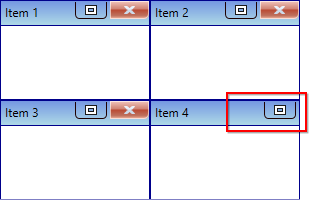
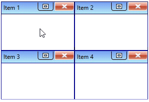
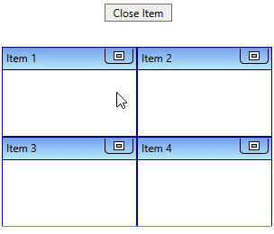
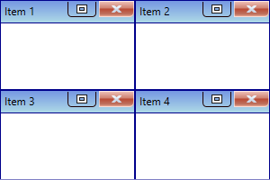
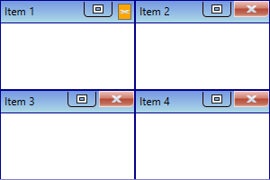

# Close TileViewItem in WPF Tile View

This section explains how to closing the [TileViewItem](https://help.syncfusion.com/cr/wpf/Syncfusion.Windows.Shared.TileViewItem.html) and its functionalities in the [TileViewControl](https://help.syncfusion.com/cr/wpf/Syncfusion.Windows.Shared.TileViewControl.html).

## Show close button

By default, the close button is not displayed in the `TileViewItem`. If you want to display the close button on specific `TileViewItem`, use the [TileViewItem.CloseButtonVisibility](https://help.syncfusion.com/cr/wpf/Syncfusion.Windows.Shared.TileViewItem.html#Syncfusion_Windows_Shared_TileViewItem_CloseButtonVisibility) property value as `Visible`. The default value of `TileViewItem.CloseButtonVisibility` property is `Collapsed`.




<syncfusion:TileViewControl Name="tileViewControl">
    <syncfusion:TileViewItem Header="Item 1" 
                             CloseButtonVisibility="Visible"/>
    <syncfusion:TileViewItem Header="Item 2" 
                             CloseButtonVisibility="Visible"/>
    <syncfusion:TileViewItem Header="Item 3" 
                             CloseButtonVisibility="Visible"/>
    <syncfusion:TileViewItem Header="Item 4" 
                             CloseButtonVisibility="Collapsed"/>
</syncfusion:TileViewControl>




TileViewControl tileViewControl = new TileViewControl();
tileViewControl.Items.Add(new TileViewItem() { Header = "Item 1",
    CloseButtonVisibility= Visibility.Visible});
tileViewControl.Items.Add(new TileViewItem() { Header = "Item 2",
    CloseButtonVisibility = Visibility.Visible });
tileViewControl.Items.Add(new TileViewItem() { Header = "Item 3",
    CloseButtonVisibility = Visibility.Visible });
tileViewControl.Items.Add(new TileViewItem() { Header = "Item 4",
    CloseButtonVisibility = Visibility.Collapsed });




N> [View Sample in GitHub](https://github.com/SyncfusionExamples/syncfusion-wpf-tileview-control-examples/blob/master/Samples/Closing-TileItem)

## Closing TileViewItem

You can close the `TileViewItem` by clicking the close button which is placed top-right corner of the header panel.




<syncfusion:TileViewControl Name="tileViewControl">
    <syncfusion:TileViewItem Header="Item 1" 
                             CloseButtonVisibility="Visible"/>
    <syncfusion:TileViewItem Header="Item 2" 
                             CloseButtonVisibility="Visible"/>
    <syncfusion:TileViewItem Header="Item 3" 
                             CloseButtonVisibility="Visible"/>
    <syncfusion:TileViewItem Header="Item 4" 
                             CloseButtonVisibility="Visible"/>
</syncfusion:TileViewControl>




TileViewControl tileViewControl = new TileViewControl();
tileViewControl.Items.Add(new TileViewItem() { Header = "Item 1",
    CloseButtonVisibility= Visibility.Visible});
tileViewControl.Items.Add(new TileViewItem() { Header = "Item 2",
    CloseButtonVisibility = Visibility.Visible });
tileViewControl.Items.Add(new TileViewItem() { Header = "Item 3",
    CloseButtonVisibility = Visibility.Visible });
tileViewControl.Items.Add(new TileViewItem() { Header = "Item 4",
    CloseButtonVisibility = Visibility.Visible });




N> [View Sample in GitHub](https://github.com/SyncfusionExamples/syncfusion-wpf-tileview-control-examples/blob/master/Samples/Closing-TileItem)

## Closing TileViewItem programmatically

If you want to close the `TileViewItem` programmatically, pass that items into the [CloseTileViewItem()](https://help.syncfusion.com/cr/wpf/Syncfusion.Windows.Shared.TileViewControl.html#Syncfusion_Windows_Shared_TileViewControl_CloseTileViewItem_Syncfusion_Windows_Shared_TileViewItem_) method.




 <Button Content="Close Item" 
         Click="CloseItem_Click"/>
         
<syncfusion:TileViewControl Name="tileViewControl">
    <syncfusion:TileViewItem Header="Item 1" />
    <syncfusion:TileViewItem Header="Item 2" />
    <syncfusion:TileViewItem Header="Item 3" />
    <syncfusion:TileViewItem />
</syncfusion:TileViewControl>




TileViewControl tileViewControl = new TileViewControl();
tileViewControl.Items.Add(new TileViewItem() { Header = "Item 1" });
tileViewControl.Items.Add(new TileViewItem() { Header = "Item 2" });
tileViewControl.Items.Add(new TileViewItem() { Header = "Item 3" });
tileViewControl.Items.Add(new TileViewItem());
Button button= new Button();
button.Click += CloseItem_Click




You can handle the CloseItem_Click event as follows:




private void CloseItem_Click(object sender, RoutedEventArgs e) {
    //First item in the Items collection will be removed
    tileViewControl.CloseTileViewItem(tileViewControl.Items[0] as TileViewItem);
}




## Hide or delete TileViewItem when closing a item

You can decide whether the `TileViewItem` can be only hidden from the view or removed from the items collection of `TileViewControl` by using the [CloseMode](https://help.syncfusion.com/cr/wpf/Syncfusion.Windows.Shared.TileViewItem.html#Syncfusion_Windows_Shared_TileViewItem_CloseMode) property while closing it. If you set `CloseMode` property as `Hide`, the `TileViewItem` will be hidden and the selection will be moved to previous index while hiding it. Also, if the property `CloseMode` is `Delete`, the `TileViewItem` will be removed from the items collection and the selection will be retained in the same index while removing it. The default value of the `CloseMode` property is `Hide`.




<syncfusion:TileViewControl Name="tileViewControl">
    <syncfusion:TileViewItem Header="Item 1" CloseMode="Delete"
                             CloseButtonVisibility="Visible"/>
    <syncfusion:TileViewItem Header="Item 2" CloseMode="Delete"
                             CloseButtonVisibility="Visible"/>
    <syncfusion:TileViewItem Header="Item 3" CloseMode="Delete"
                             CloseButtonVisibility="Visible"/>
    <syncfusion:TileViewItem Header="Item 4" CloseMode="Delete"
                             CloseButtonVisibility="Visible"/>
</syncfusion:TileViewControl>




TileViewControl tileViewControl = new TileViewControl();
tileViewControl.Items.Add(new TileViewItem() { Header = "Item 1",
    CloseButtonVisibility= Visibility.Visible, CloseMode= CloseMode.Delete});
tileViewControl.Items.Add(new TileViewItem() { Header = "Item 2", 
    CloseButtonVisibility = Visibility.Visible, CloseMode= CloseMode.Delete});
tileViewControl.Items.Add(new TileViewItem() { Header = "Item 3", 
    CloseButtonVisibility = Visibility.Visible, CloseMode= CloseMode.Delete});
tileViewControl.Items.Add(new TileViewItem() { Header = "Item 4",
    CloseButtonVisibility = Visibility.Visible, CloseMode= CloseMode.Delete});




N> [View Sample in GitHub](https://github.com/SyncfusionExamples/syncfusion-wpf-tileview-control-examples/blob/master/Samples/Closing-TileItem)

## Custom UI of close button

You can customize the appearance of particular `TileViewItem`'s close button by using the [CloseButtonStyle](https://help.syncfusion.com/cr/wpf/Syncfusion.Windows.Shared.TileViewItem.html#Syncfusion_Windows_Shared_TileViewItem_CloseButtonStyle) property. You can also change the margin of the `TileViewItem` close button by using the [CloseButtonMargin](https://help.syncfusion.com/cr/wpf/Syncfusion.Windows.Shared.TileViewItem.html#Syncfusion_Windows_Shared_TileViewItem_CloseButtonMargin) property. The `DataContext` of the `CloseButtonStyle` property is [TileViewItemCloseButton](https://help.syncfusion.com/cr/wpf/Syncfusion.Windows.Shared.TileViewItemCloseButton.html).




<Window.Resources>
    
</Window.Resources>
<Grid>
    <syncfusion:TileViewControl Name="tileViewControl">
        <syncfusion:TileViewItem CloseButtonMargin="3"
                                 CloseButtonStyle="{StaticResource closeButtonStyle}"
                                 Header="Item 1" CloseButtonVisibility="Visible"/>
        <syncfusion:TileViewItem Header="Item 2" CloseButtonVisibility="Visible"/>
        <syncfusion:TileViewItem Header="Item 3" CloseButtonVisibility="Visible"/>
        <syncfusion:TileViewItem Header="Item 4" CloseButtonVisibility="Visible"/>
    </syncfusion:TileViewControl>
</Grid>




N> [View Sample in GitHub](https://github.com/SyncfusionExamples/syncfusion-wpf-tileview-control-examples/blob/master/Samples/Closing-TileItem)

## TileViewItem closing notification

When the `TileViewItem` is closing, it will be notified by using the [TileViewItem.Closing](https://help.syncfusion.com/cr/wpf/Syncfusion.Windows.Shared.TileViewItem.html) event. You can restrict the closing of `TileViewItem` by using the [CloseEventArgs.Cancel](https://help.syncfusion.com/cr/wpf/Syncfusion.Windows.Shared.TileViewItem.CloseEventArgs.html#Syncfusion_Windows_Shared_TileViewItem_CloseEventArgs_Cancel) property value as `true`.




<syncfusion:TileViewControl Name="tileViewControl">
    <syncfusion:TileViewItem Closing="TileViewItem_Closing" 
                             Header="Item 1"
                             CloseButtonVisibility="Visible"/>
    <syncfusion:TileViewItem Closing="TileViewItem_Closing" 
                             Header="Item 2"
                             CloseButtonVisibility="Visible"/>
    <syncfusion:TileViewItem Closing="TileViewItem_Closing"
                             Header="Item 3"
                             CloseButtonVisibility="Visible"/>
    <syncfusion:TileViewItem Closing="TileViewItem_Closing"
                             Header="Item 4"
                             CloseButtonVisibility="Visible"/>
</syncfusion:TileViewControl>




You can handle the event as follows:




private void TileViewItem_Closing(object sender, TileViewItem.CloseEventArgs args) {
    //Restrict closing
    args.Cancel = true;
}




