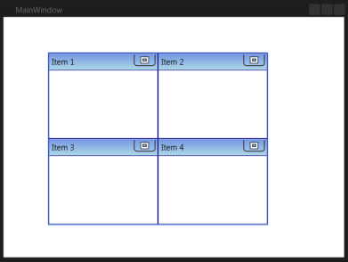

# Getting Started of TileViewControl

This section describes how to design a [TileViewControl](https://help.syncfusion.com/cr/cref_files/wpf/Syncfusion.Shared.Wpf~Syncfusion.Windows.Shared.TileViewControl_members.html) control in a WPF application and overview of its basic functionalities.

## Assembly deployment
Refer to the [control dependencies](https://help.syncfusion.com/wpf/control-dependencies#tileview) section to get the list of assemblies or NuGet package that needs to be added as a reference to use the [TileViewControl](https://help.syncfusion.com/cr/cref_files/wpf/Syncfusion.Shared.Wpf~Syncfusion.Windows.Shared.TileViewControl_members.html) control in any application.

You can find more details about installing the NuGet package in a WPF application in the following link:
[How to install nuget packages](https://help.syncfusion.com/wpf/nuget-packages).

## Creating sample application with TileViewControl

The [TileViewControl](https://help.syncfusion.com/cr/cref_files/wpf/Syncfusion.Shared.Wpf~Syncfusion.Windows.Shared.TileViewControl_members.html)  can be added to an application using Visual Studio and Blend.

You can create the WPF application with [TileViewControl](https://help.syncfusion.com/cr/cref_files/wpf/Syncfusion.Shared.Wpf~Syncfusion.Windows.Shared.TileViewControl_members.html) control as follows:

1. [Creating project](#creating-the-project)
2. [Adding control via designer](#adding-control-via-designer)
3. [Adding control manually via XAML](#adding-control-manually-via-XAML)
3. [Adding control manually via C#](#adding-control-manually-via-C#)

## Creating the project

Below section provides detailed information to create new project in Visual Studio to display [TileViewControl](https://help.syncfusion.com/cr/cref_files/wpf/Syncfusion.Shared.Wpf~Syncfusion.Windows.Shared.TileViewControl_members.html).

## Adding control via designer

[TileViewControl](https://help.syncfusion.com/cr/cref_files/wpf/Syncfusion.Shared.Wpf~Syncfusion.Windows.Shared.TileViewControl_members.html)  can be added to the application by dragging it from the toolbox and dropping it in a designer view. The following required assembly **Syncfusion.Shared.WPF** references will be added automatically.

### Through Visual Studio

The following are the steps to create the [TileViewControl](https://help.syncfusion.com/cr/cref_files/wpf/Syncfusion.Shared.Wpf~Syncfusion.Windows.Shared.TileViewControl_members.html) using Visual Studio.

1. Drag TileViewControl from the Toolbox and drop it in the Designer area. 

     

2. To add items to the [TileViewControl](https://help.syncfusion.com/cr/cref_files/wpf/Syncfusion.Shared.Wpf~Syncfusion.Windows.Shared.TileViewControl_members.html) using the Collection Editor, select the TileViewControl and click the button in the Items property. This will open the Collection Editor.

     

3. Using the Collection Editor, add the [TileViewItem](https://help.syncfusion.com/cr/cref_files/wpf/Syncfusion.Shared.Wpf~Syncfusion.Windows.Shared.TileViewItem.html) and configure their properties.

### Through Expression Blend

The [TileViewControl](https://help.syncfusion.com/cr/cref_files/wpf/Syncfusion.Shared.Wpf~Syncfusion.Windows.Shared.TileViewControl_members.html) can also be created and configured using Expression Blend. The following are the steps to do so.

1. Create a WPF project in Expression Blend and refer the following assemblies.

   1. Syncfusion.Shared.Wpf
   
2. Drag TileViewControl from the Toolbox and drop it in the Designer area. 

     

3. To add items to the [TileViewControl](https://help.syncfusion.com/cr/cref_files/wpf/Syncfusion.Shared.Wpf~Syncfusion.Windows.Shared.TileViewControl_members.html) using the Collection Editor, select TileViewControl and go to Properties and click Items (Collection) under Common Properties.

     

4. Once the Collection Editor window opens, click Add another item button to open Select Object window. 

5. Select [TileViewItem](https://help.syncfusion.com/cr/cref_files/wpf/Syncfusion.Shared.Wpf~Syncfusion.Windows.Shared.TileViewItem.html) by typing _TileViewItem_ in the search box, and then click OK.

     

6. Configure the [TileViewItem](https://help.syncfusion.com/cr/cref_files/wpf/Syncfusion.Shared.Wpf~Syncfusion.Windows.Shared.TileViewItem.html) using the properties in the Collection Editor.

N> You can customize the appearance of the [TileViewControl](https://help.syncfusion.com/cr/cref_files/wpf/Syncfusion.Shared.Wpf~Syncfusion.Windows.Shared.TileViewControl_members.html) and its Item using the template-editing feature available in the Expression Blend.

## Adding control manually via XAML

The [TileViewControl](https://help.syncfusion.com/cr/cref_files/wpf/Syncfusion.Shared.Wpf~Syncfusion.Windows.Shared.TileViewControl_members.html) can be created through XAML codes. 





<Window
xmlns="http://schemas.microsoft.com/winfx/2006/xaml/presentation"
xmlns:x="http://schemas.microsoft.com/winfx/2006/xaml"
xmlns:d="http://schemas.microsoft.com/expression/blend/2008"
xmlns:mc="http://schemas.openxmlformats.org/markup-compatibility/2006"
xmlns:local="clr-namespace:WPF_ForDocumentation"
xmlns:syncfusion="http://schemas.syncfusion.com/wpf" 
x:Class="WPF_ForDocumentation.MainWindow"
mc:Ignorable="d"
Name="mainWindow"
Title="MainWindow" Height="450" Width="700" >
<Grid>
<syncfusion:TileViewControl Name="tileViewControl1" >
     <syncfusion:TileViewItem Header="Item 1" />
     <syncfusion:TileViewItem Header="Item 2" />
     <syncfusion:TileViewItem Header="Item 3" />
     <syncfusion:TileViewItem Header="Item 4" />
</syncfusion:TileViewControl>
</Grid>
</Window>




## Adding control manually via C#

To create the [TileViewControl](https://help.syncfusion.com/cr/cref_files/wpf/Syncfusion.Shared.Wpf~Syncfusion.Windows.Shared.TileViewControl_members.html) through C#, include the following namespace to the directives list.





using Syncfusion.Windows.Shared;





Imports Syncfusion.Windows.Shared





Create an instance for [TileViewControl](https://help.syncfusion.com/cr/cref_files/wpf/Syncfusion.Shared.Wpf~Syncfusion.Windows.Shared.TileViewControl_members.html) and add the TileViewItems in it.





TileViewControl tvControl = new TileViewControl();
TileViewItem tvitem1 = new TileViewItem() { Header = "Item 1" };
TileViewItem tvitem2 = new TileViewItem() { Header = "Item 2" };
TileViewItem tvitem3 = new TileViewItem() { Header = "Item 3" };
TileViewItem tvitem4 = new TileViewItem() { Header = "Item 4" };

tvControl.Items.Add(tvitem1);
tvControl.Items.Add(tvitem2);
tvControl.Items.Add(tvitem3);
tvControl.Items.Add(tvitem4);





Dim tvControl As TileViewControl = New TileViewControl
Dim tvitem1 As TileViewItem = New TileViewItem
Dim tvitem2 As TileViewItem = New TileViewItem
Dim tvitem3 As TileViewItem = New TileViewItem
Dim tvitem4 As TileViewItem = New TileViewItem

tvControl.Items.Add(tvitem1)
tvControl.Items.Add(tvitem2)
tvControl.Items.Add(tvitem3)
tvControl.Items.Add(tvitem4)





N> To learn how to data bind the TileViewControl using ItemSource [click here](https://help.syncfusion.com/wpf/tile-view/data-binding).  

## Selection

You can set the [TileViewItem](https://help.syncfusion.com/cr/cref_files/wpf/Syncfusion.Shared.Wpf~Syncfusion.Windows.Shared.TileViewItem.html) to be selected or check whether required TileViewItem is selected in [TileViewControl](https://help.syncfusion.com/cr/cref_files/wpf/Syncfusion.Shared.Wpf~Syncfusion.Windows.Shared.TileViewControl_members.html) using [IsSelected](https://help.syncfusion.com/cr/cref_files/wpf/Syncfusion.Shared.Wpf~Syncfusion.Windows.Shared.TileViewItem~IsSelected.html) property.





<syncfusion:TileViewControl x:Name="TileView" Height="600" Width="800">
     <syncfusion:TileViewItem x:Name="Tile1" Header="TileViewItem 1" />
     <syncfusion:TileViewItem x:Name="Tile2" Header="TileViewItem 2" IsSelected="True" /> 
</syncfusion:TileViewControl>





TileViewControl tvControl = new TileViewControl();
TileViewItem tvitem1 = new TileViewItem() { Header = "Item 1" };
TileViewItem tvitem2 = new TileViewItem() { Header = "Item 2" };

tvControl.Items.Add(tvitem1);
tvControl.Items.Add(tvitem2);
tvitem1.IsSelected = true;





Dim tvControl As TileViewControl = New TileViewControl
Dim tvitem1 As TileViewItem = New TileViewItem
Dim tvitem2 As TileViewItem = New TileViewItem

tvControl.Items.Add(tvitem1)
tvControl.Items.Add(tvitem2)

tvitem1.IsSelected = true





## Maximize TileViewItem 

In [TileViewControl](https://help.syncfusion.com/cr/cref_files/wpf/Syncfusion.Shared.Wpf~Syncfusion.Windows.Shared.TileViewControl_members.html) you can maximize the [TileViewItem](https://help.syncfusion.com/cr/cref_files/wpf/Syncfusion.Shared.Wpf~Syncfusion.Windows.Shared.TileViewItem.html) by clicking on its header after enabling the [ClickHeaderToMaximize](https://help.syncfusion.com/cr/cref_files/wpf/Syncfusion.Shared.Wpf~Syncfusion.Windows.Shared.TileViewControl~ClickHeaderToMaximize.html) property.




<syncfusion:TileViewControl x:Name="TileView" Height="600" Width="800" ClickHeaderToMaximize ="True" >
     <syncfusion:TileViewItem x:Name="Tile1" Header="TileViewItem 1" />
     <syncfusion:TileViewItem x:Name="Tile2" Header="TileViewItem 2" />
</syncfusion:TileViewControl>




TileViewControl tvControl = new TileViewControl();
TileViewItem tvitem1 = new TileViewItem() { Header = "Item 1" };
TileViewItem tvitem2 = new TileViewItem() { Header = "Item 2" };

tvControl.Items.Add(tvitem1);
tvControl.Items.Add(tvitem2);
tvControl.ClickHeaderToMaximize = true;      




