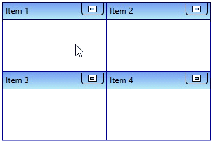
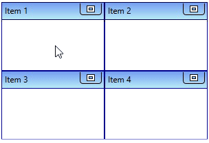
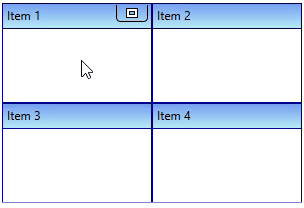
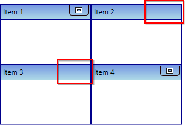
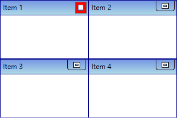
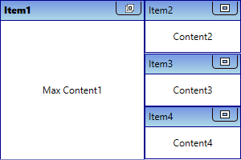
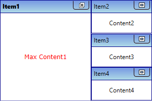

# Maximizing TileViewItem

You can maximize the [TileViewItem](https://help.syncfusion.com/cr/wpf/Syncfusion.Windows.Shared.TileViewItem.html) and change its appearance in the [TileViewControl](https://help.syncfusion.com/cr/wpf/Syncfusion.Windows.Shared.TileViewControl.html).

## Maximize the TileViewItem

You can maximize the `TileViewItem` by click on the maximize button.




<syncfusion:TileViewControl Name="tileViewControl" >
    <syncfusion:TileViewItem Header="Item 1" />
    <syncfusion:TileViewItem Header="Item 2" />
    <syncfusion:TileViewItem Header="Item 3" />
    <syncfusion:TileViewItem Header="Item 4" />
</syncfusion:TileViewControl>




TileViewControl tileViewControl = new TileViewControl();
tileViewControl.Items.Add(new TileViewItem() { Header = "Item 1" });
tileViewControl.Items.Add(new TileViewItem() { Header = "Item 2" });
tileViewControl.Items.Add(new TileViewItem() { Header = "Item 3" });
tileViewControl.Items.Add(new TileViewItem() { Header = "Item 4" });




N> [View Sample in GitHub](https://github.com/SyncfusionExamples/syncfusion-wpf-tileview-control-examples/blob/master/Samples/MinMax-TileItem)

## Maximize on click the header

If you want to maximize the `TileViewItem` on clicking the header, use the [ClickHeaderToMaximize](https://help.syncfusion.com/cr/wpf/Syncfusion.Windows.Shared.TileViewControl.html#Syncfusion_Windows_Shared_TileViewControl_ClickHeaderToMaximize) property value as `true`. The default value of `ClickHeaderToMaximize` property is `false`.




<syncfusion:TileViewControl ClickHeaderToMaximize="True" Name="tileViewControl" >
    <syncfusion:TileViewItem Header="Item 1" />
    <syncfusion:TileViewItem Header="Item 2" />
    <syncfusion:TileViewItem Header="Item 3" />
    <syncfusion:TileViewItem Header="Item 4" />
</syncfusion:TileViewControl>




tileViewControl.ClickHeaderToMaximize = true;




N> [View Sample in GitHub](https://github.com/SyncfusionExamples/syncfusion-wpf-tileview-control-examples/blob/master/Samples/MinMax-TileItem)

## Show maximize button only on mouse hover

If you want to show the maximize button only by mouse hover on the particular `TileViewItem`, use the [IsMinMaxButtonOnMouseOverOnly](https://help.syncfusion.com/cr/wpf/Syncfusion.Windows.Shared.TileViewControl.html#Syncfusion_Windows_Shared_TileViewControl_IsMinMaxButtonOnMouseOverOnly) property value as `true`. The default value of `IsMinMaxButtonOnMouseOverOnly` property is `false`.




<syncfusion:TileViewControl IsMinMaxButtonOnMouseOverOnly="True" Name="tileViewControl" >
    <syncfusion:TileViewItem Header="Item 1" />
    <syncfusion:TileViewItem Header="Item 2" />
    <syncfusion:TileViewItem Header="Item 3" />
    <syncfusion:TileViewItem Header="Item 4" />
</syncfusion:TileViewControl>




tileViewControl.IsMinMaxButtonOnMouseOverOnly = true;




N> [View Sample in GitHub](https://github.com/SyncfusionExamples/syncfusion-wpf-tileview-control-examples/blob/master/Samples/MinMax-TileItem)

## Hide maximize button

You can hide the maximize button for the specific `TileViewItem` by using the [TileViewItem.MinMaxButtonVisibility](https://help.syncfusion.com/cr/wpf/Syncfusion.Windows.Shared.TileViewItem.html#Syncfusion_Windows_Shared_TileViewItem_MinMaxButtonVisibility) property value as `Collapsed`. The default value of `TileViewItem.MinMaxButtonVisibility` property is `Visible`. 




<syncfusion:TileViewControl Name="tileViewControl" >
    <syncfusion:TileViewItem Header="Item 1" />
    <syncfusion:TileViewItem Header="Item 2" 
                             MinMaxButtonVisibility="Collapsed" />
    <syncfusion:TileViewItem Header="Item 3" 
                             MinMaxButtonVisibility="Collapsed"/>
    <syncfusion:TileViewItem Header="Item 4" />
</syncfusion:TileViewControl>




TileViewControl tileViewControl = new TileViewControl();
tileViewControl.Items.Add(new TileViewItem() { Header = "Item 1" });
tileViewControl.Items.Add(new TileViewItem() { Header = "Item 2", 
    MinMaxButtonVisibility= Visibility.Collapsed });
tileViewControl.Items.Add(new TileViewItem() { Header = "Item 3", 
    MinMaxButtonVisibility = Visibility.Collapsed });
tileViewControl.Items.Add(new TileViewItem() { Header = "Item 4" });




N> [View Sample in GitHub](https://github.com/SyncfusionExamples/syncfusion-wpf-tileview-control-examples/blob/master/Samples/Custom-Maximize-Button)

## Custom UI of the maximize button

You can customize the appearance of particular `TileViewItem`'s maximize button by using the [MinMaxButtonStyle](https://help.syncfusion.com/cr/wpf/Syncfusion.Windows.Shared.TileViewItem.html#Syncfusion_Windows_Shared_TileViewItem_MinMaxButtonStyle) property. You can also change the margin of the `TileViewItem` maximize button by using the [MinMaxButtonMargin](https://help.syncfusion.com/cr/wpf/Syncfusion.Windows.Shared.TileViewItem.html#Syncfusion_Windows_Shared_TileViewItem_MinMaxButtonMargin) property. The `DataContext` of the `MinMaxButtonStyle` property is [TileViewItemMinMaxButton](https://help.syncfusion.com/cr/wpf/Syncfusion.Windows.Shared.TileViewItemMinMaxButton.html).




<Window.Resources>
    
</Window.Resources>
<Grid>
    <syncfusion:TileViewControl Name="tileViewControl">
        <syncfusion:TileViewItem Header="Item 1" 
                                 MinMaxButtonMargin="2"
                                 MinMaxButtonStyle="{StaticResource tileViewItemMinMaxButton}"/>
        <syncfusion:TileViewItem Header="Item 2"/>
        <syncfusion:TileViewItem Header="Item 3"/>
        <syncfusion:TileViewItem Header="Item 4"/>
    </syncfusion:TileViewControl>
</Grid>




N> [View Sample in GitHub](https://github.com/SyncfusionExamples/syncfusion-wpf-tileview-control-examples/blob/master/Samples/Custom-Maximize-Button)

## Change maximized TileViewItem content

By default, `TileViewItem.Content` property values displayed as `TileViewItem` content on maximized state. If you want to change the content of the `TileViewItem` on maximized state, use the [MaximizedItemContent](https://help.syncfusion.com/cr/wpf/Syncfusion.Windows.Shared.TileViewItem.html#Syncfusion_Windows_Shared_TileViewItem_MaximizedItemContent) property. The default value of `MaximizedItemContent` property is `null`.




<syncfusion:TileViewControl  Name="tileViewControl">
    <syncfusion:TileViewItem Header="Item1" Content="Content1"
                             MaximizedItemContent="Max Content1" />
    <syncfusion:TileViewItem Header="Item2" Content="Content2"
                             MaximizedItemContent="Max Content2" />
    <syncfusion:TileViewItem Header="Item3" Content="Content3"
                             MaximizedItemContent="Max Content3" />
    <syncfusion:TileViewItem Header="Item4" Content="Content4"
                             MaximizedItemContent="Max Content4" />
</syncfusion:TileViewControl>




TileViewControl tileViewControl = new TileViewControl();
tileViewControl.Items.Add(new TileViewItem() { Header = "Item 1", 
    Content = "Content1", MaximizedItemContent = "Max Content1" });
tileViewControl.Items.Add(new TileViewItem() { Header = "Item 2",
    Content = "Content2", MaximizedItemContent = "Max Content2" });
tileViewControl.Items.Add(new TileViewItem() { Header = "Item 3",
    Content = "Content3", MaximizedItemContent = "Max Content3" });
tileViewControl.Items.Add(new TileViewItem() { Header = "Item 4",
    Content = "Content4", MaximizedItemContent = "Max Content4" });




N> [View Sample in GitHub](https://github.com/SyncfusionExamples/syncfusion-wpf-tileview-control-examples/blob/master/Samples/MinMax-TileItem)

## Custom UI of maximized TileViewItem content

You can customize the appearance of maximized `TileViewItem` content by using the [MaximizedItemTemplate](https://help.syncfusion.com/cr/wpf/Syncfusion.Windows.Shared.TileViewControl.html#Syncfusion_Windows_Shared_TileViewControl_MaximizedItemTemplate) property. The `DataContext` of the `MaximizedItemTemplate` property is `TileViewItem.MaximizedItemContent`.




<syncfusion:TileViewControl Name="tileViewControl">
    <syncfusion:TileViewItem Header="Item1" Content="Content1"
                             MaximizedItemContent="Max Content1" />
    <syncfusion:TileViewItem Header="Item2" Content="Content2"
                             MaximizedItemContent="Max Content2" />
    <syncfusion:TileViewItem Header="Item3" Content="Content3"
                             MaximizedItemContent="Max Content3" />
    <syncfusion:TileViewItem Header="Item4" Content="Content4"
                             MaximizedItemContent="Max Content4" />
    <syncfusion:TileViewControl.MaximizedItemTemplate>
        <DataTemplate x:Name="MaxTemplate">
            <Grid>
                <TextBlock HorizontalAlignment="Center"
                           Text="{Binding}" 
                           FontFamily="Verdana"
                           Foreground="Red"/>
            </Grid>
        </DataTemplate>
    </syncfusion:TileViewControl.MaximizedItemTemplate>
</syncfusion:TileViewControl>




N> [View Sample in GitHub](https://github.com/SyncfusionExamples/syncfusion-wpf-tileview-control-examples/blob/master/Samples/CustomUI-MinMaxTileItem)

## Change maximized TileViewItem header

If you want to change the header of the `TileViewItem` on maximized state, use the [MaximizedHeader](https://help.syncfusion.com/cr/wpf/Syncfusion.Windows.Shared.TileViewItem.html#Syncfusion_Windows_Shared_TileViewItem_MaximizedHeader) property. The default value of `MaximizedHeader` property is `null`.

N> Please refer [Maximized TileViewItem header](https://help.syncfusion.com/wpf/tile-view/tileviewitem-header#change-minimized-and-maximized-header) topic to know more details about maximized `TileViewItem` header and its customization available in the `TileViewControl`.

## Maximized state changed notification

The `TileViewControl` notifies that the maximized state changed in the `TileViewItem` by using [Maximized](https://help.syncfusion.com/cr/wpf/Syncfusion.Windows.Shared.TileViewControl.html) event. You can get the maximized item by using the [Source](https://help.syncfusion.com/cr/wpf/Syncfusion.Windows.Shared.TileViewEventArgs.html#Syncfusion_Windows_Shared_TileViewEventArgs_Source) property. You can also use the [OldState](https://help.syncfusion.com/cr/wpf/Syncfusion.Windows.Shared.TileViewEventArgs.html#Syncfusion_Windows_Shared_TileViewEventArgs_OldState) and [NewState](https://help.syncfusion.com/cr/wpf/Syncfusion.Windows.Shared.TileViewEventArgs.html#Syncfusion_Windows_Shared_TileViewEventArgs_NewState) properties to get the old and new state of `TileViewItem`.




<syncfusion:TileViewControl Maximized="TileViewControl_Maximized"
                            Name="tileViewControl" />




 tileViewControl.Maximized += TileViewControl_Maximized;




You can handle the event as follows:




private void TileViewControl_Maximized(object sender, TileViewEventArgs args) {
    var maximizedItem = args.Source;
    var oldState = args.OldState;
    var newState = args.NewState;
}




