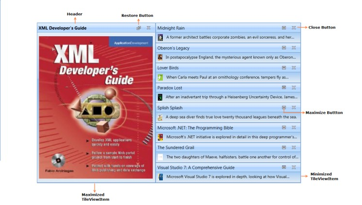

# WPF Tile View Overview

The [TileViewControl](https://help.syncfusion.com/cr/wpf/Syncfusion.Windows.Shared.TileViewControl.html) acts as a container that holds a set of [TileViewItems](https://help.syncfusion.com/cr/wpf/Syncfusion.Windows.Shared.TileViewItem.html), in which you can host rich information. You can maximize, minimize and drag the items of the `TileViewControl` in a matrix position to achieve the best layout. 

## Structure of the TileViewControl

## Key features

* Auto arrangements in the matrix order.

* Drag-drop support - To arrange the TileViewItems.

* Maximizing and minimizing support.

* The minimized position of the TileViewItems horizontal and vertical positions.

* Separate custom UI for minimized and maximized TileViewItem

* Header and content UI customization

* Closing support

* Scroll bar support

