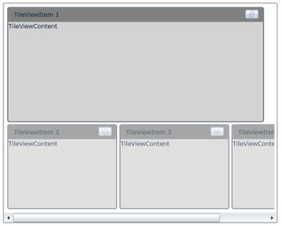

# ScrollBar Support

The ScrollBar will be visible in the bottom of the TileViewControl, when the width of the Minimized TileViewItem increases and also when [MinimizedItemsOrientation](https://help.syncfusion.com/cr/wpf/Syncfusion.Shared.Wpf~Syncfusion.Windows.Shared.TileViewControl~MinimizedItemsOrientation.html) of the TileViewControl is set to top or bottom. The ScrollBar will be visible in the right side of the TileViewControl, when the height of the Minimized TileViewItem increases and also when [MinimizedItemsOrientation](https://help.syncfusion.com/cr/wpf/Syncfusion.Shared.Wpf~Syncfusion.Windows.Shared.TileViewControl~MinimizedItemsOrientation.html) of the TileViewControl is set to right or left. 

## Use Case Scenarios

ScrollBar support enables you to see all the minimized TileViewItems, if the total height and width of the minimized TileViewItems increases from the actual control height.

## Adding ScrollBar Support to an Application 

The following code example illustrates how to add the ScrollBar to an application.



<syncfusion:TileViewControl x:Name="TileView1" Background="White">

       <syncfusion:TileViewItem BorderThickness="2" Header="TileViewItem 1"                                         

               Content="TileViewContent" OnMinimizedHeight="200" 

               OnMinimizedWidth="200" Background="LightGray" 

               HeaderBackground="Gray" Margin="2" CornerRadius="3"/>

       <syncfusion:TileViewItem BorderThickness="2" Header="TileViewItem 2"                                          

               Content="TileViewContent" OnMinimizedHeight="200" 

               OnMinimizedWidth="200" Background="LightGray" 

               HeaderBackground="Gray" Margin="2" CornerRadius="3"/>

       <syncfusion:TileViewItem BorderThickness="2" Header="TileViewItem 3" 

               Content="TileViewContent" OnMinimizedHeight="200" 

               OnMinimizedWidth="200" Background="LightGray" 

               HeaderBackground="Gray" Margin="2" CornerRadius="3"/>

       <syncfusion:TileViewItem BorderThickness="2" Header="TileViewItem 4" 

               Content="TileViewContent" OnMinimizedHeight="200" 

               OnMinimizedWidth="200" Background="LightGray" 

               HeaderBackground="Gray" Margin="2" CornerRadius="3"/>

</syncfusion:TileViewControl>


## Properties

* [OnMinimizedHeight](https://help.syncfusion.com/cr/wpf/Syncfusion.Shared.Wpf~Syncfusion.Windows.Shared.TileViewItem~OnMinimizedHeight.html)
* [OnMinimizedWidth](https://help.syncfusion.com/cr/wpf/Syncfusion.Shared.Wpf~Syncfusion.Windows.Shared.TileViewItem~OnMinimizedWidth.html)

## Sample Link

To view samples: 

1. Select Start -> Programs -> Syncfusion -> Essential Studio x.x.xx -> Dashboard.
2. Select Run Locally Installed Samples in WPF Button.
3. Now expand the DragAndDropManagerDemo tree-view item in the Sample Browser.
4. Choose any one of the samples listed under it to launch. 

