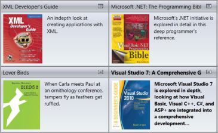
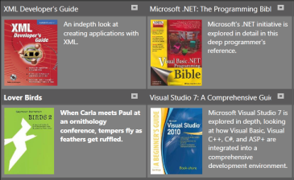

# Styling

Styling can be applied to both the TileViewControl and its items. The TileViewControl supports nine built-in styles that can be implemented at run time based on specified conditions.

## Visual Styles

The TileViewControl has the following built-in styles:

1. Office2007Blue
1. Office2007Black
2. Office2007Silver
3. Office2010Blue
4. Office2010Black
5. Office2010Silver
6. Blend
7. Metro
8. Transparent

These styles can be applied to the control using XAML and C#. The following code example illustrates how to apply Office2007Blue style to the TileViewControl.





<syncfusion:TileViewControl         syncfusion:SkinStorage.VisualStyle="Office2010Blue"        />    




SkinStorage.SetVisualStyle(tileViewInstance, "Office2010Blue");




The following illustrations show the TileViewControl that is applied with different built-in styles.

## ItemContainerStyle

The _ItemContainerStyle_ property of _TileViewControl_ sets the style of TileViewItem. This style will be applied to all items available in the TileViewControl. The following example illustrates how to apply styles to the items.

1. Create the style for TileViewControl.

   ~~~ xml
     

     

   ~~~
   

2. Set the _ItemContainerStyle_ of the _TileViewControl_ as follows.

   ~~~ xml
     

     <syncfusion:TileViewControl  ItemContainerStyle="{StaticResource itemStyle}" ItemsSource="{Binding Source={StaticResource xmlSource}, XPath=Book}"  >

        </syncfusion:TileViewControl>

   ~~~
   

This will generate the following TileViewControl.

## ItemContainerStyleSelector

The _ItemContainerStyleSelector_ property is used to choose the ItemContainerStyle at run time base on specific conditions. The following examples illustrate this.

1. Create _StyleSelector_ in the code.

   ~~~ cs
   
       

         public class TileViewItemContainerStyleSelector : StyleSelector

            {

      

                 public override Style SelectStyle(object item, DependencyObject container)

                {

                     Window window = Application.Current.MainWindow;

                     string bookname = (item as System.Xml.XmlElement).GetAttribute("Name").ToString().ToLower();

                     if (bookname.Contains("wpf"))

                    {

                     return ((Style)window.Resources["WpfBookStyle"]);

                    }

                     else

                    {

                     return ((Style)window.Resources["CsBookStyle"]);

                    }

                }

            }
   ~~~
  

2. Create the styles in the Window’s resource.

   ~~~ xml
   

        

        
   ~~~
   

3. Define the Style selector in the Window’s resource.

   ~~~ xml
    

     <local:TileViewItemContainerStyleSelector x:Key="tileViewStyleSelector"/>

   ~~~
   

4. Set _ItemContainerStyle_ for the TileViewControl.

   ~~~ xml
     

      <syncfusion:TileViewControl  ItemContainerStyleSelector="{StaticResource tileViewStyleSelector}" ItemsSource="{Binding Source={StaticResource xmlSource}, XPath=Book}"  Margin="20" >

         </syncfusion:TileViewControl>
   ~~~
   

This will generate the following TileViewControl.

