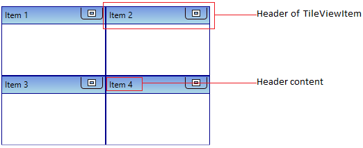
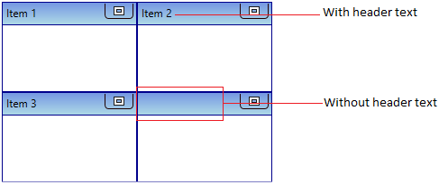
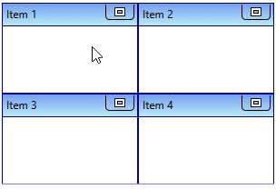
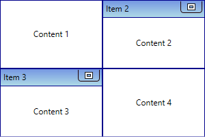
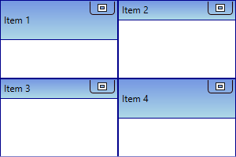
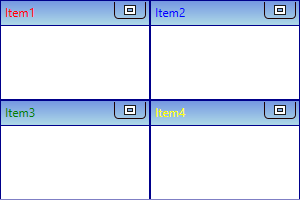
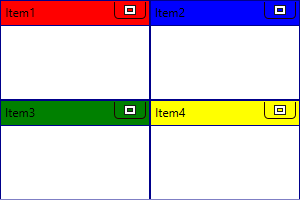
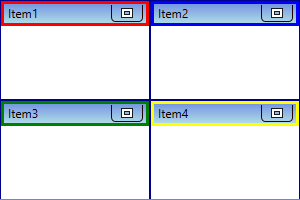
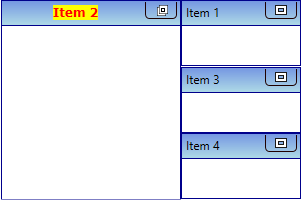

# TileViewItem Header in WPF Tile View

This section explains how to set header text and UI customization of the `TileViewItem` header in the [TileViewControl](https://help.syncfusion.com/cr/wpf/Syncfusion.Windows.Shared.TileViewControl.html).

## Setting TileViewItem header

You can add a text for the each [TileViewItem](https://help.syncfusion.com/cr/wpf/Syncfusion.Windows.Shared.TileViewItem.html) header by using the `TileViewItem.Header` property. The default value of `TileViewItem.Header` property is `null`.




<syncfusion:TileViewControl Name="tileViewControl">
    <syncfusion:TileViewItem Header="Item 1" />
    <syncfusion:TileViewItem Header="Item 2" />
    <syncfusion:TileViewItem Header="Item 3" />
    <syncfusion:TileViewItem />
</syncfusion:TileViewControl>




TileViewControl tileViewControl = new TileViewControl();
tileViewControl.Items.Add(new TileViewItem() { Header = "Item 1" });
tileViewControl.Items.Add(new TileViewItem() { Header = "Item 2" });
tileViewControl.Items.Add(new TileViewItem() { Header = "Item 3" });
tileViewControl.Items.Add(new TileViewItem());




N> [View Sample in GitHub](https://github.com/SyncfusionExamples/syncfusion-wpf-tileview-control-examples/blob/master/Samples/Getting-Started)

## Change minimized and maximized header

By default, the `TileViewItem.Header` property value is displayed as `TileViewItem` header text. If you want to change the header text on minimized and maximized state, use the [TileViewItem.MinimizedHeader](https://help.syncfusion.com/cr/wpf/Syncfusion.Windows.Shared.TileViewItem.html#Syncfusion_Windows_Shared_TileViewItem_MinimizedHeader) and [TileViewItem.MaximizedHeader](https://help.syncfusion.com/cr/wpf/Syncfusion.Windows.Shared.TileViewItem.html#Syncfusion_Windows_Shared_TileViewItem_MaximizedHeader) properties. Based on the minimized and maximized state of the `TileViewItem`, respective header text is displayed. The default value of `TileViewItem.MinimizedHeader` and `TileViewItem.MaximizedHeader` property is ``.




<syncfusion:TileViewControl Name="tileViewControl">
    <syncfusion:TileViewItem Header="Item 1" MinimizedHeader="Min Item 1"
                             MaximizedHeader="Max Item 1" />
    <syncfusion:TileViewItem Header="Item 2" MinimizedHeader="Min Item 2"
                             MaximizedHeader="Max Item 2" />
    <syncfusion:TileViewItem Header="Item 3" MinimizedHeader="Min Item 3"
                             MaximizedHeader="Max Item 3" />
    <syncfusion:TileViewItem Header="Item 4" MinimizedHeader="Min Item 4"
                             MaximizedHeader="Max Item 4" />
</syncfusion:TileViewControl>




TileViewControl tileViewControl = new TileViewControl();
tileViewControl.Items.Add(new TileViewItem() { Header = "Item 1", 
    MinimizedHeader = "Min Item 1", MaximizedHeader = "Max Item 1"});
tileViewControl.Items.Add(new TileViewItem() { Header = "Item 2", 
    MinimizedHeader = "Min Item 2", MaximizedHeader = "Max Item 2"});
tileViewControl.Items.Add(new TileViewItem() { Header = "Item 3", 
    MinimizedHeader = "Min Item 3", MaximizedHeader = "Max Item 3"});
tileViewControl.Items.Add(new TileViewItem() { Header = "Item 4", 
    MinimizedHeader = "Min Item 4", MaximizedHeader = "Max Item 4"});




N> [View Sample in GitHub](https://github.com/SyncfusionExamples/syncfusion-wpf-tileview-control-examples/blob/master/Samples/MinMax-TileItem)

## Hide the TileViewItem header

If you want to hide the specific `TileViewItem`'s header panel, use the [TileViewItem.HeaderVisibility](https://help.syncfusion.com/cr/wpf/Syncfusion.Windows.Shared.TileViewItem.html#Syncfusion_Windows_Shared_TileViewItem_HeaderVisibility) property value as `Collapsed`. The default value of `TileViewItem.HeaderVisibility` property is `Visible`.




<syncfusion:TileViewControl  Name="tileViewControl">
    <syncfusion:TileViewItem Content="Content 1" Header="Item 1" 
                             HeaderVisibility="Collapsed"/>
    <syncfusion:TileViewItem Content="Content 2" Header="Item 2" />
    <syncfusion:TileViewItem Content="Content 3" Header="Item 3" />
    <syncfusion:TileViewItem Content="Content 4" Header="Item 4"
                             HeaderVisibility="Collapsed"/>
</syncfusion:TileViewControl>




TileViewControl tileViewControl = new TileViewControl();
tileViewControl.Items.Add(new TileViewItem() { Content="Content 1",
    Header = "Item 1", HeaderVisibility= Visibility.Collapsed });
tileViewControl.Items.Add(new TileViewItem() { Content="Content 2",
    Header = "Item 2",  });
tileViewControl.Items.Add(new TileViewItem() { Content="Content 3",
    Header = "Item 3" });
tileViewControl.Items.Add(new TileViewItem() { Content = "Content 4",
    Header = "Item 4", HeaderVisibility = Visibility.Collapsed });




N> [View Sample in GitHub](https://github.com/SyncfusionExamples/syncfusion-wpf-tileview-control-examples/blob/master/Samples/Header)

## Change TileViewItem header height

If you want to change height of the specific `TileViewItem`'s header panel, use the [TileViewItem.HeaderHeight](https://help.syncfusion.com/cr/wpf/Syncfusion.Windows.Shared.TileViewItem.html#Syncfusion_Windows_Shared_TileViewItem_HeaderHeight) property. The default value of `TileViewItem.HeaderHeight` property is `25`.




<syncfusion:TileViewControl  Name="tileViewControl">
        <syncfusion:TileViewItem Header="Item 1" HeaderHeight="50" />
        <syncfusion:TileViewItem Header="Item 2" />
        <syncfusion:TileViewItem Header="Item 3" />
        <syncfusion:TileViewItem Header="Item 4" HeaderHeight="50" />
</syncfusion:TileViewControl>




TileViewControl tileViewControl = new TileViewControl();
tileViewControl.Items.Add(new TileViewItem() { Header = "Item 1", HeaderHeight = 50 });
tileViewControl.Items.Add(new TileViewItem() { Header = "Item 2" });
tileViewControl.Items.Add(new TileViewItem() { Header = "Item 3" });
tileViewControl.Items.Add(new TileViewItem() { Header = "Item 4", HeaderHeight = 50 });




N> [View Sample in GitHub](https://github.com/SyncfusionExamples/syncfusion-wpf-tileview-control-examples/blob/master/Samples/Header)

## Change TileViewItem header cursor

If you want to change specific `TileViewItem` header's mouse hover cursor, use the `TileViewItem.HeaderCursor` property. The default value of `TileViewItem.HeaderCursor` property is `Cursors.Hand`.




TileViewControl tileViewControl = new TileViewControl();
tileViewControl.Items.Add(new TileViewItem() { Header = "Item 1",
    HeaderCursor = Cursors.UpArrow });
tileViewControl.Items.Add(new TileViewItem() { Header = "Item 2",
    HeaderCursor = Cursors.ArrowCD });
tileViewControl.Items.Add(new TileViewItem() { Header = "Item 3",
    HeaderCursor = Cursors.Cross });
tileViewControl.Items.Add(new TileViewItem() { Header = "Item 4",
    HeaderCursor = Cursors.Help });




## Custom appearance of TileViewItem header

You can change the foreground, background and border appearance of the `TileViewItem` header.

### Change foreground for TileViewItem header

You can change the foreground color of the each `TileViewItem` header separately by using the [TileViewItem.HeaderForeground](https://help.syncfusion.com/cr/wpf/Syncfusion.Windows.Shared.TileViewItem.html#Syncfusion_Windows_Shared_TileViewItem_HeaderForeground) property. The default value of `TileViewItem.HeaderForeground` property is `Black`.




<syncfusion:TileViewControl Name="tileViewControl">
    <syncfusion:TileViewItem HeaderForeground="Red" Header="Item1" />
    <syncfusion:TileViewItem HeaderForeground="Blue" Header="Item2" />
    <syncfusion:TileViewItem HeaderForeground="Green" Header="Item3" />
    <syncfusion:TileViewItem HeaderForeground="Yellow" Header="Item4" />
</syncfusion:TileViewControl>




TileViewControl tileViewControl = new TileViewControl();
tileViewControl.Items.Add(new TileViewItem() { Header = "Item 1",
    HeaderForeground = Brushes.Red });
tileViewControl.Items.Add(new TileViewItem() { Header = "Item 2",
    HeaderForeground = Brushes.Blue});
tileViewControl.Items.Add(new TileViewItem() { Header = "Item 3",
    HeaderForeground = Brushes.Green });
tileViewControl.Items.Add(new TileViewItem() { Header = "Item 4",
    HeaderForeground = Brushes.Yellow });




N> [View Sample in GitHub](https://github.com/SyncfusionExamples/syncfusion-wpf-tileview-control-examples/blob/master/Samples/Header)

### Change background for TileViewItem header

You can change the background color of the each `TileViewItem` header separately by using the [TileViewItem.HeaderBackground](https://help.syncfusion.com/cr/wpf/Syncfusion.Windows.Shared.TileViewItem.html#Syncfusion_Windows_Shared_TileViewItem_HeaderBackground) property. The default value of `TileViewItem.HeaderBackground` property is `Cornflower Blue`.




<syncfusion:TileViewControl Name="tileViewControl">
    <syncfusion:TileViewItem HeaderBackground="Red" Header="Item1"/>
    <syncfusion:TileViewItem HeaderBackground="Blue" Header="Item2"/>
    <syncfusion:TileViewItem HeaderBackground="Green" Header="Item3"/>
    <syncfusion:TileViewItem HeaderBackground="Yellow" Header="Item4"/>
</syncfusion:TileViewControl>




TileViewControl tileViewControl = new TileViewControl();
tileViewControl.Items.Add(new TileViewItem() { Header = "Item 1",
    HeaderBackground = Brushes.Red });
tileViewControl.Items.Add(new TileViewItem() { Header = "Item 2",
    HeaderBackground = Brushes.Blue});
tileViewControl.Items.Add(new TileViewItem() { Header = "Item 3",
    HeaderBackground = Brushes.Green });
tileViewControl.Items.Add(new TileViewItem() { Header = "Item 4",
    HeaderBackground = Brushes.Yellow });




N> [View Sample in GitHub](https://github.com/SyncfusionExamples/syncfusion-wpf-tileview-control-examples/blob/master/Samples/Header)

### Change border for TileViewItem header

You can change the border color of the each `TileViewItem` header separately by using the [TileViewItem.HeaderBorderBrush](https://help.syncfusion.com/cr/wpf/Syncfusion.Windows.Shared.TileViewItem.html#Syncfusion_Windows_Shared_TileViewItem_HeaderBorderBrush) property. You can also change the header border thickness by using the [TileViewItem.HeaderBorderThickness](https://help.syncfusion.com/cr/wpf/Syncfusion.Windows.Shared.TileViewItem.html#Syncfusion_Windows_Shared_TileViewItem_HeaderBorderThickness) property. The default value of `TileViewItem.HeaderBorderBrush` property is `Dark Blue` and `TileViewItem.HeaderBorderThickness` property is `{0,0,0,1}`.




<syncfusion:TileViewControl Name="tileViewControl">
    <syncfusion:TileViewItem HeaderBorderThickness="3" Header="Item1"
                             HeaderBorderBrush="Red"/>
    <syncfusion:TileViewItem HeaderBorderThickness="3" Header="Item2" 
                             HeaderBorderBrush="Blue"/>
    <syncfusion:TileViewItem HeaderBorderThickness="3" Header="Item3"
                             HeaderBorderBrush="Green"/>
    <syncfusion:TileViewItem HeaderBorderThickness="3" Header="Item4"
                             HeaderBorderBrush="Yellow"/>
</syncfusion:TileViewControl>




TileViewControl tileViewControl = new TileViewControl();
tileViewControl.Items.Add(new TileViewItem() { Header = "Item 1",
    HeaderBorderBrush = Brushes.Red, HeaderBorderThickness= new Thickness(3)});
tileViewControl.Items.Add(new TileViewItem() { Header = "Item 2",
    HeaderBorderBrush = Brushes.Blue, HeaderBorderThickness= new Thickness(3)});
tileViewControl.Items.Add(new TileViewItem() { Header = "Item 3",
    HeaderBorderBrush = Brushes.Green, HeaderBorderThickness= new Thickness(3)});
tileViewControl.Items.Add(new TileViewItem() { Header = "Item 4",
    HeaderBorderBrush = Brushes.Yellow, HeaderBorderThickness= new Thickness(3)});




N> [View Sample in GitHub](https://github.com/SyncfusionExamples/syncfusion-wpf-tileview-control-examples/blob/master/Samples/Header)

## Custom UI of TileViewItem header

You can customize the appearance of `TileViewItem` headers by using the [HeaderTemplate](https://help.syncfusion.com/cr/wpf/Syncfusion.Windows.Shared.TileViewControl.html#Syncfusion_Windows_Shared_TileViewControl_HeaderTemplate) property. The `DataContext` of the `HeaderTemplate` property is `TileViewItem.Header`.




<syncfusion:TileViewControl  Name="tileViewControl">
    <syncfusion:TileViewItem Header="Item 1" />
    <syncfusion:TileViewItem Header="Item 2" />
    <syncfusion:TileViewItem Header="Item 3" />
    <syncfusion:TileViewItem Header="Item 4" />
    <syncfusion:TileViewControl.HeaderTemplate>
        <DataTemplate x:Name="headerTemplate">
            <Grid>
                <TextBlock HorizontalAlignment="Center"
                           Text="{Binding}" 
                           FontFamily="Verdana"
                           Background="Yellow"
                           Foreground="Red"/>
            </Grid>
        </DataTemplate>
    </syncfusion:TileViewControl.HeaderTemplate>
</syncfusion:TileViewControl>




N> [View Sample in GitHub](https://github.com/SyncfusionExamples/syncfusion-wpf-tileview-control-examples/blob/master/Samples/Custom-UI)

### Custom UI of specific TileViewItem header

You can customize the appearance of specific `TileViewItem` headers by using the [TileViewItem.HeaderTemplate](https://help.syncfusion.com/cr/wpf/Syncfusion.Windows.Shared.TileViewItem.html#Syncfusion_Windows_Shared_TileViewItem_HeaderTemplate) property. The `DataContext` of the `TileViewItem.HeaderTemplate` property is `TileViewItem.Header`.




<Window.Resources>
    <DataTemplate x:Key="headerTemplate">
        <Grid>
            <TextBlock HorizontalAlignment="Center"
                       Text="{Binding}" 
                       FontFamily="Verdana"
                       Background="Yellow"
                       Foreground="Red"/>
        </Grid>
    </DataTemplate>
</Window.Resources>
<Grid>
    <syncfusion:TileViewControl  Name="tileViewControl">
        <syncfusion:TileViewItem Header="Item 1" 
                                 HeaderTemplate="{StaticResource headerTemplate }" />
        <syncfusion:TileViewItem Header="Item 2" />
        <syncfusion:TileViewItem Header="Item 3" />
        <syncfusion:TileViewItem Header="Item 4" 
                                 HeaderTemplate="{StaticResource headerTemplate }" />
    </syncfusion:TileViewControl>
</Grid>



N> [View Sample in GitHub](https://github.com/SyncfusionExamples/syncfusion-wpf-tileview-control-examples/blob/master/Samples/Specific-CustomUI)

## Custom UI of minimized TileViewItem header

You can customize the appearance of minimized `TileViewItem` headers by using the [MinimizedHeaderTemplate](https://help.syncfusion.com/cr/wpf/Syncfusion.Windows.Shared.TileViewControl.html#Syncfusion_Windows_Shared_TileViewControl_MinimizedHeaderTemplate) property. The `DataContext` of the `MinimizedHeaderTemplate` property is `TileViewItem.MinimizedHeader`.




<Window.Resources>
    <DataTemplate x:Key="minimizedHeaderTemplate">
        <Grid>
            <TextBlock HorizontalAlignment="Center"
                       Text="{Binding}" 
                       FontFamily="Verdana"
                       Background="Yellow"
                       Foreground="Red"/>
        </Grid>
    </DataTemplate>
</Window.Resources>
<Grid>
    <syncfusion:TileViewControl MinimizedHeaderTemplate="{StaticResource minimizedHeaderTemplate}"
                                Name="tileViewControl">
        <syncfusion:TileViewItem Header="Item 1" />
        <syncfusion:TileViewItem Header="Item 2" />
        <syncfusion:TileViewItem Header="Item 3" />
        <syncfusion:TileViewItem Header="Item 4" />
    </syncfusion:TileViewControl>
</Grid>




N> [View Sample in GitHub](https://github.com/SyncfusionExamples/syncfusion-wpf-tileview-control-examples/blob/master/Samples/MinimizedItem)

## Custom UI of maximized TileViewItem header

You can customize the appearance of maximized `TileViewItem` headers by using the [MaximizedHeaderTemplate](https://help.syncfusion.com/cr/wpf/Syncfusion.Windows.Shared.TileViewControl.html#Syncfusion_Windows_Shared_TileViewControl_MaximizedHeaderTemplate) property. The `DataContext` of the `MaximizedHeaderTemplate` property is `TileViewItem.MaximizedHeader`.




<Window.Resources>
    <DataTemplate x:Key="maximizedHeaderTemplate">
        <Grid>
            <TextBlock HorizontalAlignment="Center"
                       Text="{Binding}" 
                       FontFamily="Verdana"
                       Background="Yellow"
                       Foreground="Red"/>
        </Grid>
    </DataTemplate>
</Window.Resources>
<Grid>
    <syncfusion:TileViewControl MaximizedHeaderTemplate="{StaticResource maximizedHeaderTemplate}"
                                Name="tileViewControl">
        <syncfusion:TileViewItem Header="Item 1" />
        <syncfusion:TileViewItem Header="Item 2" />
        <syncfusion:TileViewItem Header="Item 3" />
        <syncfusion:TileViewItem Header="Item 4" />
    </syncfusion:TileViewControl>
</Grid>




N> [View Sample in GitHub](https://github.com/SyncfusionExamples/syncfusion-wpf-tileview-control-examples/blob/master/Samples/MinimizedItem)
