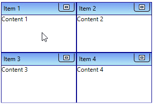
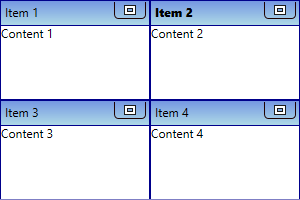
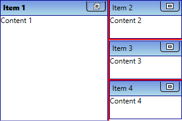
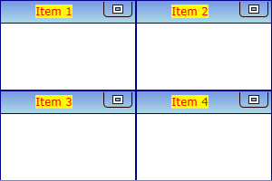
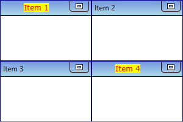
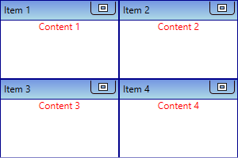
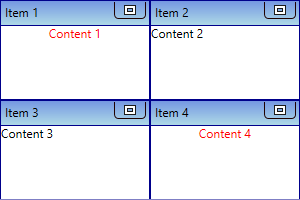

# Working with WPF TileViewControl

This section explains different UI customization and common features available in [TileViewControl](https://help.syncfusion.com/cr/cref_files/wpf/Syncfusion.Shared.Wpf~Syncfusion.Windows.Shared.TileViewControl.html) control.

## Populating items using TileViewItem

You can add the tileview items inside the control by adding the [TileViewItem](https://help.syncfusion.com/cr/cref_files/wpf/Syncfusion.Shared.Wpf~Syncfusion.Windows.Shared.TileViewItem.html) into the `TileViewControl.Items` collection property.




<syncfusion:TileViewControl Name="tileViewControl">
    <syncfusion:TileViewItem Content="Content 1" Header="Item 1" />
    <syncfusion:TileViewItem Content="Content 2" Header="Item 2" />
    <syncfusion:TileViewItem Content="Content 3" Header="Item 3" />
    <syncfusion:TileViewItem Content="Content 4" Header="Item 4" />
</syncfusion:TileViewControl>




TileViewControl tileViewControl = new TileViewControl();
tileViewControl.Items.Add(new TileViewItem() { Content="Content 1",
    Header = "Item 1" });
tileViewControl.Items.Add(new TileViewItem() { Content="Content 2",
    Header = "Item 2" });
tileViewControl.Items.Add(new TileViewItem() { Content="Content 3",
    Header = "Item 3" });
tileViewControl.Items.Add(new TileViewItem() { Content = "Content 4",
    Header = "Item 4" });




## Populating items using binding

You can populate items to the `TileView` control by setting the collection value to the `ItemsSource` property.

N> Please refer [Data Binding](https://help.syncfusion.com/wpf/tile-view/data-binding) page to know more details about binding support available in the `TileViewControl`.

## Select a TileViewItem

You can select any `TileViewItem` by mouse click on the specific `TileViewItem`. You can get the selected item by using the `SelectedItem` property. You can also get the selected value and its index by using the `SelectedValue` and `SelectedIndex` properties. The default value of `SelectedItem` property is `null`.

N> You can select only one item at a time.




<syncfusion:TileViewControl Name="tileViewControl">
    <syncfusion:TileViewItem Content="Content 1" Header="Item 1" />
    <syncfusion:TileViewItem Content="Content 2" Header="Item 2" />
    <syncfusion:TileViewItem Content="Content 3" Header="Item 3" />
    <syncfusion:TileViewItem Content="Content 4" Header="Item 4" />
</syncfusion:TileViewControl>




TileViewControl tileViewControl = new TileViewControl();
tileViewControl.Items.Add(new TileViewItem() { Content="Content 1",
    Header = "Item 1" });
tileViewControl.Items.Add(new TileViewItem() { Content="Content 2",
    Header = "Item 2" });
tileViewControl.Items.Add(new TileViewItem() { Content="Content 3",
    Header = "Item 3" });
tileViewControl.Items.Add(new TileViewItem() { Content = "Content 4",
    Header = "Item 4" });




### Select TileViewItem programmatically using property

You can select a particular `TileViewItem` programmatically by using the [TileViewItem.IsSelected](https://help.syncfusion.com/cr/cref_files/wpf/Syncfusion.Shared.Wpf~Syncfusion.Windows.Shared.TileViewItem~IsSelected.html) property.




<syncfusion:TileViewControl Name="tileViewControl">
    <syncfusion:TileViewItem Content="Content 1" Header="Item 1" />
    <syncfusion:TileViewItem IsSelected="True"
                             Content="Content 2" Header="Item 2" />
    <syncfusion:TileViewItem Content="Content 3" Header="Item 3" />
    <syncfusion:TileViewItem Content="Content 4" Header="Item 4" />
</syncfusion:TileViewControl>




TileViewControl tileViewControl = new TileViewControl();
tileViewControl.Items.Add(new TileViewItem() { Content="Content 1",
    Header = "Item 1" });
tileViewControl.Items.Add(new TileViewItem() { Content="Content 2",
    Header = "Item 2", IsSelected = true });
tileViewControl.Items.Add(new TileViewItem() { Content="Content 3",
    Header = "Item 3" });
tileViewControl.Items.Add(new TileViewItem() { Content = "Content 4",
    Header = "Item 4" });




## Selected item changed notification

The selected item changed in `TileViewControl` can be examined using `SelectionChanged` event. The `SelectionChanged` event contains the old and newly selected item in the `RemovedItems` and `AddedItems` properties.




<syncfusion:TileViewControl SelectionChanged="TileViewControl_SelectionChanged" 
                            Name="tileViewControl">
    <syncfusion:TileViewItem Content="Content 1" Header="Item 1" />
    <syncfusion:TileViewItem Content="Content 2" Header="Item 2" />
    <syncfusion:TileViewItem Content="Content 3" Header="Item 3" />
    <syncfusion:TileViewItem Content="Content 4" Header="Item 4" />
</syncfusion:TileViewControl>




tileViewControl.SelectionChanged += TileViewControl_SelectionChanged;




You can handle the event as follows,




private void TileViewControl_SelectionChanged(object sender, SelectionChangedEventArgs e) {
    //Get old and new selected TileView item
    var oldItem = e.RemovedItems;
    var newItem = e.AddedItems;
}




## Display TileViewItem splitter

If you want to display the splitter between maximized and each minimized items, use the [SplitterVisibility](https://help.syncfusion.com/cr/cref_files/wpf/Syncfusion.Shared.Wpf~Syncfusion.Windows.Shared.TileViewControl~SplitterVisibility.html) property value as `Visible`. You can also change the splitter color and thickness by using the [SplitterColor](https://help.syncfusion.com/cr/cref_files/wpf/Syncfusion.Shared.Wpf~Syncfusion.Windows.Shared.TileViewControl~SplitterColor.html)and [SplitterThickness](https://help.syncfusion.com/cr/cref_files/wpf/Syncfusion.Shared.Wpf~Syncfusion.Windows.Shared.TileViewControl~SplitterThickness.html) properties. The default value of `SplitterVisibility` is `Collapsed`, `SplitterColor` value is `Gray` and `SplitterThickness` value is `0`.




<syncfusion:TileViewControl SplitterColor="Red" 
                            SplitterThickness="2" 
                            SplitterVisibility="Visible"
                            Name="tileViewControl">
    <syncfusion:TileViewItem Content="Content 1" Header="Item 1" />
    <syncfusion:TileViewItem Content="Content 2" Header="Item 2" />
    <syncfusion:TileViewItem Content="Content 3" Header="Item 3" />
    <syncfusion:TileViewItem Content="Content 4" Header="Item 4" />
</syncfusion:TileViewControl>




tileViewControl.SplitterColor = Brushes.Red;
tileViewControl.SplitterThickness = 2;
tileViewControl.SplitterVisibility = Visibility.Visible;




## Custom UI of TileViewItem header

You can customize the appearance of `TileViewItem` headers by using the [HeaderTemplate](https://help.syncfusion.com/cr/cref_files/wpf/Syncfusion.Shared.Wpf~Syncfusion.Windows.Shared.TileViewControl~HeaderTemplate.html) property. The `DataContext` of the `HeaderTemplate` property is `TileViewItem.Header`.




<syncfusion:TileViewControl  Name="tileViewControl">
    <syncfusion:TileViewItem Header="Item 1" />
    <syncfusion:TileViewItem Header="Item 2" />
    <syncfusion:TileViewItem Header="Item 3" />
    <syncfusion:TileViewItem Header="Item 4" />
    <syncfusion:TileViewControl.HeaderTemplate>
        <DataTemplate x:Name="headerTemplate">
            <Grid>
                <TextBlock HorizontalAlignment="Center"
                           Text="{Binding}" 
                           FontFamily="Verdana"
                           Background="Yellow"
                           Foreground="Red"/>
            </Grid>
        </DataTemplate>
    </syncfusion:TileViewControl.HeaderTemplate>
</syncfusion:TileViewControl>




### Custom UI of specfic TileViewItem header

You can customize the appearance of specific `TileViewItem` headers by using the [TileViewItem.HeaderTemplate](https://help.syncfusion.com/cr/cref_files/wpf/Syncfusion.Shared.Wpf~Syncfusion.Windows.Shared.TileViewItem~HeaderTemplate.html) property. The `DataContext` of the `TileViewItem.HeaderTemplate` property is `TileViewItem.Header`.




<Window.Resources>
    <DataTemplate x:Key="headerTemplate">
        <Grid>
            <TextBlock HorizontalAlignment="Center"
                       Text="{Binding}" 
                       FontFamily="Verdana"
                       Background="Yellow"
                       Foreground="Red"/>
        </Grid>
    </DataTemplate>
</Window.Resources>
<Grid>
    <syncfusion:TileViewControl  Name="tileViewControl">
        <syncfusion:TileViewItem Header="Item 1" 
                                 HeaderTemplate="{StaticResource headerTemplate }" />
        <syncfusion:TileViewItem Header="Item 2" />
        <syncfusion:TileViewItem Header="Item 3" />
        <syncfusion:TileViewItem Header="Item 4" 
                                 HeaderTemplate="{StaticResource headerTemplate }" />
    </syncfusion:TileViewControl>
</Grid>



## Custom UI of TileViewItem content

You can customize the appearance of `TileViewItem` content by using the [ItemTemplate](https://help.syncfusion.com/cr/cref_files/wpf/Syncfusion.Shared.Wpf~Syncfusion.Windows.Shared.TileViewControl~ItemTemplate.html) property. The `DataContext` of the `ItemTemplate` property is `TileViewItem.Content`.




<Window.Resources>
    <DataTemplate x:Key="contentTemplate">
        <Grid>
            <TextBlock HorizontalAlignment="Center"
                       Text="{Binding}"
                       Foreground="Red"/>
        </Grid>
    </DataTemplate>
</Window.Resources>

<Grid>
    <syncfusion:TileViewControl ItemTemplate="{StaticResource contentTemplate}"
                                Name="tileViewControl">
        <syncfusion:TileViewItem Content="Content 1" Header="Item 1" />
        <syncfusion:TileViewItem Content="Content 2" Header="Item 2" />
        <syncfusion:TileViewItem Content="Content 3" Header="Item 3" />
        <syncfusion:TileViewItem Content="Content 4" Header="Item 4" />
    </syncfusion:TileViewControl>
</Grid>




### Custom UI of specfic TileViewItem content

You can customize the appearance of specific `TileViewItem` content by using the [TileViewItem.ContentTemplate](https://help.syncfusion.com/cr/cref_files/wpf/Syncfusion.Shared.Wpf~Syncfusion.Windows.Shared.TileViewItem~ContentTemplate.html) property. The `DataContext` of the `TileViewItem.ContentTemplate` property is `TileViewItem.Content`.




<Window.Resources>
    <DataTemplate x:Key="contentTemplate">
        <Grid>
            <TextBlock HorizontalAlignment="Center"
                       Text="{Binding}"
                       Foreground="Red"/>
        </Grid>
    </DataTemplate>
</Window.Resources>

<Grid>
    <syncfusion:TileViewControl Name="tileViewControl">
        <syncfusion:TileViewItem ContentTemplate="{StaticResource contentTemplate}"
                                 Content="Content 1" Header="Item 1" />
        <syncfusion:TileViewItem Content="Content 2" Header="Item 2" />
        <syncfusion:TileViewItem Content="Content 3" Header="Item 3" />
        <syncfusion:TileViewItem ContentTemplate="{StaticResource contentTemplate}"
                                 Content="Content 4" Header="Item 4" />
    </syncfusion:TileViewControl>
</Grid>




