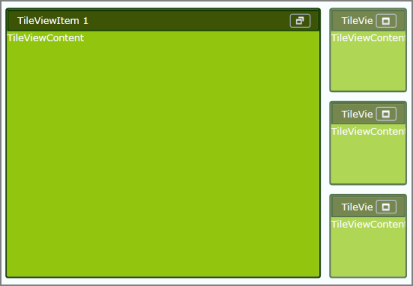

# Blendability Support

The TileViewControl includes the Blendability support that allows you to edit the control in Microsoft Expression Blend and apply their own styles for the control in place of predefined styles.

## Use Case Scenarios

The feature enables you to set own styles for the control.

## Adding Blendability Support to an Application 

The following are the step-by-step procedure to edit the TileViewControl in Microsoft Expression Blend.

1. Open a new WPF Project in Microsoft Expression Blend.
2. Include the required assembly to the application.
3. From the Toolbox and Controls sections, drag and drop the TileViewControl into the application.
4. Once the TileViewControl is drag and dropped, the window will look as shown below.

     

5. Once the TileViewControl is added to the application, the instance of TileViewControl will be added to the Object and the TimeLine window.
6. Right click the instance of the TileViewControl in the Object and TimeLine window and select “Edit Template” and then “Edit a copy” as shown below.

     

7. After clicking the “Edit a Copy” a new window, “Create Style Resource” will appear as shown below which asks for the Name of the Style. Give the style name and press OK.

     

8. Now edit the template and apply your own styles to the control. The sample application created using Microsoft Expression Blend will appear as shown below.

     

