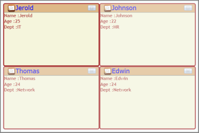

# Data Binding Support

Data Binding is the process of establishing a connection between the application UI and business logic. To bind the business object collection, [ItemSource](https://docs.microsoft.com/en-us/dotnet/api/system.windows.controls.itemscontrol.itemssource?view=netframework-4.7.2) and [ItemTemplate](https://docs.microsoft.com/en-us/dotnet/api/system.windows.controls.itemscontrol.itemtemplate?view=netframework-4.7.2) properties are used. You can bind the data object to any control and show them in the TileViewItem.

## Adding Data Binding to an Application 

Data Binding can be added to an application by using either XAML or C# code.

The following code example illustrates how to add the Data Binding to an application through XAML and C#.





<DataTemplate x:Name="header">

     <StackPanel Orientation="Horizontal">

         <Image Source="Images/messages.png"/>

         <TextBlock Text="{Binding Name}" FontFamily="Verdana" 

                    FontSize="18" Foreground="Blue"/>                      

     </StackPanel>

</DataTemplate>

<syncfusion:TileViewControl x:Name="TileView1" 

            ItemsSource="{Binding TileViewItemData, ElementName=Cont}"

            Width="600" Height="400"                          

            HeaderTemplate="{Binding Source={StaticResource header}}">        

            <syncfusion:TileViewControl.ItemTemplate>                

                <DataTemplate>            

                    <StackPanel Orientation="Vertical">

                      <StackPanel Orientation="Horizontal">

                        <TextBlock Text="Name :" FontFamily="Trebuchet MS" 

                                    Foreground="Brown" FontSize="14"/>

                        <TextBlock Text="{Binding Name}"/>

                      </StackPanel>

                      <StackPanel Orientation="Horizontal">

                        <TextBlock Text="Age :" FontFamily="Trebuchet MS" 

                                    Foreground="Brown" FontSize="14"/>

                        <TextBlock Text="{Binding Age}"/>

                      </StackPanel>

                      <StackPanel Orientation="Horizontal">

                        <TextBlock Text="Dept :" FontFamily="Trebuchet MS" 

                                   Foreground="Brown" FontSize="14"/>

                        <TextBlock Text="{Binding Dept}" />

                      </StackPanel>

                    </StackPanel>

                </DataTemplate>

            </syncfusion:TileViewControl.ItemTemplate>

        </syncfusion:TileViewControl>





public ObservableCollection<object> TileViewItemData

        {  get;  set;  }

TileViewItemData = new ObservableCollection<object>();

TileViewItemData.Add(new Data(){Name="Jerold", Age=25 , Dept="IT"});

TileViewItemData.Add(new Data(){Name = "Johnson", Age = 22,Dept = "HR" });

TileViewItemData.Add(new Data(){Name = "Thomas", Age = 24,Dept="Network"});

TileViewItemData.Add(new Data(){Name = "Edwin", Age = 24,Dept="Network"});

public class Data

{       

        public Data(){ }                

        public string Name { get; set; }

        public int Age  { get;  set; }

        public string Dept {  get; set; }       

}





## Sample Link

To view samples: 

1. Select Start -> Programs -> Syncfusion -> Essential Studio x.x.xx -> Dashboard.
2. Select Run Locally Installed Samples in WPF Button.
3. Now expand the DragAndDropManagerDemo tree-view item in the Sample Browser.
4. Choose any one of the samples listed under it to launch. 

