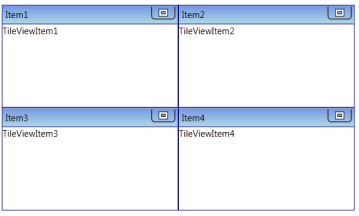

# Data Binding

The topics under this section explain the data binding support for the TileViewControl.

## Data-Binding to Objects

The TileViewControl supports binding to objects. The following code example illustrates this.

1. Create a class that act as a model for TileViewItem.

   ~~~ cs
     

      public class Model

      {

        public string Header { get; set; }

        public string Content { get; set; }

      }
   ~~~
   

2. Create a ViewModel class and initialize the items as follows:

   ~~~ cs
     

     public class ViewModel

    {

        public ObservableCollection<Model> TileItems { get; set; }

        public ViewModel()

        {

            TileItems = new ObservableCollection<Model>();

            PopulateData();

        }

        private void PopulateData()

        {

            Model model1 = new Model() { Header = "Item1", Content = "TileViewItem1" };

            Model model2 = new Model() { Header = "Item2", Content = "TileViewItem2" };

            Model model3 = new Model() { Header = "Item3", Content = "TileViewItem3" };

            Model model4 = new Model() { Header = "Item4", Content = "TileViewItem4" };           

            TileItems.Add(model1);

            TileItems.Add(model2);

            TileItems.Add(model3);

            TileItems.Add(model4);

        }

    }
   ~~~
   

3. Create a _ViewModel_ instance and use it as _DataContext_ for the root window.

   ~~~ xml
     

     <Window.DataContext>

      <local:ViewModel/>

     </Window.DataContext>
   ~~~
   

4. Configure the [ItemSource](https://docs.microsoft.com/en-us/dotnet/api/system.windows.controls.itemscontrol.itemssource?view=netframework-4.7.2) and _ItemContainerStyle_ of the TileViewControl.

   ~~~ xml
     

     <syncfusion:TileViewControl ItemsSource="{Binding TileItems}" >

            <syncfusion:TileViewControl.ItemContainerStyle>

                

            </syncfusion:TileViewControl.ItemContainerStyle>

        </syncfusion:TileViewControl>

   ~~~
   

This creates the following TileViewControl.

## Data-Binding with XML

An XML file can also be used as [ItemSource](https://docs.microsoft.com/en-us/dotnet/api/system.windows.controls.itemscontrol.itemssource?view=netframework-4.7.2) for the TileViewControl. The following example illustrates this.

1. Create an XML file with the following details and name it as Data.xml.

   ~~~ xml
     

     <?xml version="1.0" encoding="utf-8" ?>

     <Books>

     <Book Name="Programming C# 4.0" Description="Learn C# fundamentals, such as variables, flow control, loops, and methods"/>

     <Book Name="Programming WPF" Description="A tutorial on XAML, the new HTML-like markup language for declaring Windows UI"/>

     <Book Name="Essential WPF" Description="Visuals and media, including 2D, 3D, video, and animation"/>

     <Book Name="WPF Unleashed" Description="Examines the WPF feature areas in incredible depth: controls, layout, resources, data binding, styling, graphics, animation, and more"/>

     </Books>
   ~~~
   

2. Add _XmlDataProvider_ for the above XML document.

   ~~~ xml
     

     <XmlDataProvider Source="Data.xml" x:Key="xmlSource" XPath="Books"/> 

   ~~~
   

3. Set _ItemsSource_ property for the TileViewControl as follows.

   ~~~ xml
     

     <syncfusion:TileViewControl ItemsSource="{Binding Source={StaticResource xmlSource}, XPath=Book}"   >

            <syncfusion:TileViewControl.ItemContainerStyle>

                

            </syncfusion:TileViewControl.ItemContainerStyle>

     </syncfusion:TileViewControl>
   ~~~
   

This will create the following TileViewControl.

