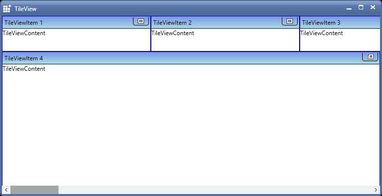

# Set the Visibility of the CloseButton

You can set the visibility of the CloseButton by using the CloseButtonVisibility property through C# as below. Refer to the detailed sample



      TileViewItem item1 = new TileViewItem();

      item1.CloseButtonVisibility = System.Windows.Visibility.Visible;



# Use Case of RowCount and ColumnCount in TileViewControl 

You can define the rows and columns value in TileViewControl using `RowCount` and `ColumnCount` properties.

<table>
<tr>
<th>
Property </th><th>
Description </th><th>
Data Type </th><th>
Usage</th><th>
<tr>
<td>
RowCount</td><td>
Gets or sets the TileViewControl row count.</td><td>
int</td><td>
Used to define number of rows to be shown in TileViewControl.</td><td>
<tr>
<td>
ColumnCount</td><td>
Gets or sets the TileViewControl column count.</td><td>
int</td><td>
Used to define number of columns to be shown in TileViewControl.</td><td>
</table>





<!-- TileViewControl -->
		
<syncfusion:TileViewControl x:Name="tile" RowCount="3" ColumnCount="4">

<syncfusion:TileViewItem Header="Item1"/>

<syncfusion:TileViewItem Header="Item2"/>

<syncfusion:TileViewItem Header="Item3"/>

<syncfusion:TileViewItem Header="Item4"/>

<syncfusion:TileViewItem Header="Item5"/>

<syncfusion:TileViewItem Header="Item6"/>

<syncfusion:TileViewItem Header="Item7"/>

<syncfusion:TileViewItem Header="Item8"/>

<syncfusion:TileViewItem Header="Item9"/>

<syncfusion:TileViewItem Header="Item10"/>

<syncfusion:TileViewItem Header="Item11"/>

<syncfusion:TileViewItem Header="Item12"/>

</syncfusion:TileViewControl>





//Define rows count

tile.RowCount = 3;

//Define Columns count 

tile.ColumnCount = 4; 





# How to set the same width and height for all TileViewItems 

User can set the same height and width for all rows in TileView control using the `RowHeight`,`ColumnWidth` property.

<table>
<tr>
<th>
Property </th><th>
Description </th><th>
Data Type </th><th>
Usage</th><th>
<tr>
<td>
RowHeight</td><td>
Gets or sets the height value for all TileViewItems in TileViewControl.</td><td>
GridLength</td><td>
All the TileViewitems are created in equal height.</td><td>
<tr>
<td>
ColumnWidth</td><td>
Gets or sets the width value for all TileViewItems in TileViewControl.</td><td>
GridLength</td><td>
All the TileViewitems are created in equal width.</td><td>
</table>





<!-- TileViewControl -->
		
<syncfusion:TileViewControl x:Name="tile" RowHeight="100" ColumnWidth="150">

<syncfusion:TileViewItem Header="Item1"/>

<syncfusion:TileViewItem Header="Item2"/>

<syncfusion:TileViewItem Header="Item3"/>

<syncfusion:TileViewItem Header="Item4"/>

</syncfusion:TileViewControl>





//Set the height for all TileViewItems
			
tile.RowHeight = new GridLength(100);

//Set the width for all TileViewItems

tile.ColumnWidth = new GridLength(150);





# How to set height and width for TileViewItems in minimized state

User can set the width and height for TileViewItems in minimized state using `OnMinimizedWidth` and `OnMinimizedHeight` properties of TileViewControl.

<table>
<tr>
<th>
Property </th><th>
Description </th><th>
Data Type </th><th>
Usage</th><th>
<tr>
<td>
OnMinimizedWidth</td><td>
Specifies the Width of the MinimizedTileViewItem.</td><td>
GridLength</td><td>
Used to set the width for TileViewItems in Minimized State.</td><td>
<tr>
<td>
OnMinimizedHeight</td><td>
Specifies the Height of the MinimizedTileViewItem.</td><td>
GridLength</td><td>
Used to set the height for TileViewItem in Minimized State.</td><td>
</table>





<!-- TileViewControl -->
		
<syncfusion:TileViewControl x:Name="tile" RowHeight="100" ColumnWidth="150">

<syncfusion:TileViewItem Header="Item1"/>

<syncfusion:TileViewItem Header="Item2"/>

<syncfusion:TileViewItem Header="Item3"/>

<syncfusion:TileViewItem Header="Item4"/>

</syncfusion:TileViewControl>





TileViewItem tile1 = new TileViewItem();
			
//Set height
			
tile1.OnMinimizedHeight = new GridLength(150);

//Set width

tile1.OnMinimizedWidth = new GridLength(300);





