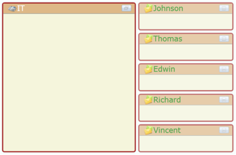

# MinimizedHeaderTemplate / MaximizedHeaderTemplate

The [MinimizedHeaderTemplate](https://help.syncfusion.com/cr/wpf/Syncfusion.Shared.Wpf~Syncfusion.Windows.Shared.TileViewControl~MinimizedHeaderTemplate.html) and [MaximizedHeaderTemplate](https://help.syncfusion.com/cr/wpf/Syncfusion.Shared.Wpf~Syncfusion.Windows.Shared.TileViewControl~MaximizedHeaderTemplate.html) feature in the TileViewControl enables you to set the different templates for header in the TileViewItem maximized state and TileViewItem minimized state. The HeaderTemplate property will be used to set the template for header in the TileViewItem Normal state. If you set the [MinimizedHeaderTemplate](https://help.syncfusion.com/cr/wpf/Syncfusion.Shared.Wpf~Syncfusion.Windows.Shared.TileViewControl~MinimizedHeaderTemplate.html), then the value in HeaderTemplate property will be displayed in maximized state and vice versa.

## Use Case Scenarios

This feature will be very useful when you want to show two different DataTemplates for header in minimized state and maximized state.

## Adding MinimizedHeaderTemplate / MaximizedHeaderTemplate to an Application 

The [MinimizedHeaderTemplate](https://help.syncfusion.com/cr/wpf/Syncfusion.Shared.Wpf~Syncfusion.Windows.Shared.TileViewControl~MinimizedHeaderTemplate.html) and [MaximizedHeaderTemplate](https://help.syncfusion.com/cr/wpf/Syncfusion.Shared.Wpf~Syncfusion.Windows.Shared.TileViewControl~MaximizedHeaderTemplate.html) can be added to an application by either using XAML or C# code.

The following code example illustrates how to add the [MinimizedHeaderTemplate](https://help.syncfusion.com/cr/wpf/Syncfusion.Shared.Wpf~Syncfusion.Windows.Shared.TileViewControl~MinimizedHeaderTemplate.html) and [MaximizedHeaderTemplate](https://help.syncfusion.com/cr/wpf/Syncfusion.Shared.Wpf~Syncfusion.Windows.Shared.TileViewControl~MaximizedHeaderTemplate.html) to an application through XAML.



<DataTemplate x:Name="NormalHeader">

     <StackPanel Orientation="Horizontal">

          <Image Source="Images/messages.png"/>

          <TextBlock Text="{Binding Name}" FontFamily="Verdana" 

                     FontSize="18" Foreground="Blue"/>                      

     </StackPanel>

</DataTemplate>

<DataTemplate x:Name="MinHeader">

     <StackPanel Orientation="Horizontal">

           <Image Source="Images/Email.png"/>

           <TextBlock Text="{Binding Name}" FontFamily="Verdana" 

                      FontSize="18" Foreground="Green" 

                      TextTrimming="WordEllipsis"/>                                        

     </StackPanel>

</DataTemplate>

<DataTemplate x:Name="MaxHeader">

     <StackPanel Orientation="Horizontal">

           <Image Source="Images/phonelist.png"/>

           <TextBlock Text="{Binding Dept}" FontFamily="Verdana" 

                      FontSize="18" Foreground="White"/>                    

     </StackPanel>

</DataTemplate>

<syncfusion:TileViewControl x:Name="TileView1" Width="600" Height="400"

     ItemsSource="{Binding TileViewItemData, ElementName=Tile}"

     MinimizedHeaderTemplate="{Binding Source={StaticResource MinHeader}}"                          

     MaximizedHeaderTemplate="{Binding Source={StaticResource MaxHeader}}" 

     HeaderTemplate="{Binding Source={StaticResource NormalHeader}}">  

</syncfusion:TileViewControl>


## Sample Link

To view samples: 

1. Select Start -> Programs -> Syncfusion -> Essential Studio x.x.xx -> Dashboard.
2. Select Run Locally Installed Samples in WPF Button.
3. Now expand the DragAndDropManagerDemo tree-view item in the Sample Browser.
4. Choose any one of the samples listed under it to launch. 

