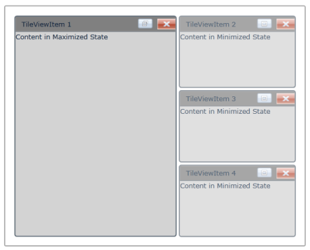

# MinimizedItemContent and MaximizedItemContent

The MinimizedItemContent and MaximizedItemContent feature in the TileViewItem enables you to set the different contents in TileViewItem maximized state and TileViewItem minimized state. The content property will be used to set the content for TileViewItem normal state. If you set the MinimizedItemContent, then the value in content property will be displayed in maximized state and vice versa.

## Use Case Scenarios

This feature will be very useful when you want to show two different contents in minimized state and maximized state.

## Adding MinimizedItemContent and MaximizedItemContent to an Application 

The MinimizedItemContent and MaximizedItemContent can be added to an application by using either XAML or C# code.

The following code example illustrates how to add the MinimizedItemContent and MaximizedItemContent to an application through XAML.



<syncfusion:TileViewControl x:Name="TileView1" Background="White">

     <syncfusion:TileViewItem BorderThickness="2" Header="TileViewItem 1" 

          MinimizedItemContent="Content in Minimized State" 

          MaximizedItemContent="Content in Maximized State"

          Content="Content in Normal State" CloseButtonVisibility="Visible" 

          Background="LightGray" HeaderBackground="Gray" Margin="2" 

          CornerRadius="3"/>

     <syncfusion:TileViewItem BorderThickness="2" Header="TileViewItem 2" 

          MinimizedItemContent="Content in Minimized State" 

          MaximizedItemContent="Content in Maximized State"

          Content="Content in Normal State" CloseButtonVisibility="Visible" 

          Background="LightGray" HeaderBackground="Gray" Margin="2" 

          CornerRadius="3"/>

     <syncfusion:TileViewItem BorderThickness="2" Header="TileViewItem 3" 

          MinimizedItemContent="Content in Minimized State" 

          MaximizedItemContent="Content in Maximized State"

          Content="Content in Normal State" CloseButtonVisibility="Visible" 

          Background="LightGray" HeaderBackground="Gray" Margin="2" 

          CornerRadius="3"/>

     <syncfusion:TileViewItem BorderThickness="2" Header="TileViewItem 4" 

          MinimizedItemContent="Content in Minimized State" 

          MaximizedItemContent="Content in Maximized State"

          Content="Content in Normal State" CloseButtonVisibility="Visible" 

          Background="LightGray" HeaderBackground="Gray" Margin="2" 

          CornerRadius="3"/>

</syncfusion:TileViewControl>



## Properties

<table>
<tr>
<th>
Property </th><th>
Description </th><th>
Type </th><th>
Data Type </th><th>
Reference links </th></tr>
<tr>
<td>
MinimizedItemContent</td><td>
Specifies the content that can be used to set when the TileViewItem is in Minimized state.</td><td>
DependencyProperty</td><td>
Object</td><td>
</td></tr>
<tr>
<td>
MaximizedItemContent </td><td>
Specifies the content that can be used to set when the TileViewItem is in Maximized state.</td><td>
DependencyProperty</td><td>
Object</td><td>
</td></tr>
</table>

## Sample Link

To view samples: 

1. Select Start -> Programs -> Syncfusion -> Essential Studio XX.X.X.XX -> Dashboard.
2. Select Run Locally Installed Samples in WPF Button.
3. Now expand the DragAndDropManagerDemo tree-view item in the Sample Browser.
4. Choose any one of the samples listed under it to launch. 

