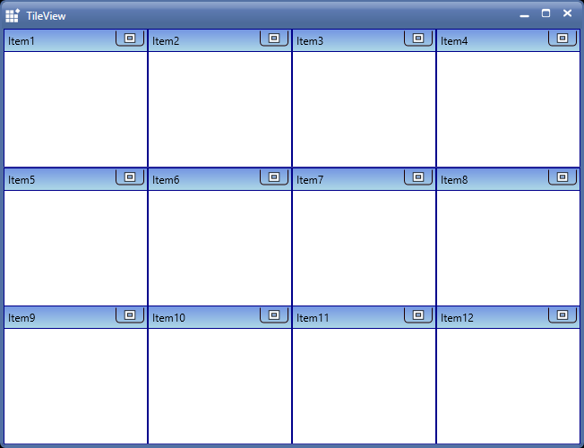
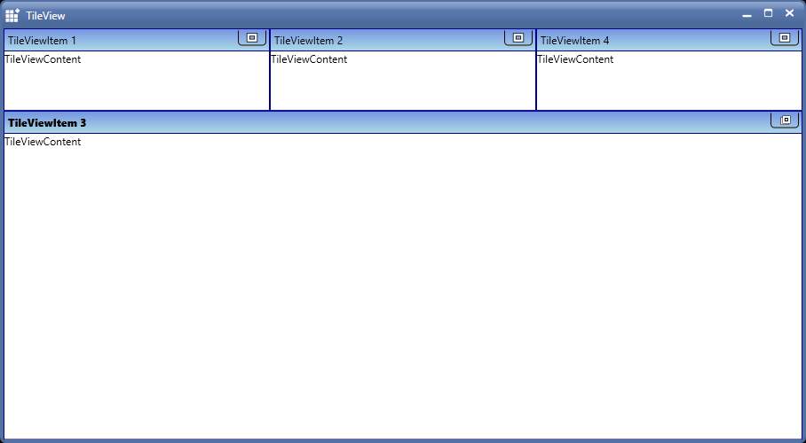

# Setting rows and columns count in TileViewControl

User can define the rows and columns value in TileViewControl using `RowCount` and `ColumnCount` properties.

<table>
<tr>
<th>
Property </th><th>
Description </th><th>
<tr>
<td>
RowCount</td><td>
Sets the row count in TileViewControl.</td><td>
<tr>
<td>
ColumnCount</td><td>
Sets the column count in TileViewControl.</td><td>
</table>





<!-- TileViewControl -->
                                
<syncfusion:TileViewControl x:Name="tile" RowCount="3" ColumnCount="4">

<syncfusion:TileViewItem Header="Item1"/>

<syncfusion:TileViewItem Header="Item2"/>

<syncfusion:TileViewItem Header="Item3"/>

<syncfusion:TileViewItem Header="Item4"/>

<syncfusion:TileViewItem Header="Item5"/>

<syncfusion:TileViewItem Header="Item6"/>

<syncfusion:TileViewItem Header="Item7"/>

<syncfusion:TileViewItem Header="Item8"/>

<syncfusion:TileViewItem Header="Item9"/>

<syncfusion:TileViewItem Header="Item10"/>

<syncfusion:TileViewItem Header="Item11"/>

<syncfusion:TileViewItem Header="Item12"/>

</syncfusion:TileViewControl>





//Define rows count

tile.RowCount = 3;

//Define Columns count 

tile.ColumnCount = 4; 





# Setting the TileViewItem size in normal state

User can set the size of TileViewItem in normal state by using `RowHeight` and `ColumnWidth` properties of TileViewControl.

<table>
<tr>
<th>
Property </th><th>
Description </th><th>
<tr>
<td>
RowHeight</td><td>
Sets the height of normal state TileViewItem.</td><td>
<tr>
<td>
ColumnWidth</td><td>
Sets the width of normal state TileViewItem.</td><td>
</table>





<!-- TileViewControl -->
                                
<syncfusion:TileViewControl x:Name="tile" RowHeight="100" ColumnWidth="150">

<syncfusion:TileViewItem Header="Item1"/>

<syncfusion:TileViewItem Header="Item2"/>

<syncfusion:TileViewItem Header="Item3"/>

<syncfusion:TileViewItem Header="Item4"/>

</syncfusion:TileViewControl>





//Set the height for all TileViewItems
                                                
tile.RowHeight = new GridLength(100);

//Set the width for all TileViewItems

tile.ColumnWidth = new GridLength(150);





# Setting the size of TileViewItem in minimized state

User can set the size of TileViewItem in minimized state by using `OnMinimizedWidth` and `OnMinimizedHeight` properties of TileViewControl.

<table>
<tr>
<th>
Property </th><th>
Description </th><th>
<tr>
<td>
OnMinimizedWidth</td><td>
Specifies the Width of the MinimizedTileViewItem.</td><td>
<tr>
<td>
OnMinimizedHeight</td><td>
Specifies the Height of the MinimizedTileViewItem.</td><td>
</table>





<!-- TileViewControl -->

<syncfusion:TileViewControl x:Name="tile"  RowHeight="200" ColumnWidth="200" MinimizedItemsOrientation="Top">
                                                
<syncfusion:TileViewItem Header="TileViewItem 1" Content="TileViewContent" OnMinimizedHeight="150" OnMinimizedWidth="300"/>
                                                
<syncfusion:TileViewItem Header="TileViewItem 2" Content="TileViewContent" OnMinimizedHeight="150" OnMinimizedWidth="300"/>
                                                
<syncfusion:TileViewItem Header="TileViewItem 3" Content="TileViewContent" OnMinimizedHeight="150" OnMinimizedWidth="300" />
                                                
<syncfusion:TileViewItem Header="TileViewItem 4" Content="TileViewContent" OnMinimizedHeight="150" OnMinimizedWidth="300"/>
                                
</syncfusion:TileViewControl>





TileViewItem tile1 = new TileViewItem();
                                                
//Set height
                                                
tile1.OnMinimizedHeight = new GridLength(150);

//Set width

tile1.OnMinimizedWidth = new GridLength(300);





