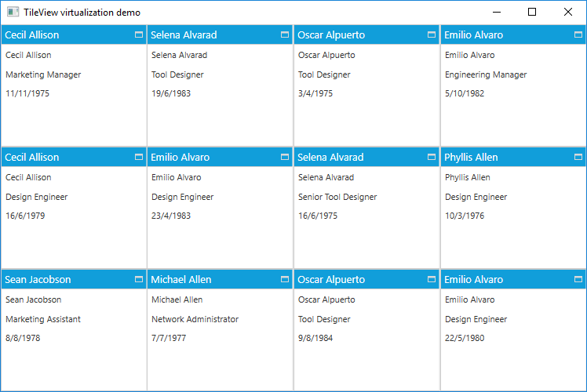

# TileView Virtualization 

The TileView control provides support to handle a large amount of data through built-in virtualization features. While virtualization is enabled, it maintains only the items in the view port of the TileView control, which speeds up the loading time. Virtualization support can be enabled by setting the [IsVirtualizing](https://help.syncfusion.com/cr/wpf/Syncfusion.Shared.Wpf~Syncfusion.Windows.Shared.TileViewControl~IsVirtualizing.html) property to true in the TileView control.

Once virtualization is enabled for the TileView control, it only creates item containers based on the [RowCount](https://help.syncfusion.com/cr/wpf/Syncfusion.Shared.Wpf~Syncfusion.Windows.Shared.TileViewControl~RowCount.html) and [ColumnCount](https://help.syncfusion.com/cr/wpf/Syncfusion.Shared.Wpf~Syncfusion.Windows.Shared.TileViewControl~ColumnCount.html). Further items are created on demand based on the mouse wheel or based on the scroll offset changed in the scroll viewer.





<syncfusion:TileViewControl  x:Name="TileView" ItemsSource="{Binding EmployeeDetails}" RowCount="3"  ColumnCount="4"  IsVirtualizing="True">
   <syncfusion:TileViewControl.ItemTemplate>
      <DataTemplate>
        <Grid>
           <StackPanel HorizontalAlignment="Left" VerticalAlignment="Top">
              <TextBlock Text="{Binding Name}" TextTrimming="WordEllipsis" Margin="5" FontSize="11" HorizontalAlignment="Left" ToolTip="{Binding Name}"/>
              <TextBlock Text="{Binding Title}" TextTrimming="WordEllipsis" Margin="5" FontSize="11" HorizontalAlignment="Left" ToolTip="{Binding Title}"/>
              <TextBlock Text="{Binding BirthDate}" TextTrimming="WordEllipsis" Margin="5" FontSize="11" HorizontalAlignment="Left" ToolTip="{Binding BirthDate}"/>
           </StackPanel>
        </Grid>
      </DataTemplate>
      </syncfusion:TileViewControl.ItemTemplate>
      <syncfusion:TileViewControl.HeaderTemplate>
         <DataTemplate>
            <TextBlock Text="{Binding Name}"/>
         </DataTemplate>
      </syncfusion:TileViewControl.HeaderTemplate>       
</syncfusion:TileViewControl>





TileView.IsVirtualizing = true;



  

**Model class**





public class NotificationObject : INotifyPropertyChanged
{
   public void RaisePropertyChanged(string propName)
   {
      if (this.PropertyChanged != null)
         this.PropertyChanged(this, new PropertyChangedEventArgs(propName));
   }
        
   public event PropertyChangedEventHandler PropertyChanged;
}

public class Employee : NotificationObject
{
   private string _Name;
   private string _Title;
   private string _BirthDate;
   private int _EmployeeID;

   public int EmployeeID
   {
      get { return this._EmployeeID; }
      set
      {
         this._EmployeeID = value;
         this.RaisePropertyChanged("EmployeeID");
      }
   }

   public string Name
   {
      get { return this._Name; }
      set
      {
         this._Name = value;
         this.RaisePropertyChanged("Name");
      }
   }

   public string Title
   {
      get { return this._Title; }
      set
      {
         this._Title = value;
         this.RaisePropertyChanged("Title");
      }
   }

   public String BirthDate
   {
      get { return this._BirthDate; }
      set
      {
         this._BirthDate = value;
         this.RaisePropertyChanged("BirthDate");
      }
   }
}



  

**ViewModel class**





public class ViewModel : NotificationObject
{
   private ObservableCollection<Employee> _employeeDetails = new ObservableCollection<Employee>();
   Random r = new Random();
   Dictionary<string, string> loginID = new Dictionary<string, string>();
   Dictionary<string, string> gender = new Dictionary<string, string>();

   #region Implementation

   public ViewModel()
   {
      PopulateData();
      _employeeDetails = GetEmployeesDetails(12);
   }

   public ObservableCollection<Employee> EmployeeDetails
   {
      get
      {
         return _employeeDetails;
      }
      set
      {
         _employeeDetails = value;
         RaisePropertyChanged("EmployeeDetails");
      }
   }
       
   public ObservableCollection<Employee> GetEmployeesDetails(int count)
   {
      var employees = new ObservableCollection<Employee>();
      for (var i = 1; i <= count; i++)
      {
         employees.Add(GetEmployee(i));
      }
      
      return employees;
   }

   public Employee GetEmployee(int i)
   {
      var name = employeeName[r.Next(employeeName.Count() - 1)];
      DateTime date = new DateTime(r.Next(1975, 1985), r.Next(1, 12), r.Next(1, 28));
      return new Employee()
      {
         EmployeeID = 1000 + i,
         Name = name,
         Title = title[r.Next(title.Count() - 1)],
         BirthDate = date.Day.ToString() + "/" + date.Month.ToString() + "/" + date.Year.ToString(),
      };
   }

   /// 

   /// Helps to populate the tile view items.
   /// 

   private void PopulateData()
   {
      gender.Add("Sean Jacobson", "Male");
      gender.Add("Phyllis Allen", "Male");
      gender.Add("Marvin Allen", "Male");
      gender.Add("Michael Allen", "Male");
      gender.Add("Cecil Allison", "Male");
      gender.Add("Oscar Alpuerto", "Male");
      gender.Add("Sandra Altamirano", "Female");
      gender.Add("Selena Alvarad", "Female");
      gender.Add("Emilio Alvaro", "Female");
      gender.Add("Maxwell Amland", "Male");

      loginID.Add("Sean Jacobson", "sean2");
      loginID.Add("Phyllis Allen", "phyllis0");
      loginID.Add("Marvin Allen", "marvin0");
      loginID.Add("Michael Allen", "michael10");
      loginID.Add("Cecil Allison", "cecil0");
      loginID.Add("Oscar Alpuerto", "oscar0");
      loginID.Add("Sandra Altamirano", "sandra1");
      loginID.Add("Selena Alvarad", "selena0");
      loginID.Add("Emilio Alvaro", "emilio0");
      loginID.Add("Maxwell Amland", "maxwell0");
   }

   private string[] title = new string[]
   {
      "Marketing Assistant",
      "Engineering Manager",
      "Senior Tool Designer",
      "Tool Designer",
      "Marketing Manager",
      "Design Engineer",
      "Design Engineer",
      "Network Administrator",
      "Human Resources Manager",
      "Stocker"
   };

   private string[] employeeName = new string[]
   {
      "Sean Jacobson",
      "Phyllis Allen",
      "Marvin Allen",
      "Michael Allen",
      "Cecil Allison",
      "Oscar Alpuerto",
      "Sandra Altamirano",
      "Selena Alvarad",
      "Emilio Alvaro",
      "Maxwell Amland"
   };

   #endregion
}



 

