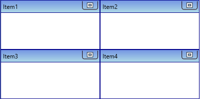
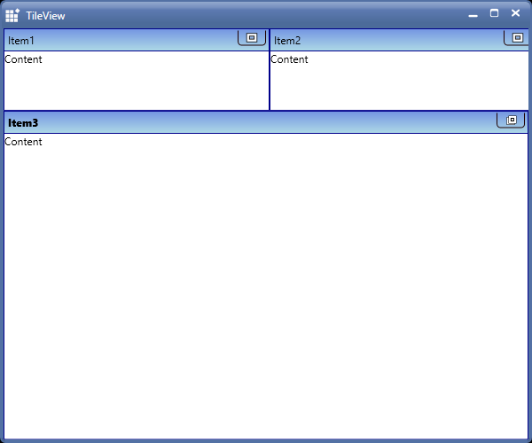

# Working with TileView

This section deals with essential features of TileViewControl, which are listed below:

* Row count and column count
* Setting the TileViewItem Size in Normal State
* Setting the Size of TileViewItem in Minimized State

## Row count and column count

The TileViewControl has [RowCount](https://help.syncfusion.com/cr/wpf/Syncfusion.Shared.Wpf~Syncfusion.Windows.Shared.TileViewControl~RowCount.html) and [ColumnCount](https://help.syncfusion.com/cr/wpf/Syncfusion.Shared.Wpf~Syncfusion.Windows.Shared.TileViewControl~ColumnCount.html) properties. These can be set to change the number of rows and columns in the TileViewControl, as shown below:





 <!-- TileViewControl -->

 <syncfusion:TileViewControl x:Name="tile"  RowCount="3" ColumnCount="3">

 <syncfusion:TileViewItem Header="Item1"/>

 <syncfusion:TileViewItem Header="Item2"/>

 <syncfusion:TileViewItem Header="Item3" />

 <syncfusion:TileViewItem Header="Item4"/>
			
 <syncfusion:TileViewItem Header="Item5"/>

 <syncfusion:TileViewItem Header="Item6"/>

 <syncfusion:TileViewItem Header="Item7" />

 <syncfusion:TileViewItem Header="Item8"/>

 <syncfusion:TileViewItem Header="Item9"/>
					
 </syncfusion:TileViewControl>





// Set Row count

tile.RowCount = 3;

// Set Column count

tile.ColumnCount = 3;





## Setting the TileViewItem Size in Normal State

You can change TileViewItem size in normal state by setting [RowHeight](https://help.syncfusion.com/cr/wpf/Syncfusion.Shared.Wpf~Syncfusion.Windows.Shared.TileViewControl~RowHeight.html) and [ColumnWidth](https://help.syncfusion.com/cr/wpf/Syncfusion.Shared.Wpf~Syncfusion.Windows.Shared.TileViewControl~ColumnWidth.html) properties.





 <!-- TileViewControl -->

 <syncfusion:TileViewControl x:Name="tile" RowHeight="100" ColumnWidth="150">

 <syncfusion:TileViewItem Header="Item1"/>

 <syncfusion:TileViewItem Header="Item2"/>

 <syncfusion:TileViewItem Header="Item3" />

 <syncfusion:TileViewItem Header="Item4"/>
			
 </syncfusion:TileViewControl>





 //Set the height 

 tile.RowHeight = new GridLength(100);

 //Set the width
 
 tile.ColumnWidth = new GridLength(150);





## Setting the Size of TileViewItem in Minimized State

You can change TileViewItem size in minimized state by setting [OnMinimizedHeight](https://help.syncfusion.com/cr/wpf/Syncfusion.Shared.Wpf~Syncfusion.Windows.Shared.TileViewItem~OnMinimizedHeight.html) and [OnMinimizedWidth](https://help.syncfusion.com/cr/wpf/Syncfusion.Shared.Wpf~Syncfusion.Windows.Shared.TileViewItem~OnMinimizedWidth.html) properties.





 <syncfusion:TileViewControl x:Name="tile"  RowHeight="200" ColumnWidth="200" MinimizedItemsOrientation="Top" >

 <syncfusion:TileViewItem Header="Item1" Content="Content" OnMinimizedHeight="150" OnMinimizedWidth="300"/>

 <syncfusion:TileViewItem Header="Item2" Content="Content" OnMinimizedHeight="150" OnMinimizedWidth="300"/>

 <syncfusion:TileViewItem Header="Item3" Content="Content" OnMinimizedHeight="150" OnMinimizedWidth="300" />

 <syncfusion:TileViewItem Header="Item4" Content="Content" OnMinimizedHeight="150" OnMinimizedWidth="300"/>

 </syncfusion:TileViewControl>





 TileViewItem tile1 = new TileViewItem();

 //Set height

 tile1.OnMinimizedHeight = new GridLength(150);
 
 //Set width

 tile1.OnMinimizedWidth = new GridLength(300);





