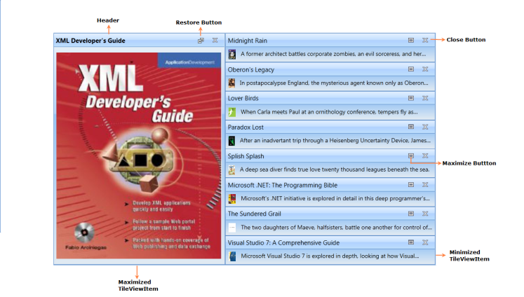
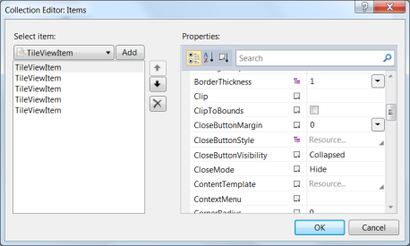

# Getting Started

## Structure of the TileViewControl

{  | markdownify }
{:.image }

## Creating the TileViewControl

The TileViewControl can be created through Visual Studio, Expression Blend, XAML, or C#. The following sections describe this.

### Through Visual Studio

The following are the steps to create the TileViewControl using Visual Studio.

1. Drag TileViewControl from the Toolbox and drop it in the Designer area. It will generate the TileViewControl. 

{  | markdownify }
{:.image }

2. To add items to the TileViewControl using the Collection Editor, select the TileViewControl and look at its properties.
3. Click the button in the Items property. This will open the Collection Editor.

{  | markdownify }
{:.image }

4.  Using the Collection Editor, add the GroupBarItems and configure their properties.
### Through Expression Blend

The TileViewControl can also be created and configured using Expression Blend. The following are the steps to do so.

1. Create a WPF project in Expression Blend and reference the following assemblies.
1. Syncfusion.Shared.Wpf
2. Syncfusion.Core
2. Search for TileViewControl in the Toolbox.

{  | markdownify }
{:.image }

3. Drag the TileViewControl to the designer. This will generate the control as follows.

{  | markdownify }
{:.image }

4. To add items to the TileViewControl using the Collection Editor, select TileViewControl and go to Properties.
5. Click Items (Collection) under Common Properties.

{  | markdownify }
{:.image }

6. Once the Collection Editor window opens, click Add another item. The Select Object window will open. 
7. Select TileViewItem by typing _TileViewItem_ in the search box, and then click OK.

{  | markdownify }
{:.image }

8. Configure the TileViewItem using the properties in the Collection Editor.

> _Note: You can customize the appearance of the TileViewControl and its Item using the template-editing feature available in the Expression Blend._

### Through XAML

The TileViewControl can also be created through XAML. The following code example illustrates this.

[XAML]

&lt;syncfusion:TileViewControl Name="tileViewControl1" &gt;

     &lt;syncfusion:TileViewItem Header="Item 1" /&gt;

     &lt;syncfusion:TileViewItem Header="Item 2" /&gt;

     &lt;syncfusion:TileViewItem Header="Item 3" /&gt;

     &lt;syncfusion:TileViewItem Header="Item 4" /&gt;

 &lt;/syncfusion:TileViewControl&gt;

### Through C#

To create the TileViewControl through C#, include the following namespace to the directives list.

[C#]

using Syncfusion.Windows.Shared;

Next, create the TileViewControl as follows.

[C#]

TileViewControl tvControl = new TileViewControl();

       TileViewItem tvitem1 = new TileViewItem() { Header = "Item 1" };

       TileViewItem tvitem2 = new TileViewItem() { Header = "Item 2" };

       TileViewItem tvitem3 = new TileViewItem() { Header = "Item 3" };

       TileViewItem tvitem4 = new TileViewItem() { Header = "Item 4" };

       tvControl.Items.Add(tvitem1);

       tvControl.Items.Add(tvitem2);

       tvControl.Items.Add(tvitem3);

       tvControl.Items.Add(tvitem4);

This will generate the following TileViewControl.

{  | markdownify }
{:.image }

