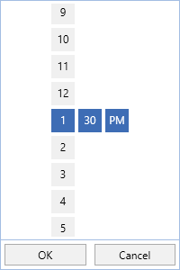
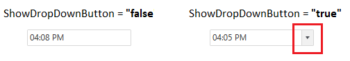

# Customizing DropDown in WPF SfTimePicker

We can customize the [SfTimeSelector](https://help.syncfusion.com/cr/wpf/Syncfusion.SfInput.Wpf~Syncfusion.Windows.Controls.Input.SfTimeSelector.html) visibility, drop down button visibility and height of the `SfTimeSelector`.

## Change DropDown height

The height of drop down can be changed using [DropDownHeight](https://help.syncfusion.com/cr/wpf/Syncfusion.SfInput.Wpf~Syncfusion.Windows.Controls.Input.SfTimePicker~DropDownHeight.html) property.




<syncfusion:SfTimePicker DropDownHeight="300"
                         Name="sfTimePicker"/>




SfTimePicker sfTimePicker = new SfTimePicker();
sfTimePicker.DropDownHeight = 300;




## Show or hide DropDown button

If we want to restrict the user to selecting a time from a drop down time selector, we can hide the drop down button by using the [ShowDropDownButton](https://help.syncfusion.com/cr/wpf/Syncfusion.SfInput.Wpf~Syncfusion.Windows.Controls.Input.SfTimePicker~ShowDropDownButton.html) property value as `false`. The default value of `ShowDropDownButton` property is `true`.




<syncfusion:SfTimePicker ShowDropDownButton="False"
                         Name="sfTimePicker"/>




SfTimePicker sfTimePicker = new SfTimePicker();
sfTimePicker.ShowDropDownButton = false;




Click [here](https://github.com/SyncfusionExamples/wpf-time-picker-examples/tree/master/Samples/TimeSelectorItem) to download the sample that showcases the DropDown customization support.