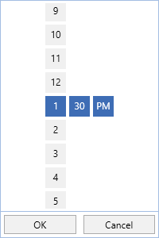
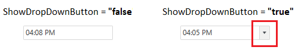

# Customizing DropDown in WPF TimePicker

We can customize the [SfTimeSelector](https://help.syncfusion.com/cr/wpf/Syncfusion.Windows.Controls.Input.SfTimeSelector.html) visibility, drop-down button visibility and height of the `SfTimeSelector`.

## Change DropDown height

The height of drop-down can be changed using [DropDownHeight](https://help.syncfusion.com/cr/wpf/Syncfusion.Windows.Controls.Input.SfTimePicker.html#Syncfusion_Windows_Controls_Input_SfTimePicker_DropDownHeight) property.




<Window 
    . . .
    xmlns:syncfusion="http://schemas.syncfusion.com/wpf">
    <syncfusion:SfTimePicker DropDownHeight="300"
                         Name="sfTimePicker"/>
</Window>



using Syncfusion.Windows.Controls.Input;

SfTimePicker sfTimePicker = new SfTimePicker();
sfTimePicker.DropDownHeight = 300;




## Show or hide DropDown button

If we want to restrict the user from selecting a time from a drop-down time selector, we can hide the drop-down button by using the [ShowDropDownButton](https://help.syncfusion.com/cr/wpf/Syncfusion.Windows.Controls.Input.SfTimePicker.html#Syncfusion_Windows_Controls_Input_SfTimePicker_ShowDropDownButton) property value as `false`. The default value of `ShowDropDownButton` property is `true`.




<Window 
    . . .
    xmlns:syncfusion="http://schemas.syncfusion.com/wpf">
    <syncfusion:SfTimePicker ShowDropDownButton="False"
                         Name="sfTimePicker"/>
</Window>



using Syncfusion.Windows.Controls.Input;

SfTimePicker sfTimePicker = new SfTimePicker();
sfTimePicker.ShowDropDownButton = false;




Click [here](https://github.com/SyncfusionExamples/wpf-time-picker-examples/tree/master/Samples/TimeSelectorItem) to download the sample that showcases the DropDown customization support.
