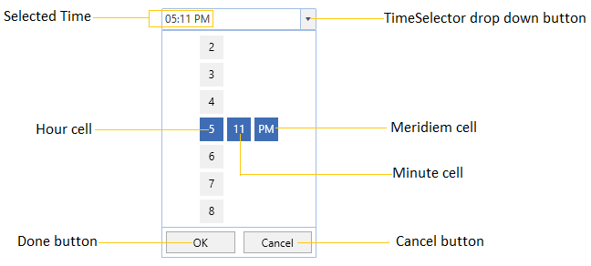
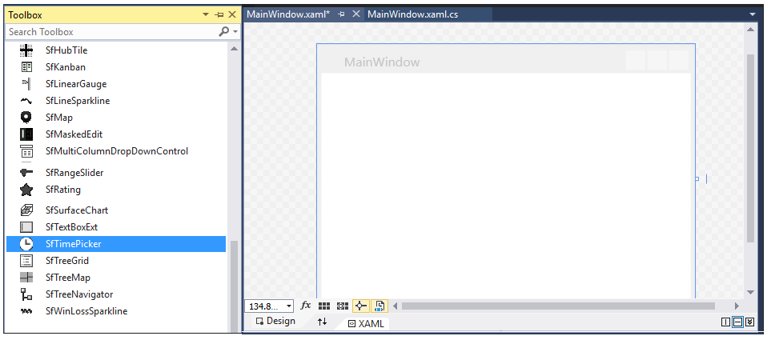
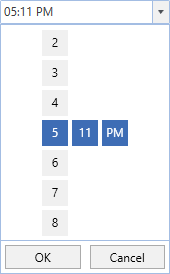
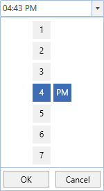

# Getting Started with WPF SfTimePicker

This section explains how to create a WPF [SfTimePicker](https://help.syncfusion.com/cr/wpf/Syncfusion.Windows.Controls.Input.SfTimePicker.html) and explains about its structure.

## Structure of SfTimePicker

## Assembly deployment

Refer to the [control dependencies](https://help.syncfusion.com/wpf/control-dependencies#sftimepicker) section to get the list of assemblies or NuGet package that needs to be added as a reference to use the control in any application.

You can find more details about installing the NuGet package in a WPF application in the following link: 

[How to install nuget packages](https://help.syncfusion.com/wpf/nuget-packages)

## Add control through designer

The `SfTimePicker` control can be added to an application by dragging it from the toolbox to a designer view. The following required assembly references will be added automatically:

* Syncfusion.SfInput.WPF
* Syncfusion.SfShared.WPF

## Adding control manually in XAML

To add the control manually in XAML, follow the given steps:

1.	Add the following required assembly references to the project:
    * Syncfusion.SfInput.WPF
    * Syncfusion.SfShared.WPF
2.	Import Syncfusion WPF schema **http://schemas.syncfusion.com/wpf** in the XAML page.
3.	Declare the `SfTimePicker` control in the XAML page.




<Window xmlns="http://schemas.microsoft.com/winfx/2006/xaml/presentation"
        xmlns:x="http://schemas.microsoft.com/winfx/2006/xaml"
        xmlns:syncfusion="http://schemas.syncfusion.com/wpf" 
        x:Class="SfTimePickerSample.MainWindow"
        Title="SfTimePicker Sample" Height="350" Width="525">
    <Grid>
        <!-- Adding SfTimePicker control -->
        <syncfusion:SfTimePicker x:Name="sfTimePicker" 
                                 Width="200"/>
    </Grid>
</Window>




## Add control manually in C\#

To add the control manually in C#, follow the given steps:

1.	Add the following required assembly references to the project:
    * Syncfusion.SfInput.WPF
    * Syncfusion.SfShared.WPF
2.	Import the `SfTimePicker` namespace **using Syncfusion.Windows.Controls.Input;**.
3.	Create an `SfTimePicker` instance, and add it to the window.




using Syncfusion.Windows.Controls.Input;
namespace SfTimePickerSample {    
    public partial class MainWindow : Window {
        public MainWindow() {
            InitializeComponent();

            //Creating an instance of SfTimePicker control
            SfTimePicker sfTimePicker = new SfTimePicker();

            //Adding SfTimePicker as window content
            this.Content = sfTimePicker;
        } 
    }
}




## Setting the time

We can set or change the selected time by using [Value](https://help.syncfusion.com/cr/wpf/Syncfusion.Windows.Controls.Input.SfTimePicker.html#Syncfusion_Windows_Controls_Input_SfTimePicker_Value) property. If we not assign any value for the `Value` property, it will automatically assign the current system time as `Value` property value.




<syncfusion:SfTimePicker  Value="04:45:00"
                          Name="sfTimePicker" />




SfTimePicker sfTimePicker= new SfTimePicker();
sfTimePicker.Value = new TimeSpan(04, 45, 00);




## Time changed notification

When the selected time of `SfTimePicker`is changed, it will be notified by using the [ValueChanged](https://help.syncfusion.com/cr/wpf/Syncfusion.Windows.Controls.Input.SfTimePicker.html) event. You can get the details about the checked item in [ItemCheckedEventArgs](https://help.syncfusion.com/cr/wpf/Syncfusion.Windows.Tools.Controls.ItemCheckedEventArgs.html).

* **OldValue** : Gets a time which is previously selected.

* **NewValue** : Gets a time which is currently selected.




<syncfusion:SfTimePicker ValueChanged="SftimePicker_ValueChanged" 
                         Name="sfTimePicker"/>




SfTimePicker sfTimePicker = new SfTimePicker();
sfTimePicker.ValueChanged += SftimePicker_ValueChanged;




You can handle the event as follows:




private void SftimePicker_ValueChanged(DependencyObject d, DependencyPropertyChangedEventArgs e) {          
    Console.WriteLine("The Old selected time: " + e.OldValue.ToString());
    Console.WriteLine("The Newly selected time: " + e.NewValue.ToString());            
}




## Display the time using the FormatString

 We can edit and display the selected time with various formatting like short time, long time, universal time and 24 hour time formats by using the [FormatString](https://help.syncfusion.com/cr/wpf/Syncfusion.Windows.Controls.Input.SfTimePicker.html#Syncfusion_Windows_Controls_Input_SfTimePicker_FormatString) property. The default value of `FormatString` property is `"h:mm tt"`.




<syncfusion:SfTimePicker x:Name="sfTimePicker" 
                         FormatString="HH:mm:ss"/>




SfTimePicker sfTimePicker = new SfTimePicker();
sfTimePicker.FormatString = "HH:mm:ss";




Here, `SfTimePicker` with 24 hour time format

## Specifying format for the TimeSelector

We can allow the user to select the pair of hour, minutes, seconds and meridiem selector or any single selector cell from the [SfTimeSelector](https://help.syncfusion.com/cr/wpf/Syncfusion.Windows.Controls.Input.SfTimeSelector.html) by using the [SelectorFormatString](https://help.syncfusion.com/cr/wpf/Syncfusion.Windows.Controls.Input.SfTimePicker.html#Syncfusion_Windows_Controls_Input_SfTimePicker_SelectorFormatString) property.  The default value of `SelectorFormatString` property is `"h:mm tt"` and the hour, minutes and meridiem value selector is enabled in the `SfTimeSelector`.




<syncfusion:SfTimePicker x:Name="sfTimePicker" 
                         SelectorFormatString="h/t"/>




SfTimePicker sfTimePicker = new SfTimePicker();
sfTimePicker.SelectorFormatString = "h/t";




Here, the `SfTimeSelector` with only hour and meridiem value selector.

Click [here](https://github.com/SyncfusionExamples/wpf-time-picker-examples/tree/master/Samples/Formatting) to download the sample that showcases the edit, display time formatting and time selection formatting by the `SfTimePicker`.

## Set selected value on lost focus

If we want to update the selected time of `SfTimeSelector` to the `SfTimeSelector.Value` property by moving the focus from `SfTimeSelector` to anywhere, use the [SetValueOnLostFocus](https://help.syncfusion.com/cr/wpf/Syncfusion.Windows.Controls.Input.SfTimePicker.html#Syncfusion_Windows_Controls_Input_SfTimePicker_SetValueOnLostFocus) property value as `true`. By default, the selected time of `SfTimeSelector` can be sets to the `SfTimeSelector.Value` property only by clicking the `OK` button, otherwise the selected value not updated by the move focus.




<syncfusion:SfTimePicker  SetValueOnLostFocus="True" 
                          Name="sfTimePicker" />




SfTimePicker sfTimePicker= new SfTimePicker();
sfTimePicker.SetValueOnLostFocus = true;




Click [here](https://github.com/SyncfusionExamples/wpf-time-picker-examples/tree/master/Samples/Value-setting) to download the sample that showcases the value setting support in the `SfTimePicker`.
