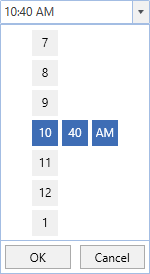

# WPF TimePicker (SfTimePicker) Overview

The [SfTimePicker](https://help.syncfusion.com/cr/wpf/Syncfusion.Windows.Controls.Input.SfTimePicker.html) control allows the user to select time values in a touch friendly manner.

### Normal view:

### Expanded view:

### Key Features

Formatting – The Control displays  the selected time value in a various formats.

Time Selector – The drop-down portion used for selecting the time can be customized.
