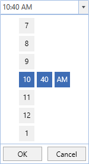

# About Syncfusion® WPF TimePicker Control

The [SfTimePicker](https://help.syncfusion.com/cr/wpf/Syncfusion.Windows.Controls.Input.SfTimePicker.html) control allows the user to select time values in a touch friendly manner.

## Normal view:

## Expanded view:

## Key Features

* **Formatting** – The control displays the selected time value in various formats.

* **Time Selector** – The drop-down portion used for selecting the time can be customized.
