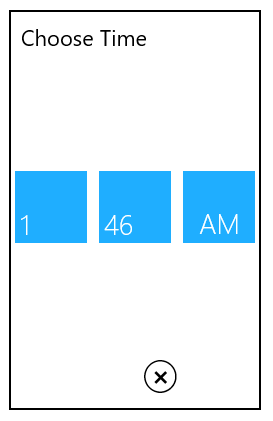

# Setting Time in WPF TimePicker (SfTimePicker)

We can change the value of [SfTimePicker](https://help.syncfusion.com/cr/wpf/Syncfusion.Windows.Controls.Input.SfTimePicker.html) by using the [SfTimeSelector](https://help.syncfusion.com/cr/wpf/Syncfusion.Windows.Controls.Input.SfTimeSelector.html) and keyboard interaction.

## Setting Time using property

We can set or change the selected time by using [Value](https://help.syncfusion.com/cr/wpf/Syncfusion.Windows.Controls.Input.SfTimePicker.html#Syncfusion_Windows_Controls_Input_SfTimePicker_Value) property. If we not assign any value for the `Value` property, it will automatically assign the current system time as `Value` property value.




<syncfusion:SfTimePicker  Value="04:45:00"
                          Name="sfTimePicker" />




SfTimePicker sfTimePicker= new SfTimePicker();
sfTimePicker.Value = new TimeSpan(04, 45, 00);




## Setting Null Value

If we want to set null value for the `SfTimePicker`, set the [AllowNull](https://help.syncfusion.com/cr/wpf/Syncfusion.Windows.Controls.Input.SfTimePicker.html#Syncfusion_Windows_Controls_Input_SfTimePicker_AllowNull) property as `true` and [Value](https://help.syncfusion.com/cr/wpf/Syncfusion.Windows.Controls.Input.SfTimePicker.html#Syncfusion_Windows_Controls_Input_SfTimePicker_Value) property as `null`. If `AllowNull` property is `false`, then the current system time is updated in `Value` property and displayed instead of `null`. 




<syncfusion:SfTimePicker  AllowNull="True" 
                          Value="{x:Null}"
                          Name="sfTimePicker" />




SfTimePicker sfTimePicker= new SfTimePicker();
sfTimePicker.AllowNull = true;
sfTimePicker.Value = null;




## Setting WaterMark text

We can prompt the user with some information by using the [Watermark](https://help.syncfusion.com/cr/wpf/Syncfusion.Windows.Controls.Input.SfTimePicker.html#Syncfusion_Windows_Controls_Input_SfTimePicker_Watermark) property. This will apply on when the `SfTimePicker` contains the [Value](https://help.syncfusion.com/cr/wpf/Syncfusion.Windows.Controls.Input.SfTimePicker.html#Syncfusion_Windows_Controls_Input_SfTimePicker_Value) property as `null` and [AllowNull](https://help.syncfusion.com/cr/wpf/Syncfusion.Windows.Controls.Input.SfTimePicker.html#Syncfusion_Windows_Controls_Input_SfTimePicker_AllowNull) property as `true`.  If `AllowNull` property is `false`, then the current system time is updated in  `Value` property and displayed instead of `Watermark` text.




<syncfusion:SfTimePicker Watermark="Select the Time"
                         AllowNull="True"  
                         Value="{x:Null}"
                         Name="sfTimePicker" >
</syncfusion:SfTimePicker>




SfTimePicker sfTimePicker = new SfTimePicker();
sfTimePicker.Watermark = "Select the Time";
sfTimePicker.AllowNull = true;
sfTimePicker.Value = null;




### Setting WaterMark Template

We can change the template of the `Watermark` by using the [WatermarkTemplate](https://help.syncfusion.com/cr/wpf/Syncfusion.Windows.Controls.Input.SfTimePicker.html#Syncfusion_Windows_Controls_Input_SfTimePicker_WatermarkTemplate) property.




<syncfusion:SfTimePicker Name="sfTimePicker" 
                         AllowNull="True" 
                         Value="{x:Null}" 
                         Watermark="Select the Time" >
    <syncfusion:SfTimePicker.WatermarkTemplate >
        <DataTemplate>
            <Border Background="Yellow">
                <TextBlock Foreground="Blue"
                           FontWeight="Bold"  
                           Text="{Binding}" 
                           TextAlignment="Center"/>
            </Border>
        </DataTemplate>
    </syncfusion:SfTimePicker.WatermarkTemplate>
</syncfusion:SfTimePicker>




## Set selected value on lost focus

If we want to update the selected time of `SfTimeSelector` to the `SfTimeSelector.Value` property by moving the focus from `SfTimeSelector` to anywhere, use the [SetValueOnLostFocus](https://help.syncfusion.com/cr/wpf/Syncfusion.Windows.Controls.Input.SfTimePicker.html#Syncfusion_Windows_Controls_Input_SfTimePicker_SetValueOnLostFocus) property value as `true`. By default, the selected time of `SfTimeSelector` can be sets to the `SfTimeSelector.Value` property only by clicking the `OK` button, otherwise the selected value not updated by the move focus.




<syncfusion:SfTimePicker  SetValueOnLostFocus="True"
                          Name="sfTimePicker" />




SfTimePicker sfTimePicker= new SfTimePicker();
sfTimePicker.SetValueOnLostFocus = true;




## Setting the time using editing

If we want to perform the validation after the user completely entering their time inputs, use the [AllowInlineEditing](https://help.syncfusion.com/cr/wpf/Syncfusion.Windows.Controls.Input.SfTimePicker.html#Syncfusion_Windows_Controls_Input_SfTimePicker_AllowInlineEditing) property value as `true`. Then the entered time value is validated with the [FormatString](https://help.syncfusion.com/cr/wpf/Syncfusion.Windows.Controls.Input.SfTimePicker.html#Syncfusion_Windows_Controls_Input_SfTimePicker_FormatString) property value by pressing the `Enter` key or lost focus. If entered value is not suit with `FormatString` property, the selected time will be set as default format value.

By default, the user entering each input numbers are automatically validated with the `FormatString` formats and assigned the proper value for it, then it will move to next input part of the time format.




<syncfusion:SfTimePicker Name="sfTimePicker" 
                         AllowInlineEditing="True" />




SfTimePicker sfTimePicker= new SfDatePicker();
sfTimePicker.AllowInlineEditing = true;




## Setting the Input Scope for the On-Screen Keyboard

We can change the input type of the on-screen keyboard by using the [InputScope](https://help.syncfusion.com/cr/wpf/Syncfusion.Windows.Controls.Input.SfTimePicker.html#Syncfusion_Windows_Controls_Input_SfTimePicker_InputScope) property. When the `InputScope` property set to `Number`, only the numeric keypad will be visible in the on-screen keyboard.

N> The [AllowInlineEditing](https://help.syncfusion.com/cr/wpf/Syncfusion.Windows.Controls.Input.SfTimePicker.html#Syncfusion_Windows_Controls_Input_SfTimePicker_AllowInlineEditing) property must be set to `True` for this property to take effect.




<syncfusion:SfTimePicker Name="sfTimePicker" 
                         AllowInlineEditing="True" 
                         InputScope="Time"/>




SfTimePicker sfTimePicker= new SfTimePicker();
sfTimePicker.AllowInlineEditing = true;
sfTimePicker.InputScope = InputScopeNameValue.Time;




## Restrict selecting time limit

we can restrict the user to select a time in the specific time limit by setting the value for the [MinTime](https://help.syncfusion.com/cr/wpf/Syncfusion.Windows.Controls.Input.SfTimePicker.html#Syncfusion_Windows_Controls_Input_SfTimePicker_MinTime) and [MinTime](https://help.syncfusion.com/cr/wpf/Syncfusion.Windows.Controls.Input.SfTimePicker.html#Syncfusion_Windows_Controls_Input_SfTimePicker_MaxTime) properties.  If we assign the value for the `Value` property lower than `MinTime`, then `MinTime` will be the selected time. If we assign the value for the `Value` property higher than `MinTime`, then `MinTime` will be the selected time.




<syncfusion:SfTimePicker MinTime="07:00:00"
                         MaxTime="09:00:00" 
                         Name="sfTimePicker"/>




SfTimePicker sfTimePicker = new SfTimePicker();
sfTimePicker.MinTime = new TimeSpan(07,00,00);
sfTimePicker.MaxTime = new TimeSpan(09,00,00);




Here, the users can select the hour from 7 to 9 only. 

## Time changed notification

When the selected time of `SfTimePicker`is changed, it will be notified by using the [ValueChanged](https://help.syncfusion.com/cr/wpf/Syncfusion.Windows.Controls.Input.SfTimePicker.html) event. You can get the details about the checked item in [ItemCheckedEventArgs](https://help.syncfusion.com/cr/wpf/Syncfusion.Windows.Tools.Controls.ItemCheckedEventArgs.html).

* **OldValue** : Gets a time which is previously selected.

* **NewValue** : Gets a time which is currently selected.




<syncfusion:SfTimePicker ValueChanged="SftimePicker_ValueChanged" 
                         Name="sfTimePicker"/>




SfTimePicker sfTimePicker = new SfTimePicker();
sfTimePicker.ValueChanged += SftimePicker_ValueChanged;




You can handle the event as follows:




private void SftimePicker_ValueChanged(DependencyObject d, DependencyPropertyChangedEventArgs e) {          
    Console.WriteLine("The Old selected time: " + e.OldValue.ToString());
    Console.WriteLine("The Newly selected time: " + e.NewValue.ToString());            
}




Click [here](https://github.com/SyncfusionExamples/wpf-time-picker-examples/tree/master/Samples/Value-setting) to download the sample that showcases the input types and selected time with its notification supports.
