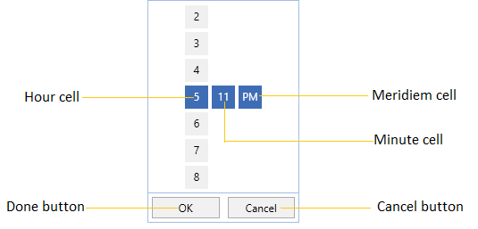
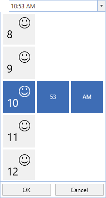
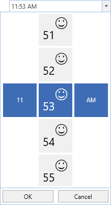
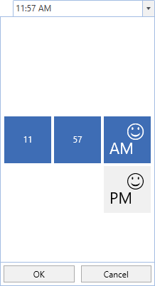
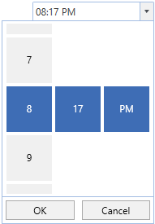
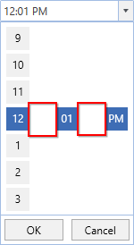

# Time Selector in WPF TimePicker (SfTimePicker)

The [SfTimeSelector](https://help.syncfusion.com/cr/wpf/Syncfusion.Windows.Controls.Input.SfTimeSelector.html) is a sub-control of [SfTimePicker](https://help.syncfusion.com/cr/wpf/Syncfusion.Windows.Controls.Input.SfTimePicker.html) which opens inside the drop-down popup and used to select the time for the `SfTimePicker`. It contains the hour, minutes and meridiem selection cells for select the time. The selected time of the `SfTimeSelector` is assigned to the [SfTimePicker.Value](https://help.syncfusion.com/cr/wpf/Syncfusion.Windows.Controls.Input.SfTimeSelector.html) property. 

The visual elements of the time selector can be customized using the [SelectorStyle](https://help.syncfusion.com/cr/wpf/Syncfusion.Windows.Controls.Input.SfTimePicker.html#Syncfusion_Windows_Controls_Input_SfTimePicker_SelectorStyle) property.

## Change the Cell templates

We can changes the template for the each hour, minute or meridiem selector by using the `HourCellTemplate`,  `MinuteCellTemplate` or `MeridiemCellTemplate` which are available in the `SfTimeSelector`.

N> The DataContext of Hour, Minute, Meridiem Selection cell is [DateTimeWrapper](https://help.syncfusion.com/cr/wpf/Syncfusion.Windows.Primitives.DateTimeWrapper.html).

## Change the HourCell Template

We can change the hour selector template by using the [HourCellTemplate](https://help.syncfusion.com/cr/wpf/Syncfusion.Windows.Controls.Input.SfTimeSelector.html#Syncfusion_Windows_Controls_Input_SfTimeSelector_HourCellTemplate) property. In that, we can add like image, icon or text with the hour values.



<syncfusion:SfTimePicker DropDownHeight="380" 
                         SelectorItemHeight="70" 
                         SelectorItemWidth="70" 
                         Width="200"
                         Name="sfTimePicker">

    <syncfusion:SfTimePicker.SelectorStyle>
        
    </syncfusion:SfTimePicker.SelectorStyle>
</syncfusion:SfTimePicker>



## Change the MinuteCell Template

We can change the minute selector template by using the [MinuteCellTemplate](https://help.syncfusion.com/cr/wpf/Syncfusion.Windows.Controls.Input.SfTimeSelector.html#Syncfusion_Windows_Controls_Input_SfTimeSelector_MinuteCellTemplate) property. In that, we can add like image, icon or text with the minute values.



<syncfusion:SfTimePicker DropDownHeight="380" 
                         SelectorItemHeight="70" 
                         SelectorItemWidth="70"
                         Width="200"
                         Name="sfTimePicker">

    <syncfusion:SfTimePicker.SelectorStyle>
        
    </syncfusion:SfTimePicker.SelectorStyle>
</syncfusion:SfTimePicker>



## Change the MeridiemCell Template

We can change the meridiem selector template by using the [MeridiemCellTemplate](https://help.syncfusion.com/cr/wpf/Syncfusion.Windows.Controls.Input.SfTimeSelector.html#Syncfusion_Windows_Controls_Input_SfTimeSelector_MeridiemCellTemplate) property.In that, we can add like image, icon or text with the meridiem values.



<syncfusion:SfTimePicker DropDownHeight="380" 
                         SelectorItemHeight="70" 
                         SelectorItemWidth="70"
                         Width="200"
                         Name="sfTimePicker">

    <syncfusion:SfTimePicker.SelectorStyle>
        
    </syncfusion:SfTimePicker.SelectorStyle>
</syncfusion:SfTimePicker>


			

## Change size of cells

We can change the cell size in the `SfTimeSelector` control by setting the [SelectorItemWidth](https://help.syncfusion.com/cr/wpf/Syncfusion.Windows.Controls.Input.SfTimePicker.html#Syncfusion_Windows_Controls_Input_SfTimePicker_SelectorItemWidth) and [SelectorItemHeight](https://help.syncfusion.com/cr/wpf/Syncfusion.Windows.Controls.Input.SfTimePicker.html#Syncfusion_Windows_Controls_Input_SfTimePicker_SelectorItemHeight) properties. The default value of the `SelectorItemWidth` and `SelectorItemHeight` properties is `30` and `30`. 




<syncfusion:SfTimePicker SelectorItemWidth="60" 
                         SelectorItemHeight="60" 
	                     x:Name="sfTimePicker"/>




SfTimePicker sfTimePicker = new SfTimePicker();
sfTimePicker.SelectorItemWidth = 60;
sfTimePicker.SelectorItemHeight = 60;




## TimeSelector item spacing
 
We can change the space between `SfTimeSelector` hour, minutes and meridiem items by using the [SelectorItemSpacing](https://help.syncfusion.com/cr/wpf/Syncfusion.Windows.Controls.Input.SfTimePicker.html#Syncfusion_Windows_Controls_Input_SfTimePicker_SelectorItemSpacing)  property. The default value of the `SelectorItemSpacing` property is `4`.




<syncfusion:SfTimePicker SelectorItemSpacing="50" 
	                     x:Name="sfTimePicker"/>




SfTimePicker sfTimePicker = new SfTimePicker();
sfTimePicker.SelectorItemSpacing = 50;




Click [here](https://github.com/SyncfusionExamples/wpf-time-picker-examples/tree/master/Samples/TimeSelectorTemplates) to download the sample that showcases the `SfTimeSelector` template customization. 
