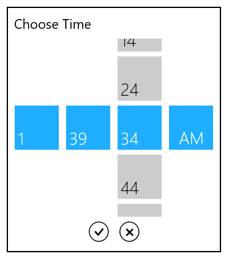

# TimeSelector in WPF SfTimePicker

The [SfTimeSelector](https://help.syncfusion.com/cr/wpf/Syncfusion.SfInput.Wpf~Syncfusion.Windows.Controls.Input.SfTimeSelector.html) control opens inside the drop-down popup.

The visual elements of the time selector can be customized using the [SelectorStyle](https://help.syncfusion.com/cr/wpf/Syncfusion.SfInput.Wpf~Syncfusion.Windows.Controls.Input.SfTimePicker~SelectorStyle.html) property.

## Change the Cell templates

We can changes the template for the each selection hour, minute or meridiem list by using the `HourCellTemplate`,  `MinuteCellTemplate` or `MeridiemCellTemplate` which are available in the `SfTimeSelector`.

N> The DataContext of Selection box is Syncfusion.UI.Xaml.Primitives.DateTimeWrapper.

## Change the HourCell Template

We can change the hour selector template by using the [HourCellTemplate](https://help.syncfusion.com/cr/wpf/Syncfusion.SfInput.Wpf~Syncfusion.Windows.Controls.Input.SfTimeSelector~HourCellTemplate.html) property. In that, we can add any image, icon or text with the hour values.



<syncfusion:SfTimePicker VerticalAlignment="Center"
                         HorizontalAlignment="Center"
                         Width="200"
                         Name="sfTimePicker">

    <syncfusion:SfTimePicker.SelectorStyle>
        
    </syncfusion:SfTimePicker.SelectorStyle>
</syncfusion:SfTimePicker>



## Change the MinuteCell Template

We can change the minute selector template by using the [MinuteCellTemplate](https://help.syncfusion.com/cr/wpf/Syncfusion.SfInput.Wpf~Syncfusion.Windows.Controls.Input.SfTimeSelector~MinuteCellTemplate.html) property. In that, we can add any image, icon or text with the minute values.



<syncfusion:SfTimePicker VerticalAlignment="Center"
                         HorizontalAlignment="Center"
                         Width="200"
                         Name="sfTimePicker">

    <syncfusion:SfTimePicker.SelectorStyle>
        
    </syncfusion:SfTimePicker.SelectorStyle>
</syncfusion:SfTimePicker>



## Change the MeridiemCell Template

We can change the meridiem selector template by using the [MeridiemCellTemplate](https://help.syncfusion.com/cr/wpf/Syncfusion.SfInput.Wpf~Syncfusion.Windows.Controls.Input.SfTimeSelector~MeridiemCellTemplate.html) property. In that, we can add any image, icon or text with the meridiem values.



<syncfusion:SfTimePicker VerticalAlignment="Center"
                         HorizontalAlignment="Center"
                         Width="200"
                         Name="sfTimePicker">

    <syncfusion:SfTimePicker.SelectorStyle>
        
    </syncfusion:SfTimePicker.SelectorStyle>
</syncfusion:SfTimePicker>


			

## Change size of cells

We can change the cell size in the `SfTimeSelector` control by setting the [SelectorItemWidth](https://help.syncfusion.com/cr/wpf/Syncfusion.SfInput.Wpf~Syncfusion.Windows.Controls.Input.SfTimePicker~SelectorItemWidth.html) and [SelectorItemHeight](https://help.syncfusion.com/cr/wpf/Syncfusion.SfInput.Wpf~Syncfusion.Windows.Controls.Input.SfTimePicker~SelectorItemHeight.html) properties. The default value of the `SelectorItemWidth` and `SelectorItemHeight` properties is `30` and `30`. 




<syncfusion:SfTimePicker SelectorItemWidth="60" 
                         SelectorItemHeight="60" 
	                     x:Name="sfTimePicker"/>




SfTimePicker sfTimePicker = new SfTimePicker();
sfTimePicker.SelectorItemWidth = 60;
sfTimePicker.SelectorItemHeight = 60;




## TimeSelector item spacing
 
We can change the space between `SfTimeSelector` hour, minutes and meridiem items by using the [SelectorItemSpacing](https://help.syncfusion.com/cr/wpf/Syncfusion.SfInput.Wpf~Syncfusion.Windows.Controls.Input.SfTimePicker~SelectorItemSpacing.html)  property. The default value of the `SelectorItemSpacing` property is `4`.




<syncfusion:SfTimePicker SelectorItemSpacing="50" 
	                     x:Name="sfTimePicker"/>




SfTimePicker sfTimePicker = new SfTimePicker();
sfTimePicker.SelectorItemSpacing = 50;




Click [here](https://github.com/SyncfusionExamples/wpf-time-picker-examples/tree/master/Samples/SfTimeSelector-templates) to download the sample that showcases the `SfTimeSelector` template customization. 

## OK and Cancel button visibility

The selected time from the [SfTimeSelector](https://help.syncfusion.com/cr/wpf/Syncfusion.SfInput.Wpf~Syncfusion.Windows.Controls.Input.SfTimeSelector.html) can be updated in the [SfTimePicker.Value](https://help.syncfusion.com/cr/wpf/Syncfusion.SfInput.Wpf~Syncfusion.Windows.Controls.Input.SfTimePicker~Value.html) property on after clicking `OK` buttons. If we want to hide the `Ok` and `Cancel` buttons, you can use the 
[SfTimeSelector.ShowDoneButton](https://help.syncfusion.com/cr/wpf/Syncfusion.SfInput.Wpf~Syncfusion.Windows.Controls.Input.SfTimeSelector~ShowDoneButton.html) and [SfTimeSelector.ShowCancelButton](https://help.syncfusion.com/cr/wpf/Syncfusion.SfInput.Wpf~Syncfusion.Windows.Controls.Input.SfTimeSelector~ShowCancelButton.html) properties values as `false`. The default value of `SfTimeSelector.ShowDoneButton` and `SfTimeSelector.ShowCancelButton` properties values is `true`.



<syncfusion:SfTimePicker Name="sfTimePicker" 
                         IsDropDownOpen="True"
                         Width="200"
                         Name="sfTimePicker">
    <syncfusion:SfTimePicker.SelectorStyle>
        
    </syncfusion:SfTimePicker.SelectorStyle>
</syncfusion:SfTimePicker>
		


Click [here](https://github.com/SyncfusionExamples/wpf-time-picker-examples/tree/master/Samples/SfTimeSelector-footer) to download the sample that showcases the `OK` and `Cancel` button visibility.