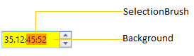
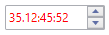

# Appearance in WPF TimeSpanEdit

This section explains different UI customization and theming options available in [TimeSpanEdit](https://help.syncfusion.com/cr/wpf/Syncfusion.Windows.Shared.TimeSpanEdit.html).

## Setting the background

You can change the background color and selection color of `TimeSpanEdit` by using the `Background` and `SelectionBrush` property. The default value of `Background` property is `White` and `SelectionBrush` property is `Royal Blue`.




<syncfusion:TimeSpanEdit Background="Yellow"
                         SelectionBrush="Red"
                         Value="35.12:45:52"
                         Name="timeSpanEdit"/>




TimeSpanEdit timeSpanEdit = new TimeSpanEdit();
timeSpanEdit.Background = Brushes.Yellow;
timeSpanEdit.SelectionBrush = Brushes.Red;
timeSpanEdit.Value = new TimeSpan(35, 12, 45, 52);




N> View [Sample](https://github.com/SyncfusionExamples/syncfusion-wpf-timespanedit-control-examples/tree/master/Samples/Appearance) in GitHub

## Setting the foreground

You can change the foreground color by using the `Foreground` property. The default value of `Foreground` property is `Black`.




<syncfusion:TimeSpanEdit Foreground="Red"
                         Value="35.12:45:52"
                         Name="timeSpanEdit"/>




TimeSpanEdit timeSpanEdit = new TimeSpanEdit();
timeSpanEdit.Foreground = Brushes.Red;
timeSpanEdit.Value = new TimeSpan(35, 12, 45, 52);




N> View [Sample](https://github.com/SyncfusionExamples/syncfusion-wpf-timespanedit-control-examples/tree/master/Samples/Appearance) in GitHub

## Change flow direction

You can change the flow direction of the `TimeSpanEdit` layout from right to left by setting the `FlowDirection` property value as `RightToLeft`. The default value of `FlowDirection` property is `LeftToRight`.




<syncfusion:TimeSpanEdit FlowDirection="RightToLeft"
                         Value="35.12:45:52"
                         Name="timeSpanEdit"/>




TimeSpanEdit timeSpanEdit = new TimeSpanEdit();
timeSpanEdit.FlowDirection = FlowDirection.RightToLeft;
timeSpanEdit.Value = new TimeSpan(35, 12, 45, 52);




N> View [Sample](https://github.com/SyncfusionExamples/syncfusion-wpf-timespanedit-control-examples/tree/master/Samples/Appearance) in GitHub

## Theme

TimeSpanEdit supports various built-in themes. Refer to the below links to apply themes for the TimeSpanEdit,

  * [Apply theme using SfSkinManager](https://help.syncfusion.com/wpf/themes/skin-manager)
	
  * [Create a custom theme using ThemeStudio](https://help.syncfusion.com/wpf/themes/theme-studio#creating-custom-theme)

 