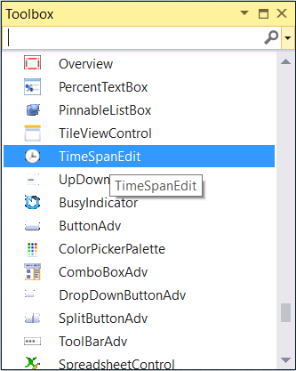

# Getting started with WPF TimeSpanEdit

This section explains how to create a WPF [TimeSpanEdit](https://help.syncfusion.com/cr/wpf/Syncfusion.Windows.Shared.TimeSpanEdit.html) and explains about its structure and features.

## Control Structure

## Assembly deployment

Refer to the [control dependencies](https://help.syncfusion.com/wpf/control-dependencies#timespanedit) section to get the list of assemblies or NuGet package that needs to be added as reference to use the control in any application.

You can find more details about installing the NuGet package in a WPF application in the following link: 

[How to install nuget packages](https://help.syncfusion.com/wpf/nuget-packages)

## Adding WPF TimeSpanEdit via designer

You can add the `TimeSpanEdit` control to an application by dragging it from the toolbox to a view of the designer. The following dependent assembly will be added automatically.

* Syncfusion.Shared.WPF

 
 
## Adding WPF TimeSpanEdit via XAML

To add the `TimeSpanEdit` control manually in XAML, follow these steps:
1. Create a new WPF project in Visual Studio.

2. Add the  following assembly references to the project,
   * Syncfusion.Shared.WPF
 
3. Import Syncfusion WPF schema **http://schemas.syncfusion.com/wpf** and declare the `TimeSpanEdit` control in XAML page.

4.	Declare the `TimeSpanEdit` control in XAML page.




<Window xmlns="http://schemas.microsoft.com/winfx/2006/xaml/presentation"
        xmlns:x="http://schemas.microsoft.com/winfx/2006/xaml"
        xmlns:syncfusion="http://schemas.syncfusion.com/wpf" 
        x:Class="TimeSpanEditSample.MainWindow"
        Title="TimeSpanEdit Sample" Height="350" Width="525">
    <Grid>
        <!--Adding TimeSpanEdit control -->
        <syncfusion:TimeSpanEdit x:Name="timeSpanEdit" 
                                       Width="100" 
                                       Height="25" />
    </Grid>
</Window>



## Adding WPF TimeSpanEdit via C\#

To add the `TimeSpanEdit` control manually in C#, follow these steps:

1. Create a new WPF application via Visual Studio.

2. Add the  following assembly references to the project,
    * Syncfusion.Shared.WPF

3. Include the required namespace and create an instance of `TimeSpanEdit` and add it to the window.

4.	Declare the `TimeSpanEdit` control using C#.




using Syncfusion.Windows.Tools.Controls;

public partial class MainWindow : Window {
    public MainWindow() {
        InitializeComponent();

        //Creating an instance of TimeSpanEdit control
        TimeSpanEdit timeSpanEdit = new timeSpanEdit();
        timeSpanEdit.Width = 100;
        timeSpanEdit.Height = 25;        

        //Adding TimeSpanEdit as window content
        this.Content = timeSpanEdit;
    }
}




## Set or change time span value

You can set or change the selected time of the `TimeSpanEdit` programmatically by setting the value to the `Value` property. You can also change the selected time at runtime using the mouse and keyboard interaction. Please refer the [Change time span value](https://help.syncfusion.com/wpf/timespan-editor/dealing-with-timespanedit#change-the-time-value) page to know more about the mouse and keyboard interaction to change the value. The default value of `Value` property is `0.0:0:0`.




<syncfusion:TimeSpanEdit Value="10.11:32:43"
                         Name="timeSpanEdit" />




TimeSpanEdit timeSpanEdit = new TimeSpanEdit();
timeSpanEdit.Value = new TimeSpan(10, 11, 32, 43);




N> View [Sample](https://github.com/SyncfusionExamples/syncfusion-wpf-timespanedit-control-examples/tree/master/Samples/TimeSpanEdit-Features) in GitHub

## Change display format of time span

You can format the each fields to show what the numerals denotes i.e. hours, minutes or days by using the [Format](https://help.syncfusion.com/cr/wpf/Syncfusion.Windows.Shared.TimeSpanEdit.html#Syncfusion_Windows_Shared_TimeSpanEdit_Format) property. The default value of `Format` is `d.h:m:s`. You can show only the days, hours or minutes values by using any one the following respective fields to the `Format` property.

* d - It displays the days value.
* h - It displays the hours value.
* m - It displays the minutes value.
* s - It displays the seconds value.




<syncfusion:TimeSpanEdit Format="d 'days' h 'hours' m 'minutes' s 'sec'" 
                         Value="25.08:33:10"
                         Name="timeSpanEdit" />




TimeSpanEdit timeSpanEdit = new TimeSpanEdit();
timeSpanEdit.Format = "d 'days' h 'hours' m 'minutes' s 'sec'";
timeSpanEdit.Value = new TimeSpan(25, 08, 33, 10);




N> View [Sample](https://github.com/SyncfusionExamples/syncfusion-wpf-timespanedit-control-examples/tree/master/Samples/TimeSpanEdit-Features) in GitHub

## Value Changed Notification

The selected time span changed in `TimeSpanEdit` can be examined using [ValueChanged](https://help.syncfusion.com/cr/wpf/Syncfusion.Windows.Shared.TimeSpanEdit.html) event. The `ValueChanged` event contains the old and newly selected time span values in the `OldValue` and `NewValue` properties.




<syncfusion:TimeSpanEdit ValueChanged="TimeSpanEdit_ValueChanged"
                         Name="timeSpanEdit" />




TimeSpanEdit timeSpanEdit = new TimeSpanEdit();
timeSpanEdit.ValueChanged += TimeSpanEdit_ValueChanged;




You can handle this event as follows,




private void TimeSpanEdit_ValueChanged(DependencyObject d, DependencyPropertyChangedEventArgs e) {
    //Get old and new values
    var oldValue = e.OldValue;
    var newValue = e.NewValue;
}




## Restrict the time within minimum and maximum time span

The selecting time in `TimeSpanEdit` can be restricted within the maximum and minimum time span limits. Once the selected time has reached the minimum or maximum time span limits , the selected time does not exceed the limit. You can change the minimum and maximum time span limits by using the [MinValue](https://help.syncfusion.com/cr/wpf/Syncfusion.Windows.Shared.TimeSpanEdit.html#Syncfusion_Windows_Shared_TimeSpanEdit_MinValue) and [MaxValue](https://help.syncfusion.com/cr/wpf/Syncfusion.Windows.Shared.TimeSpanEdit.html#Syncfusion_Windows_Shared_TimeSpanEdit_MaxValue) properties.




<syncfusion:TimeSpanEdit MinValue="2.0:0:0"
                         MaxValue="10.0:0:0"
                         Value="5.2:25:52" 
                         Name="timeSpanEdit" />




TimeSpanEdit timeSpanEdit = new TimeSpanEdit();
timeSpanEdit.MinValue = new TimeSpan(2, 0, 0, 0);
timeSpanEdit.MaxValue = new TimeSpan(10, 0, 0, 0);
timeSpanEdit.Value = new TimeSpan(5, 2, 25, 52);




N> View [Sample](https://github.com/SyncfusionExamples/syncfusion-wpf-timespanedit-control-examples/tree/master/Samples/TimeSpanEdit-Features) in GitHub

## Localization support

Localization is the process of translating the application resources into different language for the specific cultures. You can localize the `TimeSpanEdit` control by adding resource file for each language.

Refer the following links to know more about how provide a localization support for the `TimeSpanEdit`,

* [https://help.syncfusion.com/wpf/localization](https://help.syncfusion.com/wpf/localization)
* [https://github.com/syncfusion/wpf-controls-localization-resx-files](https://github.com/syncfusion/wpf-controls-localization-resx-files)

