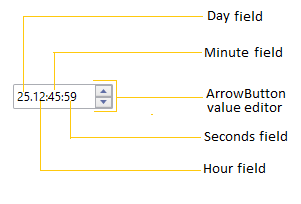

# WPF TimeSpan Editor (TimeSpanEdit) Overview

[TimeSpanEdit](https://help.syncfusion.com/cr/wpf/Syncfusion.Windows.Shared.TimeSpanEdit.html) is a compact, keyboard-friendly editor for representing and editing a time interval in a Days:Hours:Minutes:Seconds (and optional milliseconds) format. Each segment (days, hours, minutes, seconds, milliseconds) is editable independently and can be adjusted by keyboard arrows, mouse wheel, spinner buttons, or programmatically through the `Value` property.

## Overview

`TimeSpanEdit` is intended for scenarios that need precise interval input, scheduling values, or duration display. Key built-in capabilities include:

- Custom display formatting via the [Format](https://help.syncfusion.com/cr/wpf/Syncfusion.Windows.Shared.TimeSpanEdit.html#Syncfusion_Windows_Shared_TimeSpanEdit_Format) property to show or hide fields (for example: days-only, hours/minutes, or include milliseconds).
- Controlled increment behavior using [StepInterval](https://help.syncfusion.com/cr/wpf/Syncfusion.Windows.Shared.TimeSpanEdit.html#Syncfusion_Windows_Shared_TimeSpanEdit_StepInterval) so each field steps at a predictable interval when using arrows, spinner buttons, or mouse wheel.
- Range enforcement with [MinValue](https://help.syncfusion.com/cr/wpf/Syncfusion.Windows.Shared.TimeSpanEdit.html#Syncfusion_Windows_Shared_TimeSpanEdit_MinValue) and [MaxValue](https://help.syncfusion.com/cr/wpf/Syncfusion.Windows.Shared.TimeSpanEdit.html#Syncfusion_Windows_Shared_TimeSpanEdit_MaxValue) to prevent invalid durations.
- Optional null support and watermark text via [AllowNull](https://help.syncfusion.com/cr/wpf/Syncfusion.Windows.Shared.TimeSpanEdit.html#Syncfusion_Windows_Shared_TimeSpanEdit_AllowNull) and [NullString](https://help.syncfusion.com/cr/wpf/Syncfusion.Windows.Shared.TimeSpanEdit.html#Syncfusion_Windows_Shared_TimeSpanEdit_NullString) for empty states.
- User interaction modes: show/hide spinner buttons, enable/disable mouse-wheel increments, and extended click-and-drag scrolling through [ShowArrowButtons](https://help.syncfusion.com/cr/wpf/Syncfusion.Windows.Shared.TimeSpanEdit.html#Syncfusion_Windows_Shared_TimeSpanEdit_ShowArrowButtons), [IncrementOnScrolling](https://help.syncfusion.com/cr/wpf/Syncfusion.Windows.Shared.TimeSpanEdit.html#Syncfusion_Windows_Shared_TimeSpanEdit_IncrementOnScrolling) and [EnableExtendedScrolling](https://help.syncfusion.com/cr/wpf/Syncfusion.Windows.Shared.TimeSpanEdit.html#Syncfusion_Windows_Shared_TimeSpanEdit_EnableExtendedScrolling).

## Typical uses

`TimeSpanEdit` is suitable for: inputting task durations, timeouts, scheduling offsets, reporting elapsed time, and any UI that requires clear, editable time intervals. It is also useful inside forms where compact, validated duration input is needed.

## Events and integration

Monitor value changes with the [ValueChanged](https://help.syncfusion.com/cr/wpf/Syncfusion.Windows.Shared.TimeSpanEdit.html) event to react when users adjust durations. The control works with localization and themes, and integrates into MVVM applications by binding the `Value` property.

## Key features

- **Custom Format String** - display tailored field labels (days/hours/minutes/seconds/milliseconds).
- **Keyboard Navigation** - move between fields and increment/decrement using arrow keys.
- **Spin/Arrow Buttons & Mouse Wheel** - quick adjustments with optional spinner buttons and mouse interactions.
- **Step Interval Control** - fine-tune increment/decrement amounts per field with the `StepInterval` property for predictable stepping.
- **Min/Max Value Enforcement** - prevent out-of-range durations using `MinValue` and `MaxValue`.
- **Null and Watermark Support** - allow null duration values and display a placeholder using `AllowNull` and `NullString`.
- **ReadOnly Mode** - disable user edits while permitting programmatic changes via `IsReadOnly`.
- **Event Notification & Data Binding** - `ValueChanged` event and bindable `Value` property support MVVM integration.
- **Milliseconds Precision** - include milliseconds in the display and editing using the `Format` (for example the `z` specifier).
- **Localization & Theming** - works with resource-based localization and Syncfusion themes for consistent styling.
