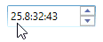
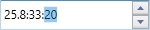
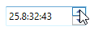
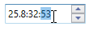
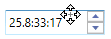
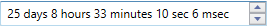

# Working with TimeSpanEdit

This section explains how to change the time value and time formats in the WPF [TimeSpanEdit](https://help.syncfusion.com/cr/wpf/Syncfusion.Shared.Wpf~Syncfusion.Windows.Shared.TimeSpanEdit.html).

## Date, hour and minute field navigation

By default, the focus field will be navigated automatically after the value has been validated to the corresponding field.If you want to manually change the day, hour or minute values, before that you navigate to the respective field by using the mouse or move the `Left-Right` keys in the keyboard.

## Increase or decrease the time fields with specific interval

If you want to increase or decrease the time span field values with specific interval, use the [StepInterval](https://help.syncfusion.com/cr/wpf/Syncfusion.Shared.Wpf~Syncfusion.Windows.Shared.TimeSpanEdit~StepInterval.html) property. Selected time span field  will be increased or decreased based on `StepInterval` field value by pressing the `Up-Down` arrow keys, UpDown button in `TimeSpanEdit` or using mouse wheel. The default value of `StepInterval` property is `{1.01:01:01}`.

For example, if value is `1.1:1:10`, seconds will increase or decrease in `10` seconds interval. other fields will increase or decrease `1` minute, hour, day interval.




<syncfusion:TimeSpanEdit StepInterval="1.1:1:10" 
                         Value="25.08:33:10"
                         Name="timeSpanEdit" />




TimeSpanEdit timeSpanEdit = new TimeSpanEdit();
timeSpanEdit.StepInterval = new TimeSpan(2, 0, 1, 10);
timeSpanEdit.Value = new TimeSpan(25, 08, 33, 10);




N> View [Sample](https://github.com/SyncfusionExamples/syncfusion-wpf-timespanedit-control-examples/tree/master/Samples/TimeSpanEdit-Features) in GitHub

## Change the time value 

 You can change the time value of `TimeSpanEdit` by programmatically and using mouse or key interactions.

### Change time programmatically

You can set or change the selected time of the `TimeSpanEdit` programmatically by setting the value to the `Value` property. 




<syncfusion:TimeSpanEdit Value="10.11:32:43"
                         Name="timeSpanEdit" />




TimeSpanEdit timeSpanEdit = new TimeSpanEdit();
timeSpanEdit.Value = new TimeSpan(10, 11, 32, 43);




N> View [Sample](https://github.com/SyncfusionExamples/syncfusion-wpf-timespanedit-control-examples/tree/master/Samples/TimeSpanEdit-Features) in GitHub

### Change time using updown buttons

You can increase or decrease the selected time span field value based on the `StepInterval` value by pressing the Up or Down arrow buttons in the `TimeSpanEdit`. If you want to restrict the user to change time by clicking the UpDown buttons, use the [ShowArrowButtons](https://help.syncfusion.com/cr/wpf/Syncfusion.Shared.Wpf~Syncfusion.Windows.Shared.TimeSpanEdit~ShowArrowButtons.html) property value as `false`. It will hides the Arrow buttons. The default value of `ShowArrowButtons` property is `true`.




<syncfusion:TimeSpanEdit ShowArrowButtons="True"
                         Value="25.09:32:43"
                         Name="timeSpanEdit" />




TimeSpanEdit timeSpanEdit = new TimeSpanEdit();
timeSpanEdit.ShowArrowButtons = true;
timeSpanEdit.Value = new TimeSpan(25, 09, 32, 43);




N> View [Sample](https://github.com/SyncfusionExamples/syncfusion-wpf-timespanedit-control-examples/tree/master/Samples/TimeSpanEdit-Features) in GitHub

### Change time on mouse wheel

You can increase or decrease the selected time span field value based on the `StepInterval` value by mouse scrolling over the `TimeSpanEdit`. If you want to restrict the user to change time by using mouse scrolling, use the [IncrementOnScrolling](https://help.syncfusion.com/cr/wpf/Syncfusion.Shared.Wpf~Syncfusion.Windows.Shared.TimeSpanEdit~IncrementOnScrolling.html) property value as `false`. The default value of `IncrementOnScrolling` property is `true`.




<syncfusion:TimeSpanEdit IncrementOnScrolling="True"
                         Value="25.08:32:43"
                         Name="timeSpanEdit" />




TimeSpanEdit timeSpanEdit = new TimeSpanEdit();
timeSpanEdit.IncrementOnScrolling = true;
timeSpanEdit.Value = new TimeSpan(25, 08, 32, 43);




N> View [Sample](https://github.com/SyncfusionExamples/syncfusion-wpf-timespanedit-control-examples/tree/master/Samples/TimeSpanEdit-Features) in GitHub

### Change time on click and drag

You can increase or decrease the selected time span field value based on the `StepInterval` value by click and dragging the mouse on up or down, use the [EnableExtendedScrolling](https://help.syncfusion.com/cr/wpf/Syncfusion.Shared.Wpf~Syncfusion.Windows.Shared.TimeSpanEdit~EnableExtendedScrolling.html) property value as `true`. This is effective only on when control is in unfocused state. The default value of `EnableExtendedScrolling` property is `false`.




<syncfusion:TimeSpanEdit EnableExtendedScrolling="True"
                         Value="25.08:33:10"
                         Name="timeSpanEdit" />




TimeSpanEdit timeSpanEdit = new TimeSpanEdit();
timeSpanEdit.EnableExtendedScrolling = true;
timeSpanEdit.Value = new TimeSpan(25, 08, 33, 10);




N> View [Sample](https://github.com/SyncfusionExamples/syncfusion-wpf-timespanedit-control-examples/tree/master/Samples/TimeSpanEdit-Features) in GitHub

### Change time using keyboard interaction

You can increase or decrease the selected time span field value based on the `StepInterval` value by pressing `Up-Arrow` and `Down-Arrow` keys in keyboard.

## Setting null value

If you want to set null value for the `TimeSpanEdit`, use the [AllowNull](https://help.syncfusion.com/cr/wpf/Syncfusion.Shared.Wpf~Syncfusion.Windows.Shared.TimeSpanEdit~AllowNull.html) property value as `true` and `Value` property as `null`. If `AllowNull` property is `false`, then the default time is displayed.




<syncfusion:TimeSpanEdit AllowNull="True" 
                         Value="{x:Null}"
                         Name="timeSpanEdit" />




TimeSpanEdit timeSpanEdit = new TimeSpanEdit();
timeSpanEdit.AllowNull = true;
timeSpanEdit.Value = null;




N> View [Sample](https://github.com/SyncfusionExamples/syncfusion-wpf-timespanedit-control-examples/tree/master/Samples/TimeSpanEdit-Features) in GitHub

## Show watermark when value is null

If you want to display any watermark text instead of null value, use the [NullString](https://help.syncfusion.com/cr/wpf/Syncfusion.Shared.Wpf~Syncfusion.Windows.Shared.TimeSpanEdit~NullString.html) property to setting the watermark text. You can enable it by setting the `AllowNull` property as `true` and `Value` property as `null`. The default value of `NullString` property is `string.Empty`.




<syncfusion:TimeSpanEdit NullString="Edit here..." 
                         AllowNull="True" 
                         Value="{x:Null}"
                         Name="timeSpanEdit" />




TimeSpanEdit timeSpanEdit = new TimeSpanEdit();
timeSpanEdit.NullString = "Edit here...";
timeSpanEdit.AllowNull = true;
timeSpanEdit.Value = null;




N> View [Sample](https://github.com/SyncfusionExamples/syncfusion-wpf-timespanedit-control-examples/tree/master/Samples/TimeSpanEdit-Features) in GitHub

## Change display format of time span

You can format the each fields to show what the numerals denotes i.e. hours, minutes or days by using the [Format](https://help.syncfusion.com/cr/wpf/Syncfusion.Shared.Wpf~Syncfusion.Windows.Shared.TimeSpanEdit~Format.html) property. The default value of `Format` is `d.h:m:s`. You can show only the days, hours or minutes values by using any one the following respective fields to the `Format` property.

* d - It displays the days value.
* h - It displays the hours value.
* m - It displays the minutes value.
* s - It displays the seconds value.




<syncfusion:TimeSpanEdit Format="d 'days' h 'hours' m 'minutes' s 'sec'" 
                         Value="25.08:33:10"
                         Name="timeSpanEdit" />




TimeSpanEdit timeSpanEdit = new TimeSpanEdit();
timeSpanEdit.Format = "d 'days' h 'hours' m 'minutes' s 'sec'";
timeSpanEdit.Value = new TimeSpan(25, 08, 33, 10);




N> View [Sample](https://github.com/SyncfusionExamples/syncfusion-wpf-timespanedit-control-examples/tree/master/Samples/TimeSpanEdit-Features) in GitHub

### Display milliseconds

If you want to show the milliseconds in the time span, use the character `z` in the format string of the `Format` property.

* z - It displays the milliseconds value.




<syncfusion:TimeSpanEdit Format=" d 'days' h 'hours' m 'minutes' s 'sec' z 'msec'" 
                         Value="25.08:33:10.6"
                         Name="timeSpanEdit" />




TimeSpanEdit timeSpanEdit = new TimeSpanEdit();
timeSpanEdit.Format = @" d 'days' h 'hours' m 'minutes' s 'sec' z 'msec'";
timeSpanEdit.Value = new TimeSpan(25, 08, 33, 10, 6);




N> View [Sample](https://github.com/SyncfusionExamples/syncfusion-wpf-timespanedit-control-examples/tree/master/Samples/TimeSpanEdit-Features) in GitHub

## Value Changed Notification

The selected time span changed in `TimeSpanEdit` can be examined using [ValueChanged](https://help.syncfusion.com/cr/wpf/Syncfusion.Shared.Wpf~Syncfusion.Windows.Shared.TimeSpanEdit~ValueChanged_EV.html) event. The `ValueChanged` event contains the old and newly selected time span values in the `OldValue` and `NewValue` properties.




<syncfusion:TimeSpanEdit ValueChanged="TimeSpanEdit_ValueChanged"
                         Name="timeSpanEdit" />




TimeSpanEdit timeSpanEdit = new TimeSpanEdit();
timeSpanEdit.ValueChanged += TimeSpanEdit_ValueChanged;




You can handle this event as follows,




private void TimeSpanEdit_ValueChanged(DependencyObject d, DependencyPropertyChangedEventArgs e) {
    //Get old and new values
    var oldValue = e.OldValue;
    var newValue = e.NewValue;
}




## ReadOnly support

If you want to restrict the inputs from the user, use the `IsReadOnly` property value as `true`. However, value can be changed programmatically in readonly mode and the user can still select text. The default value of `IsReadOnly` property is `false`.




<syncfusion:TimeSpanEdit IsReadOnly="True" 
                         Name="timeSpanEdit" />




TimeSpanEdit timeSpanEdit = new TimeSpanEdit();
timeSpanEdit.IsReadOnly = true;




N> View [Sample](https://github.com/SyncfusionExamples/syncfusion-wpf-timespanedit-control-examples/tree/master/Samples/TimeSpanEdit-Features) in GitHub

## Restrict the time within minimum and maximum time span

The selecting time in `TimeSpanEdit` can be restricted within the maximum and minimum time span limits. Once the selected time has reached the minimum or maximum time span limits , the selected time does not exceed the limit. You can change the minimum and maximum time span limits by using the [MinValue](https://help.syncfusion.com/cr/wpf/Syncfusion.Shared.Wpf~Syncfusion.Windows.Shared.TimeSpanEdit~MinValue.html) property and [MaxValue](https://help.syncfusion.com/cr/wpf/Syncfusion.Shared.Wpf~Syncfusion.Windows.Shared.TimeSpanEdit~MaxValue.html) properties.




<syncfusion:TimeSpanEdit MinValue="2.0:0:0"
                         MaxValue="10.0:0:0"
                         Value="5.2:25:52" 
                         Name="timeSpanEdit" />




TimeSpanEdit timeSpanEdit = new TimeSpanEdit();
timeSpanEdit.MinValue = new TimeSpan(2, 0, 0, 0);
timeSpanEdit.MaxValue = new TimeSpan(10, 0, 0, 0);
timeSpanEdit.Value = new TimeSpan(5, 2, 25, 52);




N> View [Sample](https://github.com/SyncfusionExamples/syncfusion-wpf-timespanedit-control-examples/tree/master/Samples/TimeSpanEdit-Features) in GitHub

