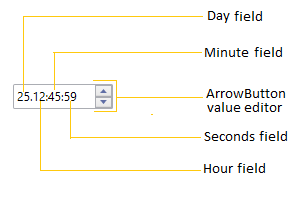
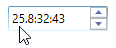
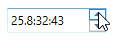
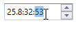
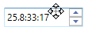
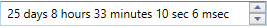

# Working with TimeSpanEdit in WPF TimeSpan Editor

This section explains how to change the time value and time formats in the WPF [TimeSpanEdit](https://help.syncfusion.com/cr/wpf/Syncfusion.Windows.Shared.TimeSpanEdit.html).

## Day, hour and minute field navigation

By default, the focus field will be navigated automatically after the value has been validated to the corresponding field. If you want to manually change the day, hour or minute values, before that you navigate to the respective field by using the mouse or move the `Left-Right` keys in the keyboard.

## Increase or decrease the time fields with specific interval

If you want to increase or decrease the time span field values with specific interval, use the [StepInterval](https://help.syncfusion.com/cr/wpf/Syncfusion.Windows.Shared.TimeSpanEdit.html#Syncfusion_Windows_Shared_TimeSpanEdit_StepInterval) property. Selected time span field will be increased or decreased based on `StepInterval` field value by pressing the `Up-Down` arrow keys, UpDown button in `TimeSpanEdit` or using mouse wheel. The default value of `StepInterval` property is `{1.01:01:01}`.

For example, if value is `1.1:1:10`, seconds will increase or decrease in `10` seconds interval. Other fields will increase or decrease by `1` minute, hour, or day interval.




<Window 
    . . .
    xmlns:syncfusion="http://schemas.syncfusion.com/wpf">
    <syncfusion:TimeSpanEdit StepInterval="1.1:1:10" 
                         Value="25.08:33:10"
                         Name="timeSpanEdit" />
</Window>




using Syncfusion.Windows.Shared;

TimeSpanEdit timeSpanEdit = new TimeSpanEdit();
timeSpanEdit.StepInterval = new TimeSpan(1, 1, 1, 10);
timeSpanEdit.Value = new TimeSpan(25, 08, 33, 10);




N> View [Sample](https://github.com/SyncfusionExamples/syncfusion-wpf-timespanedit-control-examples/tree/master/Samples/TimeSpanEdit-Features) in GitHub

## Change the time value 

You can change the time value of `TimeSpanEdit` by programmatically and using mouse or key interactions.

### Change time programmatically

You can set or change the selected time of the `TimeSpanEdit` programmatically by setting the value to the `Value` property. 




<Window 
    . . .
    xmlns:syncfusion="http://schemas.syncfusion.com/wpf">
    <syncfusion:TimeSpanEdit Value="10.11:32:43"
                         Name="timeSpanEdit" />
</Window>




using Syncfusion.Windows.Shared;

TimeSpanEdit timeSpanEdit = new TimeSpanEdit();
timeSpanEdit.Value = new TimeSpan(10, 11, 32, 43);




N> View [Sample](https://github.com/SyncfusionExamples/syncfusion-wpf-timespanedit-control-examples/tree/master/Samples/TimeSpanEdit-Features) in GitHub

### Change time using updown buttons

You can increase or decrease the selected time span field value based on the `StepInterval` value by pressing the Up or Down arrow buttons in the `TimeSpanEdit`. If you want to restrict the user from changing time by clicking the UpDown buttons, use the [ShowArrowButtons](https://help.syncfusion.com/cr/wpf/Syncfusion.Windows.Shared.TimeSpanEdit.html#Syncfusion_Windows_Shared_TimeSpanEdit_ShowArrowButtons) property value as `false`. It will hide the Arrow buttons. The default value of `ShowArrowButtons` property is `true`.




<Window 
    . . .
    xmlns:syncfusion="http://schemas.syncfusion.com/wpf">
    <syncfusion:TimeSpanEdit ShowArrowButtons="True"
                         Value="25.09:32:43"
                         Name="timeSpanEdit" />
</Window>




using Syncfusion.Windows.Shared;

TimeSpanEdit timeSpanEdit = new TimeSpanEdit();
timeSpanEdit.ShowArrowButtons = true;
timeSpanEdit.Value = new TimeSpan(25, 09, 32, 43);




N> View [Sample](https://github.com/SyncfusionExamples/syncfusion-wpf-timespanedit-control-examples/tree/master/Samples/TimeSpanEdit-Features) in GitHub

### Change time on mouse wheel

You can increase or decrease the selected time span field value based on the `StepInterval` value by mouse scrolling over the `TimeSpanEdit`. If you want to restrict the user from changing time by using mouse scrolling, use the [IncrementOnScrolling](https://help.syncfusion.com/cr/wpf/Syncfusion.Windows.Shared.TimeSpanEdit.html#Syncfusion_Windows_Shared_TimeSpanEdit_IncrementOnScrolling) property value as `false`. The default value of `IncrementOnScrolling` property is `true`.




<Window 
    . . .
    xmlns:syncfusion="http://schemas.syncfusion.com/wpf">
    <syncfusion:TimeSpanEdit IncrementOnScrolling="True"
                         Value="25.08:32:43"
                         Name="timeSpanEdit" />
</Window>




using Syncfusion.Windows.Shared;

TimeSpanEdit timeSpanEdit = new TimeSpanEdit();
timeSpanEdit.IncrementOnScrolling = true;
timeSpanEdit.Value = new TimeSpan(25, 08, 32, 43);




N> View [Sample](https://github.com/SyncfusionExamples/syncfusion-wpf-timespanedit-control-examples/tree/master/Samples/TimeSpanEdit-Features) in GitHub

### Change time on click and drag

You can increase or decrease the selected time span field value based on the `StepInterval` value by clicking and dragging the mouse on up or down, use the [EnableExtendedScrolling](https://help.syncfusion.com/cr/wpf/Syncfusion.Windows.Shared.TimeSpanEdit.html#Syncfusion_Windows_Shared_TimeSpanEdit_EnableExtendedScrolling) property value as `true`. This is effective only when the control is in unfocused state. The default value of `EnableExtendedScrolling` property is `false`.




<Window 
    . . .
    xmlns:syncfusion="http://schemas.syncfusion.com/wpf">
    <syncfusion:TimeSpanEdit EnableExtendedScrolling="True"
                         Value="25.08:33:10"
                         Name="timeSpanEdit" />
</Window>




using Syncfusion.Windows.Shared;

TimeSpanEdit timeSpanEdit = new TimeSpanEdit();
timeSpanEdit.EnableExtendedScrolling = true;
timeSpanEdit.Value = new TimeSpan(25, 08, 33, 10);




N> View [Sample](https://github.com/SyncfusionExamples/syncfusion-wpf-timespanedit-control-examples/tree/master/Samples/TimeSpanEdit-Features) in GitHub

### Change time using keyboard interaction

You can increase or decrease the selected time span field value based on the `StepInterval` value by pressing `Up-Arrow` and `Down-Arrow` keys in keyboard.

## Setting null value

If you want to set null value for the `TimeSpanEdit`, use the [AllowNull](https://help.syncfusion.com/cr/wpf/Syncfusion.Windows.Shared.TimeSpanEdit.html#Syncfusion_Windows_Shared_TimeSpanEdit_AllowNull) property value as `true` and `Value` property as `null`. If `AllowNull` property is `false`, then the default time is displayed.




<Window 
    . . .
    xmlns:syncfusion="http://schemas.syncfusion.com/wpf">
    <syncfusion:TimeSpanEdit AllowNull="True" 
                         Value="{x:Null}"
                         Name="timeSpanEdit" />
</Window>




using Syncfusion.Windows.Shared;

TimeSpanEdit timeSpanEdit = new TimeSpanEdit();
timeSpanEdit.AllowNull = true;
timeSpanEdit.Value = null;




N> View [Sample](https://github.com/SyncfusionExamples/syncfusion-wpf-timespanedit-control-examples/tree/master/Samples/TimeSpanEdit-Features) in GitHub

## Show watermark when value is null

If you want to display any watermark text instead of null value, use the [NullString](https://help.syncfusion.com/cr/wpf/Syncfusion.Windows.Shared.TimeSpanEdit.html#Syncfusion_Windows_Shared_TimeSpanEdit_NullString) property to setting the watermark text. You can enable it by setting the `AllowNull` property as `true` and `Value` property as `null`. The default value of `NullString` property is `string.Empty`.




<Window 
    . . .
    xmlns:syncfusion="http://schemas.syncfusion.com/wpf">
    <syncfusion:TimeSpanEdit NullString="Edit here..." 
                         AllowNull="True" 
                         Value="{x:Null}"
                         Name="timeSpanEdit" />
</Window>



using Syncfusion.Windows.Shared;

TimeSpanEdit timeSpanEdit = new TimeSpanEdit();
timeSpanEdit.NullString = "Edit here...";
timeSpanEdit.AllowNull = true;
timeSpanEdit.Value = null;




N> View [Sample](https://github.com/SyncfusionExamples/syncfusion-wpf-timespanedit-control-examples/tree/master/Samples/TimeSpanEdit-Features) in GitHub

## Change display format of time span

You can format each field to show what the numerals denote, i.e. days, hours, or minutes by using the [Format](https://help.syncfusion.com/cr/wpf/Syncfusion.Windows.Shared.TimeSpanEdit.html#Syncfusion_Windows_Shared_TimeSpanEdit_Format) property. The default value of `Format` is `d.h:m:s`. You can show only the days, hours or minutes values by using any one of the following respective fields to the `Format` property.

* d - It displays the days value.
* h - It displays the hours value.
* m - It displays the minutes value.
* s - It displays the seconds value.




<Window 
    . . .
    xmlns:syncfusion="http://schemas.syncfusion.com/wpf">
    <syncfusion:TimeSpanEdit Format="d 'days' h 'hours' m 'minutes' s 'sec'" 
                         Value="25.08:33:10"
                         Name="timeSpanEdit" />
</Window>



using Syncfusion.Windows.Shared;

TimeSpanEdit timeSpanEdit = new TimeSpanEdit();
timeSpanEdit.Format = "d 'days' h 'hours' m 'minutes' s 'sec'";
timeSpanEdit.Value = new TimeSpan(25, 08, 33, 10);




N> View [Sample](https://github.com/SyncfusionExamples/syncfusion-wpf-timespanedit-control-examples/tree/master/Samples/TimeSpanEdit-Features) in GitHub

### Display milliseconds

If you want to show the milliseconds in the time span, use the character `z` in the format string of the `Format` property.

* z - It displays the milliseconds value.




<Window 
    . . .
    xmlns:syncfusion="http://schemas.syncfusion.com/wpf">
    <syncfusion:TimeSpanEdit Format=" d 'days' h 'hours' m 'minutes' s 'sec' z 'msec'" 
                         Value="25.08:33:10.6"
                         Name="timeSpanEdit" />
</Window>




using Syncfusion.Windows.Shared;

TimeSpanEdit timeSpanEdit = new TimeSpanEdit();
timeSpanEdit.Format = @" d 'days' h 'hours' m 'minutes' s 'sec' z 'msec'";
timeSpanEdit.Value = new TimeSpan(25, 08, 33, 10, 6);




N> View [Sample](https://github.com/SyncfusionExamples/syncfusion-wpf-timespanedit-control-examples/tree/master/Samples/TimeSpanEdit-Features) in GitHub

## Value Changed Notification

The selected time span changed in `TimeSpanEdit` can be examined using [ValueChanged](https://help.syncfusion.com/cr/wpf/Syncfusion.Windows.Shared.TimeSpanEdit.html) event. The `ValueChanged` event contains the old and newly selected time span values in the `OldValue` and `NewValue` properties.




<Window 
    . . .
    xmlns:syncfusion="http://schemas.syncfusion.com/wpf">
    <syncfusion:TimeSpanEdit ValueChanged="TimeSpanEdit_ValueChanged"
                         Name="timeSpanEdit" />
</Window>




using Syncfusion.Windows.Shared;

TimeSpanEdit timeSpanEdit = new TimeSpanEdit();
timeSpanEdit.ValueChanged += TimeSpanEdit_ValueChanged;




You can handle this event as follows,




private void TimeSpanEdit_ValueChanged(DependencyObject d, DependencyPropertyChangedEventArgs e) {
    //Get old and new values
    var oldValue = e.OldValue;
    var newValue = e.NewValue;
}




## ReadOnly support

If you want to restrict the inputs from the user, use the `IsReadOnly` property value as `true`. However, value can be changed programmatically in readonly mode and the user can still select text. The default value of `IsReadOnly` property is `false`.




<Window 
    . . .
    xmlns:syncfusion="http://schemas.syncfusion.com/wpf">
    <syncfusion:TimeSpanEdit IsReadOnly="True" 
                         Name="timeSpanEdit" />
</Window>




using Syncfusion.Windows.Shared;

TimeSpanEdit timeSpanEdit = new TimeSpanEdit();
timeSpanEdit.IsReadOnly = true;




N> View [Sample](https://github.com/SyncfusionExamples/syncfusion-wpf-timespanedit-control-examples/tree/master/Samples/TimeSpanEdit-Features) in GitHub

## Restrict the time within minimum and maximum time span

The selecting time in `TimeSpanEdit` can be restricted within the maximum and minimum time span limits. Once the selected time has reached the minimum or maximum time span limits, the selected time does not exceed the limit. You can change the minimum and maximum time span limits by using the [MinValue](https://help.syncfusion.com/cr/wpf/Syncfusion.Windows.Shared.TimeSpanEdit.html#Syncfusion_Windows_Shared_TimeSpanEdit_MinValue) and [MaxValue](https://help.syncfusion.com/cr/wpf/Syncfusion.Windows.Shared.TimeSpanEdit.html#Syncfusion_Windows_Shared_TimeSpanEdit_MaxValue) properties.




<Window 
    . . .
    xmlns:syncfusion="http://schemas.syncfusion.com/wpf">
    <syncfusion:TimeSpanEdit MinValue="2.0:0:0"
                         MaxValue="10.0:0:0"
                         Value="5.2:25:52" 
                         Name="timeSpanEdit" />
</Window>




using Syncfusion.Windows.Shared;

TimeSpanEdit timeSpanEdit = new TimeSpanEdit();
timeSpanEdit.MinValue = new TimeSpan(2, 0, 0, 0);
timeSpanEdit.MaxValue = new TimeSpan(10, 0, 0, 0);
timeSpanEdit.Value = new TimeSpan(5, 2, 25, 52);




N> View [Sample](https://github.com/SyncfusionExamples/syncfusion-wpf-timespanedit-control-examples/tree/master/Samples/TimeSpanEdit-Features) in GitHub

