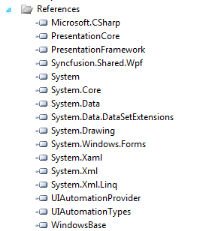
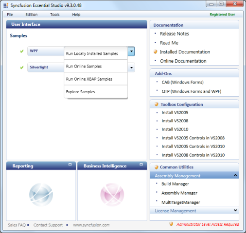

# Getting Started

## Appearance and Structure

The themes for TimeSpanEdit Control:

* Office2007Blue
* Office2007Black
* Office2007Silver
* Office2010Blue
* Office2010Black
* Office2010Silver
* Blend
* VS2010

## Adding TimeSpanEdit Control to an Application

To add TimeSpanEdit control to a Visual Studio.NET project:

1. Open a VS2010 project. The Syncfusion controls are listed in the Toolbox.
2. Click and drag the TimeSpanEdit control from the toolbox and drop it in the designer.

   

3. Syncfusion.Shared.WPF assemblies will be added automatically to the application reference.

   

   _Assemblies added into References_

4. Press F4 or open the Properties Window to customize the control by setting the required properties.

   ' | markdownify }}

## TimeSpanEdit Members

### Properties

_Property table_

<table>
<tr>
<th>
Properties</th><th>
Description</th><th>
Type Of Property</th><th>
Acceptable Value</th></tr>
<tr>
<td>
MaxValue</td><td>
Gets or sets the maximum value that can be accepted by the control</td><td>
TimeSpan</td><td>
Any value of type TimeSpan</td></tr>
<tr>
<td>
MinValue</td><td>
Gets or sets the minimum value that can be accepted by the control</td><td>
TimeSpan</td><td>
Any Value of type TimeSpan</td></tr>
<tr>
<td>
AllowNull</td><td>
Gets or sets a value indicating whether the control can accept the null value</td><td>
bool</td><td>
True/False</td></tr>
<tr>
<td>
NullString</td><td>
Gets or sets a value that will be displayed when the value is null</td><td>
string</td><td>
Any string</td></tr>
<tr>
<td>
Value</td><td>
Gets or sets the value of the control</td><td>
TimeSpan</td><td>
Any value of type TimeSpan</td></tr>
<tr>
<td>
ShowArrowButtons</td><td>
Gets or Sets a value whether the up down button can be visible</td><td>
bool</td><td>
True/False</td></tr>
<tr>
<td>
IncrementOnScrolling</td><td>
Gets or sets a value indicating whether to increment or decrement the selected option</td><td>
bool</td><td>
True/False</td></tr>
<tr>
<td>
Format</td><td>
Gets or sets the custom format strings. The word given between single quotes is displayed as it is. But the following tokens are replaced with values in the custom format string. d – replaced with days valueh – replaced with hours valuem – replaced with minutes values – replaced with seconds valuez- replaced with milliseconds valueExample :The following format string : d ‘Days’ h ‘Hours’ m ‘Minutes’Displayed as : 10 Days 20 Hours 30 Minutes</td><td>
string</td><td>
Any string</td></tr>
</table>

### Events

<table>
<tr>
<th>
Event</th><th>
Description</th><th>
Argument</th><th>
Type</th></tr>
<tr>
<td>
ValueChanged</td><td>
This event is fired when the value of the control is changed</td><td>
Value</td><td>
PropertyChangedCallback</td></tr>
</table>

##  Samples Link

      To view samples:

1. Click Start-->All Programs-->Syncfusion-->Essential Studio <XX.X.X.XX> -->Dashboard.

   The Essential Studio Enterprise Edition window is displayed. 

   

The User Interface edition panel is displayed by default. 

1. Select WPF from the samples listed. The following options will be displayed. You can view the samples in the following three ways:
1. Run Locally Installed Samples-View the locally installed Tools samples for WPF using the sample browser
2. Run Online Samples-View the online samples for WPF
3. Run Online XBAP Samples – View the online XBAP samples  for WPF
4. Explore Samples-Locate the WPF samples on the disk

   

5. Select Run Locally Installed Samples. The WPF Sample Browser displays.

   

6. On the left pane, go to Editor Controls ->Time Span Edit Demo.
