# Appearance and Styling in WPF Toast Control

This section explains how to customize the appearance and visual behavior of WPF Toast Control by using severity, variants, accent brush, placement, animations, sound, and duration.

## Severity and Variant

WPF Toast Control support multiple severity levels with built-in visual styling and provide three visual variants to suit different design preferences. The accepted severity levels are `Info`, `Success`, `Warning`, and `Error`. The accepted variants are `Text`, `Filled`, and `Outlined`.




SfToastNotification.Show(this, new ToastOptions
{
    Title = "Updates",
    Message = "Your project has been synchronized successfully",
    Mode = ToastMode.Screen,
    Severity = ToastSeverity.Success,
    Variant = ToastVariant.Filled
});




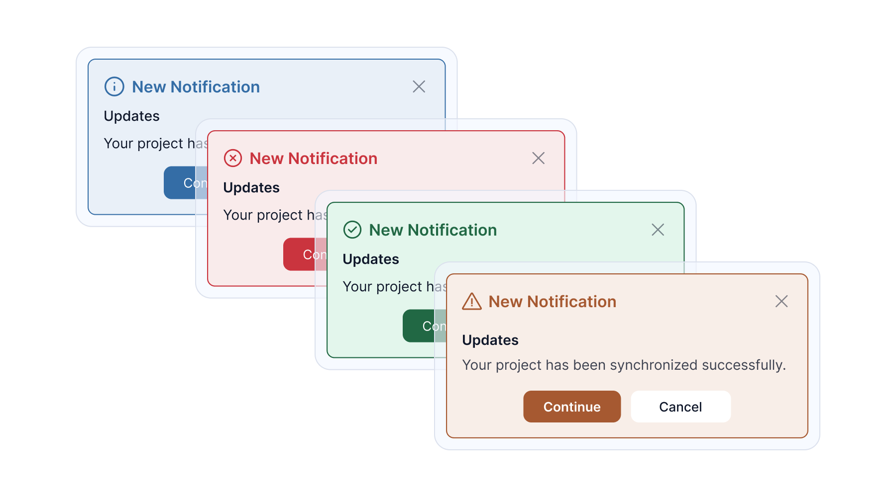

### Variant Behavior with Severity

The following table shows how each variant renders with each severity. The default severity is `Info`, and the default variant is `Text`.

| Severity | Text | Filled | Outlined |
| --- | --- | --- | --- |
| **Info** | 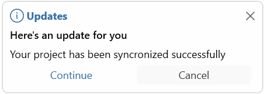 | 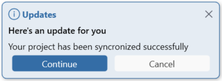 | 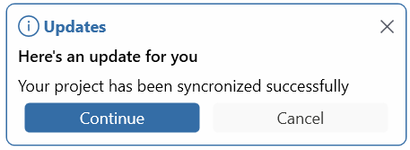 |
| **Success** | 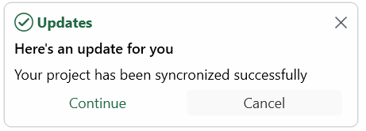 | 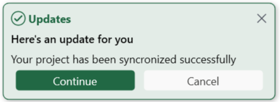 | 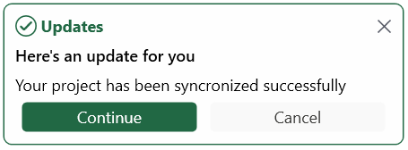 |
| **Warning** | 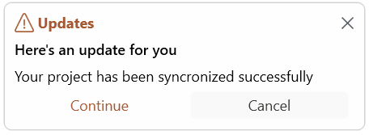 | 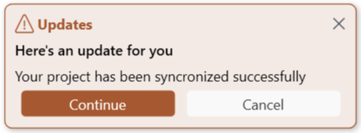 | 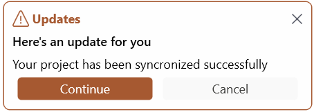 |
| **Error** | 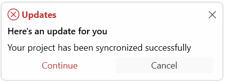 | 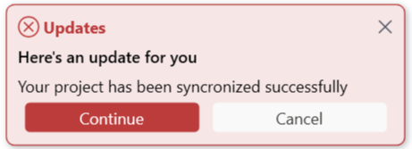 |  |

## Accent Brush

You can use the [AccentBrush](https://help.syncfusion.com/cr/wpf/Syncfusion.UI.Xaml.SfToastNotification.ToastOptions.html#Syncfusion_UI_Xaml_SfToastNotification_ToastOptions_AccentBrush) property to further customize the appearance of a WPF Toast Control after severity and variant are applied. The accent brush overrides the accent color derived from the selected severity. It is ignored when `Severity` is set to `None`.




SfToastNotification.Show(this, new ToastOptions
{
    Title = "Error",
    Message = "Accent brush customizes error styling",
    Mode = ToastMode.Screen,
    Severity = ToastSeverity.Error,
    AccentBrush = new SolidColorBrush(Colors.Violet)
});




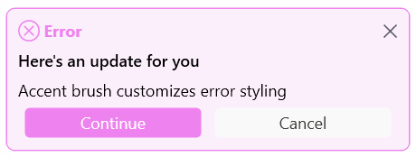

## Placement

WPF Toast Control support multiple placement options, allowing notifications to appear at different positions within the application window or screen. The accepted `ToastPlacement` values are: `TopLeft`, `TopCenter`, `TopRight`, `LeftCenter`, `RightCenter`, `BottomLeft`, `BottomCenter`, and `BottomRight`. The default placement is `BottomRight`.




SfToastNotification.Show(this, new ToastOptions
{
    Message = "Top-Left Position",
    Placement = ToastPlacement.TopLeft,
    Mode = ToastMode.Screen
});




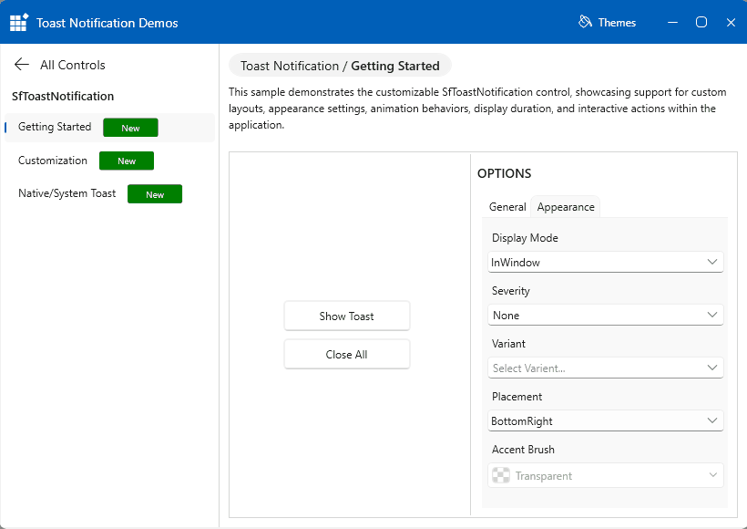

## Animations

WPF Toast Control support built-in animation types that control how notifications appear and disappear. You can configure the show and hide animations independently. The accepted `ToastAnimation` values are listed in the table below. The default values are `SlideBottomIn` and `SlideBottomOut`.




SfToastNotification.Show(this, new ToastOptions
{
    Message = "Fade effect",
    Mode = ToastMode.Screen,
    ShowAnimationType = ToastAnimation.FadeIn,
    CloseAnimationType = ToastAnimation.FadeOut
});




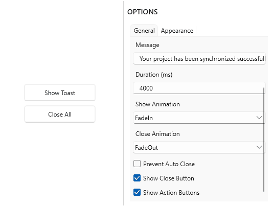

### Available Animations

| Animation | In | Out |
|-----------|----|-----|
| **Fade** | `FadeIn` | `FadeOut` |
| **Zoom** | `FadeZoomIn` | `FadeZoomOut` |
| **Slide** | `SlideBottomIn` | `SlideBottomOut` |
| **Flip Left Down** | `FlipLeftDownIn` | `FlipLeftDownOut` |
| **Flip Left Up** | `FlipLeftUpIn` | `FlipLeftUpOut` |
| **Flip Right Down** | `FlipRightDownIn` | `FlipRightDownOut` |
| **None** | `None` | `None` |

## Duration

Use the [Duration](https://help.syncfusion.com/cr/wpf/Syncfusion.UI.Xaml.SfToastNotification.ToastOptions.html#Syncfusion_UI_Xaml_SfToastNotification_ToastOptions_Duration) property to specify how long the toast remains visible in seconds before auto-closing. The default duration is `3` seconds.




SfToastNotification.Show(this, new ToastOptions
{
    Title = "Reminder",
    Message = "This toast stays visible for 5 seconds.",
    Mode = ToastMode.Screen,
    Duration = new TimeSpan(0, 0, 5)
});




## WPF Toast Control Sound Configuration

### Predefined Sound Options

WPF Toast Control supports multiple sound options when displaying notifications, helping to improve user awareness and ensuring important messages are not easily missed.

Custom notification (Window and Screen modes) support only three predefined sound values from the `ToastSound` enum: `Silent`, `Beep`, and `Hand`. The default value is `Beep`.




SfToastNotification.Show(this, new ToastOptions
{  
    Title = "Notification",
    Header = "Custom Toast",
    Message = "Notification with Beep sound",
    Mode = ToastMode.Screen,
    ToastSound = ToastSound.Beep
});




System notification (Default mode) support the remaining predefined sounds from the `ToastSound` enum, enabling developers to choose from a wide range of standard notification tones that align with the operating system's native look and feel (including `LoopingAlarm`, `IM`, `Mail`, `SMS`, and others).




SfToastNotification.Show(this, new ToastOptions
{ 
    Title = "Notification",
    Header = "System Toast",
    Message = "New messages were received", 
    Mode = ToastMode.Default,
    ToastSound = ToastSound.LoopingAlarm
});




### Custom Audio File Path

WPF Toast Control allows you to play a custom audio file for custom notification using the ToastSoundPath property. This enables developers to provide a more personalized notification experience by using their own sound files.




SfToastNotification.Show(this, new ToastOptions
{  
    Title = "Notification",
    Header = "Custom Toast",
    Message = "Notification with custom sound",
    Mode = ToastMode.Screen,
    ToastSoundPath = new Uri("pack://application:,,,/Resources/sounds/chimes.wav")
});




## Control Maximum WPF Toast Control Display Count

The [MaxToastVisibleCount](https://help.syncfusion.com/cr/wpf/Syncfusion.UI.Xaml.SfToastNotification.ToastOptions.html#Syncfusion_UI_Xaml_SfToastNotification_ToastOptions_MaxToastVisibleCount) property controls how many WPF Toast Control are displayed simultaneously. This helps manage multiple notifications efficiently and prevents UI clutter. By default, the property is `null`, and the number of notifications shown is limited only by the available space within the host.




SfToastNotification.Show(this, new ToastOptions
{   
    Title = "Notification",
    Header = "Custom Toast",
    Message = "New messages arrived",
    Mode = ToastMode.Screen,
    MaxToastVisibleCount = 4
});




N> The following properties are supported only for in-app WPF Toast Control (Window or Screen mode) and have no effect in Default (native) mode, where OS behavior controls appearance, placement, animation, and timing: `Severity`, `Variant`, `AccentBrush`, `Placement`, `ShowAnimationType`, `CloseAnimationType`, `Duration`, `MaxToastVisibleCount`, and `ToastSoundPath`. In addition, `Variant` and `AccentBrush` apply only when `Severity` is set to `Info`, `Success`, `Warning`, or `Error` (not `None`).
