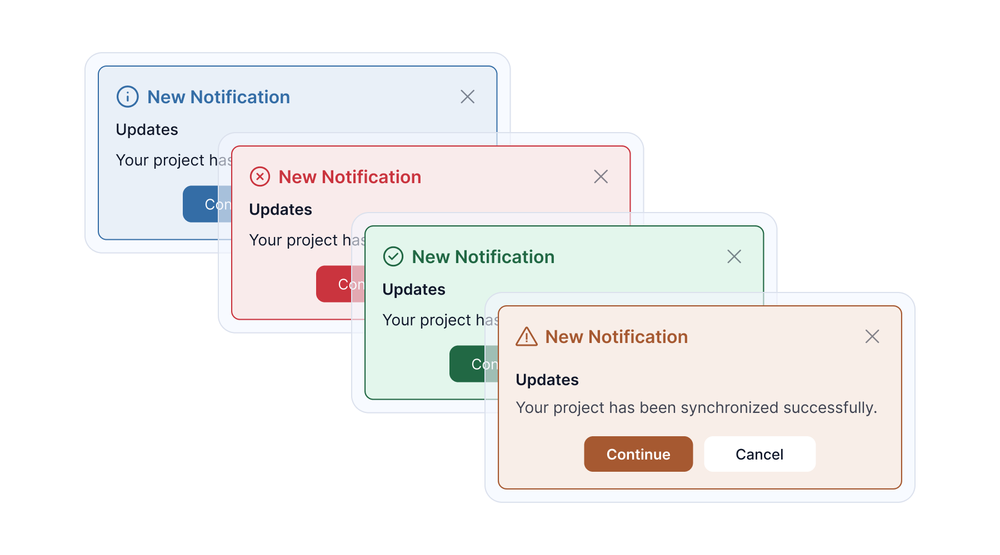
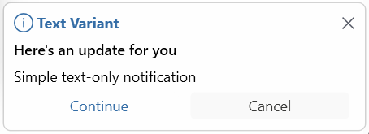
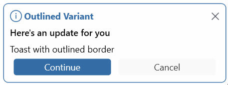
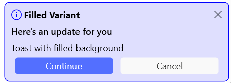
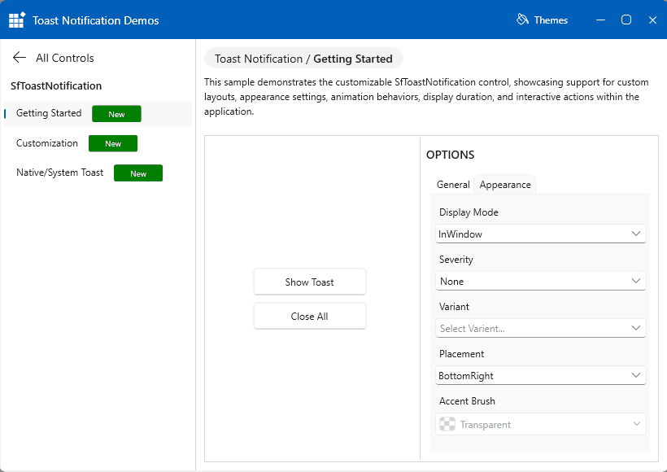
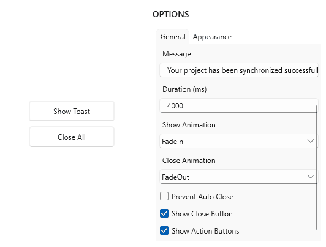

# Appearance and Styling in WPF Toast Notification (SfToastNotification)

## Severity Levels

Toast notifications support multiple severity levels that automatically apply appropriate visual styling.

### Severity Levels Available

| Level | Usage | Visual Style |
|-------|-------|--------------|
| **None** | Default state | Neutral colors |
| **Info** | Informational messages | Blue/Neutral tones |
| **Success** | Successful operations | Green colors |
| **Warning** | Warning messages | Yellow/Orange colors |
| **Error** | Error/failure messages | Red colors |

### Example Usage

```csharp
// Info notification
SfToastNotification.Show(this, new ToastOptions
{
    Title = "Information",
    Message = "Your profile has been updated.",
	Mode = ToastMode.Screen,
    Severity = ToastSeverity.Info
});

// Success notification
SfToastNotification.Show(this, new ToastOptions
{
    Title = "Success",
    Message = "File saved successfully!",
	Mode = ToastMode.Screen,
    Severity = ToastSeverity.Success
});

// Warning notification
SfToastNotification.Show(this, new ToastOptions
{
    Title = "Warning",
    Message = "You have unsaved changes.",
	Mode = ToastMode.Screen,
    Severity = ToastSeverity.Warning
});

// Error notification
SfToastNotification.Show(this, new ToastOptions
{
    Title = "Error",
    Message = "Operation failed. Please try again.",
	Mode = ToastMode.Screen,
    Severity = ToastSeverity.Error
});
```


## Toast Variants

The toast control supports three visual variants for different design preferences.

### 1. Text Variant

Minimal, text-only appearance without background fill.

```csharp
SfToastNotification.Show(this, new ToastOptions
{
    Title = "Text Variant",
    Message = "Simple text-only notification",
	Mode = ToastMode.Screen,
    Variant = ToastVariant.Text
});
```


### 2. Outlined Variant

Border-based design with emphasis on outline styling.

```csharp
SfToastNotification.Show(this, new ToastOptions
{
    Title = "Outlined Variant",
    Message = "Toast with outlined border",
	Mode = ToastMode.Screen,
    Variant = ToastVariant.Outlined
});
```


### 3. Filled Variant

Full-colored background using the accent brush.

```csharp
SfToastNotification.Show(this, new ToastOptions
{
    Title = "Filled Variant",
    Message = "Toast with filled background",
	Mode = ToastMode.Screen,
    Variant = ToastVariant.Filled,
    AccentBrush = new SolidColorBrush(Colors.Blue)
});
```



## Toast Placement

The WPF Toast Notifcation control supports nine different placement positions for displaying toasts on screen.

### Available Positions

```
┌─────────────────────────────────────┐
│ TopLeft    TopCenter    TopRight    │
│                                     │
│ LeftCenter                 RightCenter
│                                     │
│ BottomLeft BottomCenter BottomRight │
└─────────────────────────────────────┘
```

### Placement Examples

```csharp
// Top-Left corner
SfToastNotification.Show(this, new ToastOptions
{
    Message = "Top-Left Position",
    Placement = ToastPlacement.TopLeft,
    Mode = ToastMode.Screen
});

// Top-Center
SfToastNotification.Show(this, new ToastOptions
{
    Message = "Top-Center Position",
    Placement = ToastPlacement.TopCenter,
    Mode = ToastMode.Screen
});

// Bottom-Right corner
SfToastNotification.Show(this, new ToastOptions
{
    Message = "Bottom-Right Position",
    Placement = ToastPlacement.BottomRight,
    Mode = ToastMode.Screen
});
```




## Animation Types

Toast notifications support 14+ built-in animations:

```csharp
// Fade animations
SfToastNotification.Show(this, new ToastOptions
{
    Message = "Fade effect",
	Mode = ToastMode.Screen,
    ShowAnimationType = ToastAnimation.FadeIn,
    CloseAnimationType = ToastAnimation.FadeOut
});

// Zoom animations
SfToastNotification.Show(this, new ToastOptions
{
    Message = "Zoom effect",
	Mode = ToastMode.Screen,
    ShowAnimationType = ToastAnimation.FadeZoomIn,
    CloseAnimationType = ToastAnimation.FadeZoomOut
});

// Slide animations
SfToastNotification.Show(this, new ToastOptions
{
    Message = "Slide effect",
	Mode = ToastMode.Screen,
    ShowAnimationType = ToastAnimation.SlideBottomIn,
    CloseAnimationType = ToastAnimation.SlideBottomOut
});

// Flip animations
SfToastNotification.Show(this, new ToastOptions
{
    Message = "Flip effect",
	Mode = ToastMode.Screen,
    ShowAnimationType = ToastAnimation.FlipLeftDownIn,
    CloseAnimationType = ToastAnimation.FlipLeftDownOut
});

// No animation
SfToastNotification.Show(this, new ToastOptions
{
    Message = "No animation",
	Mode = ToastMode.Screen,
    ShowAnimationType = ToastAnimation.None,
    CloseAnimationType = ToastAnimation.None
});
```


### Available Animations

| Animation | In | Out |
|-----------|----|----|
| **Fade** | FadeIn | FadeOut |
| **Zoom** | FadeZoomIn | FadeZoomOut |
| **Slide** | SlideBottomIn | SlideBottomOut |
| **Flip Left Down** | FlipLeftDownIn | FlipLeftDownOut |
| **Flip Left Up** | FlipLeftUpIn | FlipLeftUpOut |
| **Flip Right Down** | FlipRightDownIn | FlipRightDownOut |
| **None** | None | None |

## Summary

| Concept | Purpose | Key Options |
|---------|---------|------------|
| **Severity** | Toast importance level | None, Info, Success, Warning, Error |
| **Variants** | Visual styling | Text, Outlined, Filled |
| **Placement** | Screen position | 9 positions available |
| **Animations** | Show/hide effects | 14+ animation types |