# Appearance and Styling in WPF Toast Notification (SfToastNotification)

## Toast Variants and Severity

Toast notifications provide multiple severity levels with built-in visual styling and offer three visual variants to suit different design preferences.




SfToastNotification.Show(this, new ToastOptions
{
    Title = "Updates",
    Message = "Your project has been syncronized successfully",
    Mode = ToastMode.Screen,
    Severity = ToastSeverity.Success,
    Variant = ToastVariant.Filled  
});




### Variant Behavior with Severity

| **Severity ↓ / Variant →** | **Text** | **Fill** | **Outlined** |
|----------------------------|-----------|-----------|---------------|
| **Info** | 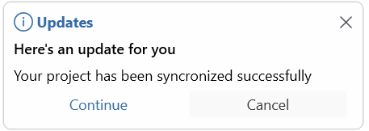  | 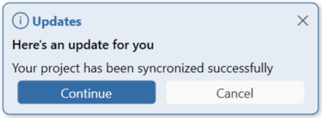 | 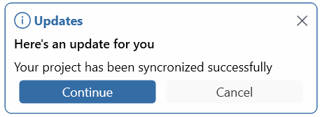 |
| **Success**                | 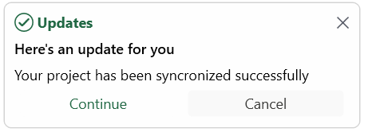 | 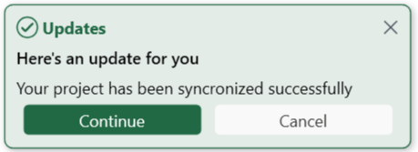  | 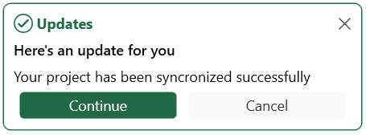 |
| **Warning**                | 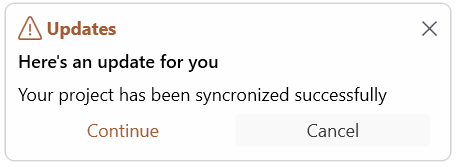 | 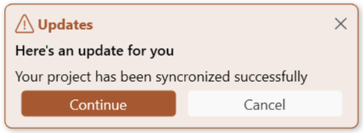 | 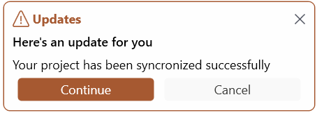  |
| **Error**                  | 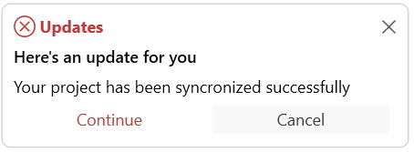 | 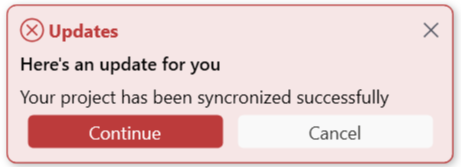 |  |

## Accent Brush

The AccentBrush property enables you to fine-tune the appearance of toast notifications. After severity and variant are applied, you can use this property to customize the color accents and overall visual styling.

### Accent Brush Behavior with Severity



// Accent brush IS applied (Severity = Error)
// Customizes the error color styling
SfToastNotification.Show(this, new ToastOptions
{
    Title = "Error",
    Message = "Accent brush customizes error styling",
    Mode = ToastMode.Screen,
    Severity = ToastSeverity.Error,
    AccentBrush = new SolidColorBrush(Colors.Crimson)  // Applied
});




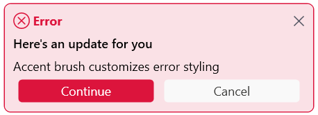

## Toast Placement Options

The Toast control supports multiple screen placement options, allowing notifications to appear at specific positions within the application window / screen. 

TopLeft - Displays the toast in the top-left corner.

TopCenter - Displays the toast centered at the top.

TopRight - Displays the toast in the top-right corner.

LeftCenter - Displays the toast vertically centered on the left edge.

RightCenter - Displays the toast vertically centered on the right edge.

BottomLeft - Displays the toast in the bottom-left corner.

BottomCenter - Displays the toast centered at the bottom.

BottomRight - Displays the toast in the bottom-right corner.

These placement options give you full control over where toast notifications appear in the UI, enabling you to tailor the experience to your app layout or user preferences.




// Top-Left corner
SfToastNotification.Show(this, new ToastOptions
{
    Message = "Top-Left Position",
    Placement = ToastPlacement.TopLeft,
    Mode = ToastMode.Screen
});




## Animation Types

Toast notifications support 14+ built-in animations:




// Fade animations
SfToastNotification.Show(this, new ToastOptions
{
    Message = "Fade effect",
	Mode = ToastMode.Screen,
    ShowAnimationType = ToastAnimation.FadeIn,
    CloseAnimationType = ToastAnimation.FadeOut
});




### Available Animations

| Animation | In | Out |
|-----------|----|----|
| **Fade** | FadeIn | FadeOut |
| **Zoom** | FadeZoomIn | FadeZoomOut |
| **Slide** | SlideBottomIn | SlideBottomOut |
| **Flip Left Down** | FlipLeftDownIn | FlipLeftDownOut |
| **Flip Left Up** | FlipLeftUpIn | FlipLeftUpOut |
| **Flip Right Down** | FlipRightDownIn | FlipRightDownOut |
| **None** | None | None |

## Customization Reference

This section provides a **complete reference** for all customization applicability rules.

| Feature | Default Mode | Window/Screen + Severity=None | Window/Screen + Severity Levels |
|---|---|---|---|
| **Severity** (Info/Success/Warning/Error) | ❌ NO (OS controlled) | ✅ YES | ✅ YES |
| **Variant** (Text/Outlined/Filled) | ❌ NO | ❌ NO (not applicable for None) | ✅ YES |
| **AccentBrush** (Custom colors) | ❌ NO | ❌ NO (not applicable for None) | ✅ YES |
| **Placement** (8 positions) | ❌ NO (OS managed) | ✅ YES | ✅ YES |
| **Animations** (14+ types) | ❌ NO | ✅ YES | ✅ YES |
| **Actions** (Interactive buttons) | ⚠️ LIMITED | ✅ YES | ✅ YES |
| **Duration** (Auto-close timing) | ❌ NO | ✅ YES | ✅ YES |
| **Title/Message** (Text content) | ✅ YES | ✅ YES | ✅ YES |

**Key Points:**
- ✅ Features marked **YES** are fully supported
- ❌ Features marked **NO** are not supported
- ⚠️ **LIMITED** means basic support only
- **Variant** and **AccentBrush** require severity levels (not applicable when Severity = None)
- **Placement**, **Animations**, **Actions** require Window/Screen modes (not available in Default mode)

## Summary

| Concept | Purpose | Key Options |
|---------|---------|------------|
| **Severity** | Toast importance level | None, Info, Success, Warning, Error |
| **Variants** | Visual styling | Text, Outlined, Filled |
| **Placement** | Screen position | 8 positions available |
| **Animations** | Show/hide effects | 14+ animation types |