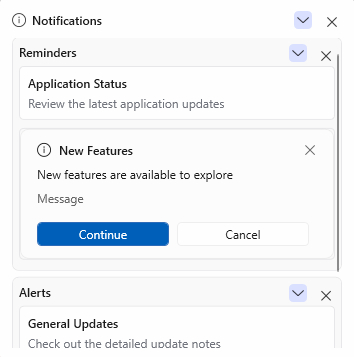
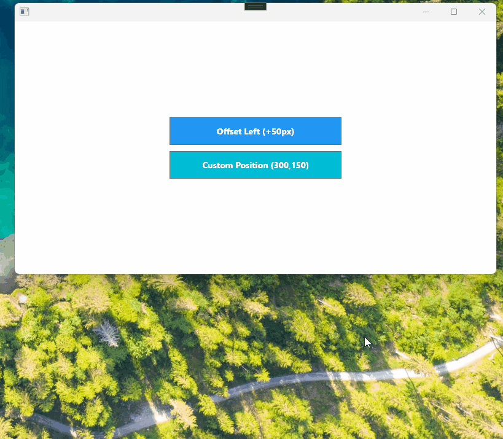
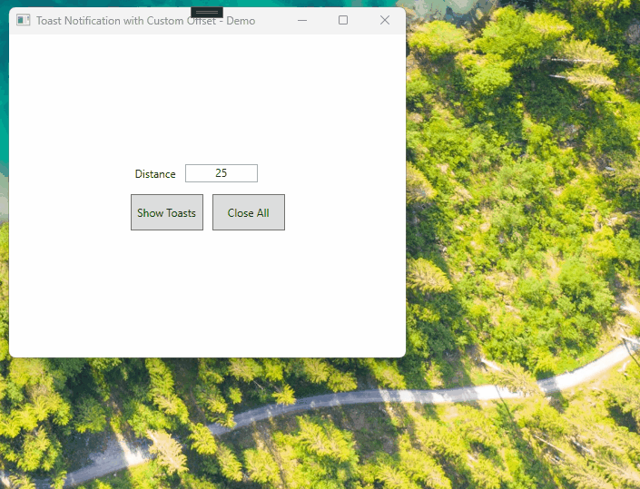

# Customization in WPF Toast Control

This section explains how to customize WPF Toast Control interaction elements such as action buttons, callbacks, templates, and close button behavior.

## Grouping Toast Notifications

You can group related toast notifications by assigning the same value to the [GroupName](https://help.syncfusion.com/cr/wpf/Syncfusion.UI.Xaml.SfToastNotification.ToastOptions.html#Syncfusion_UI_Xaml_SfToastNotification_ToastOptions_GroupName) property in [ToastOptions](https://help.syncfusion.com/cr/wpf/Syncfusion.UI.Xaml.SfToastNotification.ToastOptions.html). Grouping helps organize related notifications and reduces clutter when multiple toasts are displayed.




SfToastNotification.Show(this, new ToastOptions
{
    Mode = ToastMode.Window,
    Title = "Application Status",
    Header = "Review the latest application updates",
    Message = "Message Area",
    GroupName = "Reminders"
});

SfToastNotification.Show(this, new ToastOptions
{
    Mode = ToastMode.Window,
    Title = "New Features",
    Header = "New features are available to explore",
    GroupName = "Reminders"
});

SfToastNotification.Show(this, new ToastOptions
{
    Mode = ToastMode.Window,
    Placement = ToastPlacement.BottomLeft,
    Title = "General Updates",
    Header = "Check out the detailed update notes",
    GroupName = "Alerts"
});




To display a toast in a different group, specify a different group name. Toasts without a `GroupName` value are not assigned to a custom group.

## Custom Position

The [ToastOptions](https://help.syncfusion.com/cr/wpf/Syncfusion.UI.Xaml.SfToastNotification.ToastOptions.html) class provides flexible toast positioning. Use the [Placement](https://help.syncfusion.com/cr/wpf/Syncfusion.UI.Xaml.SfToastNotification.ToastOptions.html#Syncfusion_UI_Xaml_SfToastNotification_ToastOptions_Placement) property with a built-in [ToastPlacement](https://help.syncfusion.com/cr/wpf/Syncfusion.UI.Xaml.SfToastNotification.ToastPlacement.html) value, and use `HorizontalOffset` and `VerticalOffset` to adjust the toast relative to that placement. To position a toast at exact coordinates, set `Placement` to `Custom` and specify the `X` and `Y` coordinates. Positive and negative offset values move the toast relative to its selected placement. When `Placement` is set to `Custom`, `X` and `Y` specify the toast position directly.




// Apply offsets to a built-in placement.
SfToastNotification.Show(this, new ToastOptions
{
    Mode = ToastMode.Screen,
    Placement = ToastPlacement.BottomRight,
    Title = "Offset Toast",
    Message = "This toast is displayed with custom offsets.",
    HorizontalOffset = -50.0,
    VerticalOffset = 20.0
});

// Display a toast at an exact position.
SfToastNotification.Show(this, new ToastOptions
{
    Mode = ToastMode.Window,
    Placement = ToastPlacement.Custom,
    Title = "Custom positioned toast",
    Message = "This toast is displayed at the specified coordinates.",
    X = 200,
    Y = 450,
    PreventAutoClose = true
});




N> Absolute coordinates disable automatic stacking so each toast remains at its defined location. Offsets with predefined placements retain the normal stacking behavior.

## Toast Distance Customization

Use the [Spacing](https://help.syncfusion.com/cr/wpf/Syncfusion.UI.Xaml.SfToastNotification.SfToastNotification.html#Syncfusion_UI_Xaml_SfToastNotification_SfToastNotification_Spacing) property to customize the vertical distance between stacked toast notifications. The spacing value is applied globally to the toasts displayed by [SfToastNotification](https://help.syncfusion.com/cr/wpf/Syncfusion.UI.Xaml.SfToastNotification.SfToastNotification.html).




<TextBox Name="ToastSpacingTextBox"
         Text="8"
         Height="20"
         Width="80"
         TextAlignment="Center" />

<Button Content="Show Toasts"
        Click="Button_Click" />





private void Button_Click(object sender, RoutedEventArgs e)
{
    SfToastNotification.Spacing = double.Parse(ToastSpacingTextBox.Text);

    SfToastNotification.Show(this, new ToastOptions
    {
        Mode = ToastMode.Screen
    });
}




## Action Buttons

You can add interactive action buttons to a WPF Toast Control by using the `Actions` collection. You can also use the [ShowActionButtons](https://help.syncfusion.com/cr/wpf/Syncfusion.UI.Xaml.SfToastNotification.ToastItem.html#Syncfusion_UI_Xaml_SfToastNotification_ToastItem_ShowActionButtons) property to control whether the action button row is displayed for in-app modes. The default value of `ShowActionButtons` is `true`.

### 1. Hide Action Buttons on a WPF Toast Control




SfToastNotification.Show(this, new ToastOptions
{
    Title = "New Notification",
    Header = "Updates",
    Message = "Your project has been synchronized successfully.",
    Mode = ToastMode.Screen,
    ShowActionButtons = false
});




### 2. Add Action Buttons to a WPF Toast Control




// Required usings:
// using System.Collections.Generic;
// using Syncfusion.UI.Xaml.SfToastNotification;

SfToastNotification.Show(this, new ToastOptions
{
    Title = "File Saved",
    Message = "Your document has been saved.",
    Actions = new List<ToastAction>
    {
        new ToastAction
        {
            Label = "Undo"
        },
        new ToastAction
        {
            Label = "OK",
            CloseOnClick = true
        }
    }
});




## Action Callbacks

You can assign a callback to an action button by using the [Callback](https://help.syncfusion.com/cr/wpf/Syncfusion.UI.Xaml.SfToastNotification.ToastAction.html#Syncfusion_UI_Xaml_SfToastNotification_ToastAction_Callback) property of [ToastAction](https://help.syncfusion.com/cr/wpf/Syncfusion.UI.Xaml.SfToastNotification.ToastAction.html). This allows you to execute custom logic when the user clicks the action button. The callback is a parameterless `Action`.




SfToastNotification.Show(this, new ToastOptions
{
    Title = "New Message",
    Message = "You have a new message.",
    Actions = new List<ToastAction>
    {
        new ToastAction
        {
            Label = "Reply",
            Callback = () => OpenReplyWindow(),
            CloseOnClick = true
        },
        new ToastAction
        {
            Label = "Later",
            CloseOnClick = true
        }
    }
});

private void OpenReplyWindow()
{
    // Open reply window
}




## Action Template

You can customize the appearance of individual action buttons by using the [ActionTemplate](https://help.syncfusion.com/cr/wpf/Syncfusion.UI.Xaml.SfToastNotification.ToastAction.html#Syncfusion_UI_Xaml_SfToastNotification_ToastAction_ActionTemplate) property available in the [ToastAction](https://help.syncfusion.com/cr/wpf/Syncfusion.UI.Xaml.SfToastNotification.ToastAction.html) class. When a template is assigned, the WPF Toast Control uses the specified template instead of the default action button style. Define the template and style in `App.xaml` (or `Window.Resources`) so it is accessible from the calling code.





<DataTemplate x:Key="CustomizedActionTemplate">
    <Button Style="{StaticResource ToastActionButtonStyle}"
            Margin="4,0,4,0"
            Width="132"
            Height="24"
            HorizontalAlignment="Center"
            Tag="{Binding}"
            Content="{Binding Label}" />
</DataTemplate>





SfToastNotification.Show(this, new ToastOptions
{
    Title = "New Message",
    Message = "You have a new message.",
    Actions = new List<ToastAction>
    {
        new ToastAction
        {
            Label = "Reply",
            ActionTemplate = (DataTemplate)Application.Current.Resources["CustomizedActionTemplate"]
        },
        new ToastAction
        {
            Label = "Later"
        }
    }
});





## Close Button

You can use the [ShowCloseButton](https://help.syncfusion.com/cr/wpf/Syncfusion.UI.Xaml.SfToastNotification.ToastItem.html#Syncfusion_UI_Xaml_SfToastNotification_ToastItem_ShowCloseButton) property to specify whether the close button is visible for the WPF Toast Control. The default value of `ShowCloseButton` is `true`. The close button is available only in in-app modes (`Window` and `Screen`).




// Toast with the close button hidden
SfToastNotification.Show(this, new ToastOptions
{
    Title = "Reminder",
    Message = "This toast has its close button disabled.",
    Mode = ToastMode.Screen,
    ShowCloseButton = false
});




