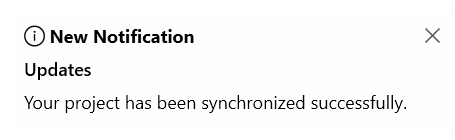
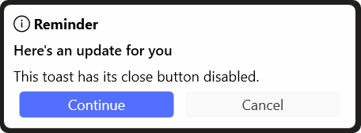

# Customization in WPF Toast Control

This section explains how to customize WPF Toast Control interaction elements such as action buttons, callbacks, templates, and close button behavior.

## Action Buttons

You can add interactive action buttons to a WPF Toast Control by using the `Actions` collection. You can also use the [ShowActionButtons](https://help.syncfusion.com/cr/wpf/Syncfusion.UI.Xaml.SfToastNotification.ToastItem.html#Syncfusion_UI_Xaml_SfToastNotification_ToastItem_ShowActionButtons) property to control whether the action button row is displayed for in-app modes. The default value of `ShowActionButtons` is `true`.

### 1. Hide Action Buttons on a WPF Toast Control




SfToastNotification.Show(this, new ToastOptions
{
    Title = "New Notification",
    Header = "Updates",
    Message = "Your project has been synchronized successfully.",
    Mode = ToastMode.Screen,
    ShowActionButtons = false
});




### 2. Add Action Buttons to a WPF Toast Control




// Required usings:
// using System.Collections.Generic;
// using Syncfusion.UI.Xaml.SfToastNotification;

SfToastNotification.Show(this, new ToastOptions
{
    Title = "File Saved",
    Message = "Your document has been saved.",
    Actions = new List<ToastAction>
    {
        new ToastAction
        {
            Label = "Undo"
        },
        new ToastAction
        {
            Label = "OK",
            CloseOnClick = true
        }
    }
});




## Action Callbacks

You can assign a callback to an action button by using the [Callback](https://help.syncfusion.com/cr/wpf/Syncfusion.UI.Xaml.SfToastNotification.ToastAction.html#Syncfusion_UI_Xaml_SfToastNotification_ToastAction_Callback) property of [ToastAction](https://help.syncfusion.com/cr/wpf/Syncfusion.UI.Xaml.SfToastNotification.ToastAction.html). This allows you to execute custom logic when the user clicks the action button. The callback is a parameterless `Action`.




SfToastNotification.Show(this, new ToastOptions
{
    Title = "New Message",
    Message = "You have a new message.",
    Actions = new List<ToastAction>
    {
        new ToastAction
        {
            Label = "Reply",
            Callback = () => OpenReplyWindow(),
            CloseOnClick = true
        },
        new ToastAction
        {
            Label = "Later",
            CloseOnClick = true
        }
    }
});

private void OpenReplyWindow()
{
    // Open reply window
}




## Action Template

You can customize the appearance of individual action buttons by using the [ActionTemplate](https://help.syncfusion.com/cr/wpf/Syncfusion.UI.Xaml.SfToastNotification.ToastAction.html#Syncfusion_UI_Xaml_SfToastNotification_ToastAction_ActionTemplate) property available in the [ToastAction](https://help.syncfusion.com/cr/wpf/Syncfusion.UI.Xaml.SfToastNotification.ToastAction.html) class. When a template is assigned, the WPF Toast Control uses the specified template instead of the default action button style. Define the template and style in `App.xaml` (or `Window.Resources`) so it is accessible from the calling code.





<DataTemplate x:Key="CustomizedActionTemplate">
    <Button Style="{StaticResource ToastActionButtonStyle}"
            Margin="4,0,4,0"
            Width="132"
            Height="24"
            HorizontalAlignment="Center"
            Tag="{Binding}"
            Content="{Binding Label}" />
</DataTemplate>





SfToastNotification.Show(this, new ToastOptions
{
    Title = "New Message",
    Message = "You have a new message.",
    Actions = new List<ToastAction>
    {
        new ToastAction
        {
            Label = "Reply",
            ActionTemplate = (DataTemplate)Application.Current.Resources["CustomizedActionTemplate"]
        },
        new ToastAction
        {
            Label = "Later"
        }
    }
});





## Close Button

You can use the [ShowCloseButton](https://help.syncfusion.com/cr/wpf/Syncfusion.UI.Xaml.SfToastNotification.ToastItem.html#Syncfusion_UI_Xaml_SfToastNotification_ToastItem_ShowCloseButton) property to specify whether the close button is visible for the WPF Toast Control. The default value of `ShowCloseButton` is `true`. The close button is available only in in-app modes (`Window` and `Screen`).




// Toast with the close button hidden
SfToastNotification.Show(this, new ToastOptions
{
    Title = "Reminder",
    Message = "This toast has its close button disabled.",
    Mode = ToastMode.Screen,
    ShowCloseButton = false
});




