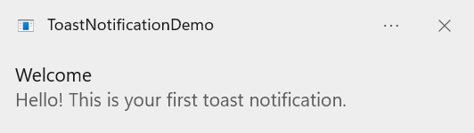
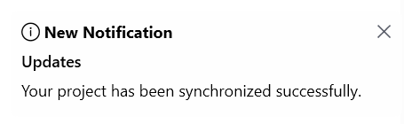
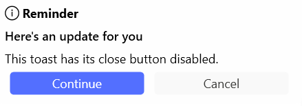
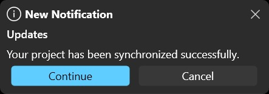

# Getting Started with WPF Toast Notification

This section will help you get started with the SfToastNotification control in your WPF application.

## Assembly deployment

There are several ways to add Syncfusion® control in to Visual Studio WPF project, the following steps will helps to add a SfToastNotification control

- Create a new WPF project in Visual Studio.
- Add references to the following assemblies: 
    - Syncfusion.SfToastNotification.WPF
    - Syncfusion.Shared.WPF

Alternatively, you can install the **Syncfusion.SfToastNotification.WPF** NuGet package. This will automatically install all the required dependent assemblies.

## Initializing the Toast Notification

### Application Startup Configuration

Import the control namespace **Syncfusion.UI.Xaml.SfToastNotification** in `App.xaml.cs` and initialize the WindowsToastBootstrapper in the `Application_Startup` event, as the SfToastNotification is a non‑UI control that must be initialized during application startup.

```csharp
using System.Windows;
using Syncfusion.UI.Xaml.SfToastNotification;

namespace ToastNotificationDemo
{
    public partial class App : Application
    {
        private void Application_Startup(object sender, StartupEventArgs e)
        {
            // Initialize the Toast Notification bootstrapper
            WindowsToastBootstrapper.RemoveShortcutOnUnload = true;
            WindowsToastBootstrapper.Initialize("ToastNotificationDemo.App", "ToastNotificationDemo");
        }
    }
}
```

Configure the `Application_Startup` event in `App.xaml`.

```xaml
<Application x:Class="ToastNotificationDemo.App"
             xmlns="http://schemas.microsoft.com/winfx/2006/xaml/presentation"
             xmlns:x="http://schemas.microsoft.com/winfx/2006/xaml"
             StartupUri="MainWindow.xaml"
             Startup="Application_Startup">
    <Application.Resources>
    </Application.Resources>
</Application>
```

## Adding WPF SfToastNotification - Code behind only

Since SfToastNotification is a non-UI control, you can create and display toasts entirely through only the C# code, it does not require any XAML configuration.

You can display a basic toast notification with a title and message using the Show method.

```csharp
using System;
using System.Windows;
using Syncfusion.UI.Xaml.SfToastNotification;

namespace ToastNotificationDemo
{
    public partial class MainWindow : Window
    {
        public MainWindow()
        {
            InitializeComponent();
        }

        private void Button_Click(object sender, RoutedEventArgs e)
        {
            // Show a simple information toast from any location in your application
            SfToastNotification.Show(this, new ToastOptions
            {
                Title = "Welcome",
                Message = "Hello! This is your first toast notification."
            });
        }
    }
}
```



The following properties allow you to set the textual content of the toast notification.
- **Title**: Represents the bold text displayed at the top of the toast. This is typically used to summarize the purpose of the notification.
- **Message**: Defines the main body text of the toast. This is the primary content that conveys the notification's information.
- **Header**: Specifies an additional header displayed above or beside the message.
This property applies only to in‑app toast modes (Window and Screen) and is ignored in native (Default) mode.

## Toast Modes

The SfToastNotification control supports three different display modes to suit various application scenarios.

### 1. Default Mode

Uses the native operating system toast notifications. Ideal for applications that want to integrate with the OS notification system.

```csharp
SfToastNotification.Show(this, new ToastOptions
{
    Title = "System Notification",
    Message = "Using native OS toast",
    Mode = ToastMode.Default
});
```

**Characteristics:**
- Native OS appearance and behavior
- System-level notifications
- Limited customization options
- Best for critical system messages

### 2. Window Mode

Displays toast notifications within the owning window. Perfect for applications where you want toasts to stay within the application boundaries.

```csharp
SfToastNotification.Show(this, new ToastOptions
{
    Title = "Window Toast",
    Message = "This notification appears within the window",
    Mode = ToastMode.Window
});
```

**Characteristics:**
- Constrained to window boundaries
- Full customization support
- Respects window activation state
- Good for application-specific feedback

### 3. Screen Mode

Displays custom toast overlay globally across the screen. Useful for application-wide notifications that should be visible regardless of window focus.

```csharp
SfToastNotification.Show(this, new ToastOptions
{
    Title = "Global Notification",
    Message = "This notification appears globally on screen",
    Mode = ToastMode.Screen
});
```

**Characteristics:**
- Global screen-level display
- Full customization capabilities
- Visible regardless of window state
- Best for important application-wide events

N> The Window and Screen modes are in-app modes and support extensive customization. The Default (native) mode integrates with the operating system and therefore supports only limited customization.

## Duration

You can use the Duration property to specify how long the toast remains visible. The default display duration is 6 seconds.

```csharp
// Toast with 10 second duration
SfToastNotification.Show(this, new ToastOptions
{
    Title = "Processing",
    Message = "Your request is being processed...",
    Mode = ToastMode.Screen,
    Duration = TimeSpan.FromSeconds(10)
});
```

## Toast without Auto-Close

You can control whether a toast closes automatically by using the **PreventAutoClose** property.

```csharp
// Toast remains until user closes it manually
SfToastNotification.Show(this, new ToastOptions
{
    Title = "Important",
    Message = "Please review this important notification.",
    Mode = ToastMode.Screen,
    PreventAutoClose = true  
});
```

## Action Button

You can set whether the action button row is visible in the toast by using the **ShowActionButtons** property. The default value is true, which displays the action buttons for in-app toasts modes (Window and Screen).

```csharp
// Toast with-out action buttons
SfToastNotification.Show(this, new ToastOptions
{
    Title = "New Notification",
    Header = "Updates",
    Message = "Your project has been synchronized successfully.",
    Mode = ToastMode.Screen,
    ShowActionButtons = false
});
```



## Close Button

You can use the **ShowCloseButton** property to specify whether the close button is visible for the toast. The close button is available only in in-app toasts (Window and Screen modes). The default value is true.

```csharp
// Toast with the close button hidden
SfToastNotification.Show(this, new ToastOptions
{
    Title = "Reminder",
    Message = "This toast has its close button disabled.",
    Mode = ToastMode.Screen,
    ShowCloseButton = false
});
```



## Toast Lifecycle

Understanding the lifecycle of a toast helps in managing notifications effectively.

### States

1. **Creation** - Toast is created with ToastOptions
2. **Display** - Toast appears on screen according to placement and mode
3. **Duration** - Toast remains visible for specified duration
4. **Dismissal** - Toast closes via auto-close timeout, close button, or programmatic close

### Managing Toast Lifecycle

```csharp
// Create a toast with custom ID
var options = new ToastOptions
{
    Id = "unique-toast-id",
    Title = "Tracked Toast",
    Message = "This toast can be managed",
    Mode = ToastMode.Screen,
    Duration = TimeSpan.FromSeconds(10)
};

SfToastNotification.Show(this, options);

// Manually close specific toast
SfToastNotification.Close("unique-toast-id");

// Close all toasts
SfToastNotification.CloseAll();
```

## Theme

SfToastNotification supports various built-in themes. Refer to the below links to apply themes for the Badge,

  * [Apply theme using SfSkinManager](https://help.syncfusion.com/wpf/themes/skin-manager)
    
  * [Create a custom theme using ThemeStudio](https://help.syncfusion.com/wpf/themes/theme-studio#creating-custom-theme)



