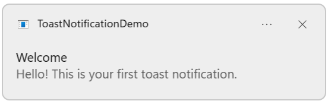

# Getting Started with WPF Toast Control

This section explains how to get started with [WPF Toast Control](https://help.syncfusion.com/cr/wpf/Syncfusion.UI.Xaml.SfToastNotification.html) in a WPF application by adding the required assemblies, showing a basic notification, configuring application startup for native support, defining content, and using the supported modes.

## Assembly Deployment

Add references to the following assemblies to use [WPF Toast Control](https://help.syncfusion.com/cr/wpf/Syncfusion.UI.Xaml.SfToastNotification.html) in your WPF application:

- `Syncfusion.SfToastNotification.WPF`
- `Syncfusion.Shared.WPF`

Alternatively, you can install the **Syncfusion.SfToastNotification.WPF** NuGet package, which automatically installs the required dependent assemblies.

## Showing a Basic WPF Toast Control

Since [WPF Toast Control](https://help.syncfusion.com/cr/wpf/Syncfusion.UI.Xaml.SfToastNotification.html) is a non-UI control, you can create and display notifications entirely through C# code without adding any XAML configuration. You can display a basic WPF Toast Control by using the [Show](https://help.syncfusion.com/cr/wpf/Syncfusion.UI.Xaml.SfToastNotification.SfToastNotification.html#Syncfusion_UI_Xaml_SfToastNotification_SfToastNotification_Show_System_Windows_DependencyObject_Syncfusion_UI_Xaml_SfToastNotification_ToastOptions_) method.

The following XAML wires up the trigger button.



<Button Content="Show Toast" HorizontalAlignment="Center" VerticalAlignment="Center" Click="Button_Click"/>






// Required usings:
// using System.Windows;
// using Syncfusion.UI.Xaml.SfToastNotification;

private void Button_Click(object sender, RoutedEventArgs e)
{
    SfToastNotification.Show(this, new ToastOptions
    {
        Title = "Welcome",
        Message = "Hello! This is your first toast notification."
    });
}




N> For displaying default or native WPF Toast Control, you must initialize the `WindowsToastBootstrapper` for your application in `App.xaml.cs`. This initialization is required for OS-level notifications.

## WPF Toast Control Content

The following properties are used to define the textual content of a WPF Toast Control:

- **Title** – Represents the bold text displayed at the top of the WPF Toast Control and is typically used to summarize the purpose of the notification.
- **Message** – Represents the main body text of the WPF Toast Control and conveys the primary notification information.
- **Header** – Represents an additional header displayed above the message. This property applies only to in-app modes (`Window` and `Screen`) and is ignored in native (`Default`) mode.

## WPF Toast Control Modes

[WPF Toast Control](https://help.syncfusion.com/cr/wpf/Syncfusion.UI.Xaml.SfToastNotification.html) supports three display modes to suit different application scenarios.

### Default Mode

`Default` mode uses the native operating system notifications and is suitable for applications that want to integrate with the OS notification system.

#### Application Startup Configuration

To use native OS notifications, import the `Syncfusion.UI.Xaml.SfToastNotification` namespace in `App.xaml.cs` and initialize the `WindowsToastBootstrapper` in the `Application_Startup` event.




// Required usings:
// using System.Windows;
// using Syncfusion.UI.Xaml.SfToastNotification;

public partial class App : Application
{
    private void Application_Startup(object sender, StartupEventArgs e)
    {
        //Create the Start Menu shortcut once during application startup
        WindowsToastBootstrapper.RemoveShortcutOnUnload = true;
        WindowsToastBootstrapper.Initialize("ToastNotificationDemo.App", "ToastNotificationDemo");
    }
}




Configure the `Application_Startup` event in `App.xaml`.





<Application x:Class="ToastNotificationDemo.App"
             xmlns="http://schemas.microsoft.com/winfx/2006/xaml/presentation"
             xmlns:x="http://schemas.microsoft.com/winfx/2006/xaml"
             StartupUri="MainWindow.xaml"
             Startup="Application_Startup">
    <Application.Resources>
    </Application.Resources>
</Application>





### Window Mode

`Window` mode displays WPF Toast Control within the owning window. This mode is useful when notifications should remain within the application boundaries.




SfToastNotification.Show(this, new ToastOptions
{
    Title = "Window Toast",
    Message = "This notification appears within the window",
    Mode = ToastMode.Window
});




### Screen Mode

`Screen` mode displays WPF Toast Control as an in-app overlay across the screen. This mode is useful for application-wide notifications that should remain visible regardless of window focus.




SfToastNotification.Show(this, new ToastOptions
{
    Title = "Global Notification",
    Message = "This notification appears globally on screen",
    Mode = ToastMode.Screen
});




N> `Window` and `Screen` are in-app WPF Toast Control modes and support customization, while `Default` mode uses native OS behavior and has limited customization.