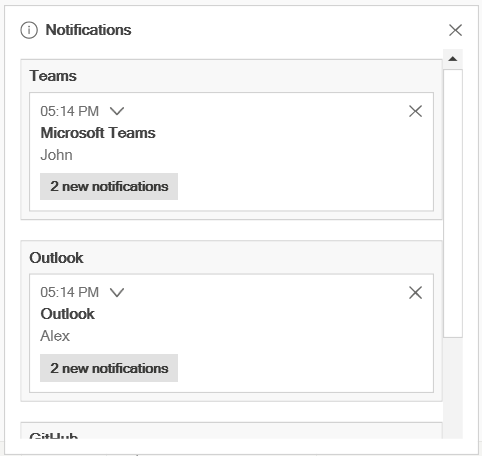
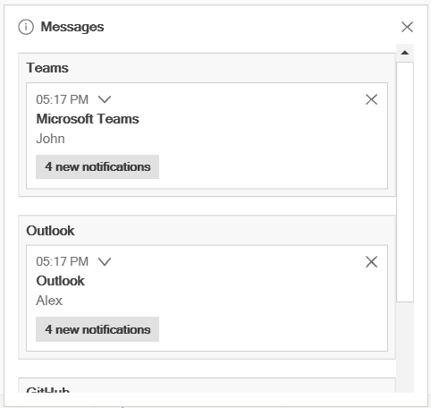

## Grouping Toast Notifications

You can group related toast notifications by assigning the same value to the [GroupName](https://help.syncfusion.com/cr/wpf/Syncfusion.UI.Xaml.SfToastNotification.ToastOptions.html#Syncfusion_UI_Xaml_SfToastNotification_ToastOptions_GroupName) property in [ToastOptions](https://help.syncfusion.com/cr/wpf/Syncfusion.UI.Xaml.SfToastNotification.ToastOptions.html). Grouping helps organize related notifications and reduces clutter when multiple toasts are displayed.

To display grouped notifications, set [EnableGroupView](https://help.syncfusion.com/cr/wpf/Syncfusion.UI.Xaml.SfToastNotification.SfToastNotification.html#Syncfusion_UI_Xaml_SfToastNotification_SfToastNotification_EnableGroupView) to true. When enabled, toast notifications with the same GroupName are displayed within a common group container. If EnableGroupView is disabled, all toast notifications are displayed individually regardless of their group name.




SfToastNotification.EnableGroupView = True;

SfToastNotification.Show(this, new ToastOptions
{
    Mode = ToastMode.Window,
    Title = "Microsoft Teams",
    Header = "John",
    Message = "Can we discuss the sprint backlog?",
    GroupName = "Teams"
});

SfToastNotification.Show(this, new ToastOptions
{
    Mode = ToastMode.Window,
    Title = "Outlook",
    Header = "Alex",
    Message = "New email received",
    GroupName = "Outlook"
});

SfToastNotification.Show(this, new ToastOptions
{
    Mode = ToastMode.Window,
    Placement = ToastPlacement.BottomLeft,
    Title = "GitHub",
    Header = "Build Pipeline",
    Message = "Build completed successfully",
    GroupName = "GitHub"
});




To display a toast in a different group, specify a different group name. Toasts without a `GroupName` value are not assigned to a custom group.

### Grouping Toast Notifications

You can also customize the header text displayed for the group container using the [GroupContainerHeader](https://help.syncfusion.com/cr/wpf/Syncfusion.UI.Xaml.SfToastNotification.SfToastNotification.html#Syncfusion_UI_Xaml_SfToastNotification_SfToastNotification_GroupContainerHeader) property. By default, the group container header is displayed as "Notification".




SfToastNotification.EnableGroupedView = True;

SfToastNotification.GroupContainerHeader = "Messages";

SfToastNotification.Show(this, new ToastOptions
{
    Mode = ToastMode.Window,
    Title = "Microsoft Teams",
    Header = "John",
    Message = "Can we discuss the sprint backlog?",
    GroupName = "Teams"
});

SfToastNotification.Show(this, new ToastOptions
{
    Mode = ToastMode.Window,
    Title = "Outlook",
    Header = "Alex",
    Message = "New email received",
    GroupName = "Outlook"
});

SfToastNotification.Show(this, new ToastOptions
{
    Mode = ToastMode.Window,
    Placement = ToastPlacement.BottomLeft,
    Title = "GitHub",
    Header = "Build Pipeline",
    Message = "Build completed successfully",
    GroupName = "GitHub"
});




