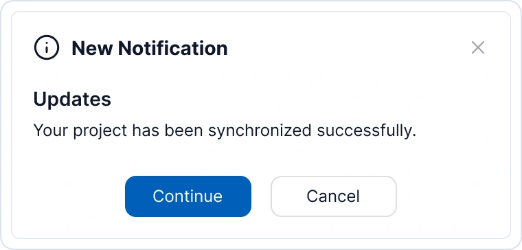

# WPF Toast Notification (SfToastNotification) Overview

The [SfToastNotification](https://help.syncfusion.com/cr/wpf/Syncfusion.UI.Xaml.SfToastNotification.html) is a non-UI control that displays native Windows toast notifications and custom overlay notifications to users about events or status changes in your application. Toast notifications are non-intrusive messages that appear for a limited time and then automatically disappear.

## Non-UI Control

SfToastNotification is a **non-UI control**, meaning it doesn't require any XAML markup to be added to your UI. Instead, you can create and display toasts entirely through C# code in your application. This makes it lightweight and easy to integrate into any WPF application without modifying your UI layer.

## Control structure

## Key features

* **Multiple Display Modes** - Display toasts as native OS notifications, overlay notifications, or window-relative notifications.
* **Severity Levels** - Support for Info, Success, Warning, and Error severity levels with corresponding visual indicators.
* **Rich Styling** - Multiple visual variants (Text, Outlined, Filled) and customizable accent colors.
* **Flexible Positioning** - Display toasts at 9 different screen positions (Top-Left, Top-Center, Top-Right, Left-Center, Right-Center, Bottom-Left, Bottom-Center, Bottom-Right, Center).
* **Animation Support** - 14+ built-in animations for toast show/hide effects (Fade, Slide, Flip, Zoom).
* **Custom Actions** - Add interactive action buttons with custom callbacks for user interactions.
* **Custom Templates** - Fully customizable content, title, close button, and action button templates.
* **Auto-Close Control** - Configurable duration with option to prevent automatic closing.
* **Multiple Identification** - Support for custom toast IDs to track and manage specific notifications.
* **Template Selectors** - DataTemplateSelector support for dynamic action button rendering.

## Architecture Overview

The SfToastNotification control uses a service-based architecture:

- **WindowsToastBootstrapper** - Initializes the toast notification system at application startup
- **SfToastNotification** - Static API for displaying and managing toasts
- **ToastOptions** - Configuration class defining toast appearance and behavior
- **ToastItem** - Visual representation of a single toast instance
- **ToastAction** - Interactive action button definition
- **ToastService** - Internal service managing toast lifecycle

## When to use Toast Notifications

Toast notifications are ideal for:
- Status confirmations (save successful, delete completed)
- Warning messages (unsaved changes, operation in progress)
- Information alerts (new message received, update available)
- Error notifications (operation failed, validation errors)
- Non-critical user feedback that doesn't require immediate action
