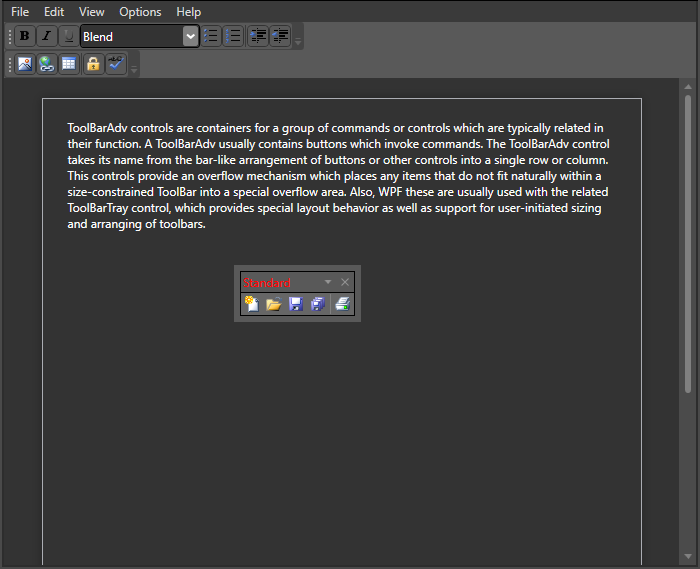

# Customization in WPF ToolBar

This section describes how to customize the appearance of a ToolBar.

## Customizing the floating ToolBar

This section demonstrates how to customize a floating ToolBar by applying a FloatingToolBarStyle to the ToolBarManager and defining toolbar items.





<syncfusion:ToolBarManager FloatingToolBarStyle="{StaticResource toolstyle}" >

<syncfusion:ToolBarTrayAdv >

<syncfusion:ToolBarAdv x:Name="Tooladv" ToolBarName="Standard" >

<Button syncfusion:ToolBarAdv.Icon="Images\NewDocumentHS.png" >

<Image Source="Images\NewDocumentHS.png" Width="16" Height="16"/>

</Button>

<Button>

<Image Source="Images\openHS.png" Width="16" Height="16" />

</Button>

<Button>

<Image Source="Images\InsertPictureHS.png" Width="16" Height="16" syncfusion:ToolBarAdv.IsAvailable="False"/>

</Button>

<Button>

<Image Source="Images\InsertHyperlinkHS.png" Width="16" Height="16"/>

</Button>

<Button>

<Image Source="Images\TableHS.png" Width="16" Height="16"/>

</Button>

</syncfusion:ToolBarAdv>

</syncfusion:ToolBarTrayAdv>

</syncfusion:ToolBarManager>





## Customizing Foreground

The [Foreground](https://learn.microsoft.com/en-us/dotnet/api/system.windows.controls.control.foreground?view=windowsdesktop-7.0) property of [ToolBarAdv](https://help.syncfusion.com/cr/wpf/Syncfusion.Windows.Tools.Controls.ToolBarAdv.html) control can be used to customize the floating ToolBar text foreground.

The following code illustrates how to set the value of the foreground property:





   <shared:ToolBarManager x:Name="toolBarManager">
        <shared:ToolBarManager.TopToolBarTray>
            <shared:ToolBarTrayAdv VerticalAlignment="Top">
                <shared:ToolBarAdv ToolBarName="Standard" Foreground="Red">
                    <Button shared:ToolBarAdv.Label="New Document" Height="22" Width="22" shared:ToolBarAdv.Icon="Images/NewDocumentHS.png" ToolTip="New">
                        <Image Source="Images/NewDocumentHS.png" Width="16" Height="16" />
                    </Button>
                    <Button  shared:ToolBarAdv.Label="Open Document" Height="22" Width="22" shared:ToolBarAdv.Icon="Images/openHS.png" ToolTip="Open">
                        <Image Source="Images/openHS.png"  Width="16" Height="16"/>
                    </Button>
                    <Button  shared:ToolBarAdv.Label="Save Document" Height="22" Width="22" shared:ToolBarAdv.Icon="Images/saveHS.png" ToolTip="Save">
                        <Image Source="Images/saveHS.png"  Width="16" Height="16"/>
                    </Button>
                    <Button  shared:ToolBarAdv.Label="Save Document" Height="22" Width="22" shared:ToolBarAdv.Icon="Images/saveAllHS.png" ToolTip="SaveAll">
                        <Image Source="Images/saveAllHS.png"  Width="16" Height="16"/>
                    </Button>
                    <shared:ToolBarItemSeparator  />
                    <Button  shared:ToolBarAdv.Label="Print Document"  Height="22" Width="22" shared:ToolBarAdv.Icon="Images/PrintHS.png" ToolTip="Print">
                        <Image Source="Images/PrintHS.png"  Width="16" Height="16"/>
                    </Button>
                </shared:ToolBarAdv>                   
            </shared:ToolBarTrayAdv>                
        </shared:ToolBarManager.TopToolBarTray>          
    </shared:ToolBarManager>





> To preview the foreground on a *floating* toolbar, you must first detach the toolbar by clicking its gripper. See [ToolBar state](ToolBarAdv-state.md) for instructions.

## Customizing a FrameworkElement's style

This section demonstrates how to customize a ToolBar by loading an external ResourceDictionary that contains style definitions. 





ToolBarAdv toolBar = new ToolBarAdv();

toolBar.ControlsResourceDictionary = new ResourceDictionary()

{

Source = new Uri("ControlsResouce.xaml", UriKind.RelativeOrAbsolute)

};





## Theme

ToolBar supports various built-in themes. Apply a theme to the ToolBar using the links below.

* [Apply theme using SfSkinManager](https://help.syncfusion.com/wpf/themes/skin-manager)
* [Create a custom theme using ThemeStudio](https://help.syncfusion.com/wpf/themes/theme-studio#creating-custom-theme)

