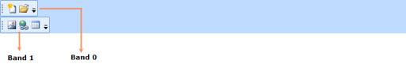
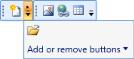
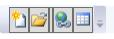

# Dealing with ToolBarAdv control in WPF ToolBar (ToolBarAdv)

## Specifying the Position of ToolBarAdv's in a ToolBarTrayAdv

The position of the ToolBarAdv in the ToolBarTrayAdv can be specified using the `Band` and the `BandIndex` properties. Band indicates the band in ToolBarTrayAdv, where ToolBarAdv has to be placed. BandIndex indicates the order in which the ToolBarAdv has to be placed within the band.





<syncfusion:ToolBarTrayAdv >

<syncfusion:ToolBarAdv ToolBarName="Standard">

<Button syncfusion:ToolBarAdv.Icon="Images\NewDocumentHS.png">

<Image Source="Images\NewDocumentHS.png" Width="16" Height="16"/>

</Button>

<Button>

<Image Source="Images\openHS.png" Width="16" Height="16"/>

</Button>

</syncfusion:ToolBarAdv>

<syncfusion:ToolBarAdv Band="1" ToolBarName="Extras">

<Button>

<Image Source="Images\InsertPictureHS.png" Width="16" Height="16"/>

</Button>

<Button>

<Image Source="Images\InsertHyperlinkHS.png" Width="16" Height="16"/>

</Button>

<Button>

<Image Source="Images\TableHS.png" Width="16" Height="16"/>

</Button>

</syncfusion:ToolBarAdv>

</syncfusion:ToolBarTrayAdv>




ToolBarTrayAdv tray = new ToolBarTrayAdv();

ToolBarAdv toolBar = new ToolBarAdv();

Button button = new Button();

button.Width = 16;

button.Height = 16;

button.Content = new Image() { Source = new BitmapImage() { UriSource = new Uri("Images/NewDocumentHS.png", UriKind.RelativeOrAbsolute) } };

toolBar.Items.Add(button);

button = new Button();

button.Width = 16;

button.Height = 16;

button.Content = new Image() { Source = new BitmapImage() { UriSource = new Uri("Images/openHS.png", UriKind.RelativeOrAbsolute) } };

toolBar.Items.Add(button);

tray.ToolBars.Add(toolBar);

toolBar = new ToolBarAdv();

toolBar.Band = 1;

button = new Button();

button.Width = 16;

button.Height = 16;

button.Content = new Image() { Source = new BitmapImage() { UriSource = new Uri("Images/InsertPictureHS.png", UriKind.RelativeOrAbsolute) } };

toolBar.Items.Add(button);

button = new Button();

button.Width = 16;

button.Height = 16;

button.Content = new Image() { Source = new BitmapImage() { UriSource = new Uri("Images/InsertHyperlinkHS.png", UriKind.RelativeOrAbsolute) } };

toolBar.Items.Add(button);

button = new Button();

button.Width = 16;

button.Height = 16;

button.Content = new Image() { Source = new BitmapImage() { UriSource = new Uri("Images/TableHS.png", UriKind.RelativeOrAbsolute) } };

toolBar.Items.Add(button);

tray.ToolBars.Add(toolBar);

Grid1.Children.Add(tray);





## ToolBarAdv with Overflow items

When ToolBarAdv control contains more items, it cannot be displayed within the toolbar’s size. So they are listed in the Overflow popup. On clicking the Overflow button, the items will be list out.

ToolBarAdv enables to set the overflow mode for each item.

* OverflowMode.Always – Specified item will always be listed in the Overflow popup.
* OverflowMode.Never - Specified item will never be moved to the Overflow popup.
* OverflowMode.AsNeeded - Specified item will be listed in the Overflow popup if required.

## Show or hide Gripper

The gripper can show and hide in ToolBarAdv using the `GripperVisibility` property. To collapse the gripper in the ToolBarAdv, set the GripperVisibility as Collapsed. By default its value is visibility.

Following code illustrates how to hide the gripper:




<syncfusion:ToolBarAdv GripperVisibility="Collapsed"/>





ToolBarAdv toolBar = new ToolBarAdv();

toolBar.GripperVisibility = Visibility.Collapsed;





## Orientation of ToolBarTrayAdv

ToolBarAdv provide two different orientation support such as Horizontal and Vertical. The desired orientation for ToolBarAdv can be changed using the `Orientation` property of ToolBarTrayAdv.




<syncfusion:ToolBarTrayAdv Orientation="Vertical" >

<syncfusion:ToolBarAdv ToolBarName="Standard">

<Button syncfusion:ToolBarAdv.Icon="Images/NewDocumentHS.png">

<Image Source="Images/NewDocumentHS.png" Width="16" Height="16"/>

</Button>

<Button >

<Image Source="Images/openHS.png" Width="16" Height="16"/>

</Button>

</syncfusion:ToolBarAdv>

<syncfusion:ToolBarAdv Band="1" ToolBarName="Extras">

<Button >

<Image Source="Images/InsertPictureHS.png" Width="16" Height="16"/>

</Button>

<Button >

<Image Source="Images/InsertHyperlinkHS.png" Width="16" Height="16"/>

</Button>

<Button >

<Image Source="Images/TableHS.png" Width="16" Height="16"/>

</Button>

</syncfusion:ToolBarAdv>

</syncfusion:ToolBarTrayAdv>





ToolBarTrayAdv tray = new ToolBarTrayAdv();

tray.Orientation = Orientation.Vertical;

ToolBarAdv toolBar = new ToolBarAdv();

Button button = new Button();

button.Content = new Image() { Source = new BitmapImage() { UriSource = new Uri("Images/InsertPictureHS.png", UriKind.RelativeOrAbsolute) } };

toolBar.Items.Add(button);

button = new Button();

button.Content = new Image() { Source = new BitmapImage() { UriSource = new Uri("Images/InsertHyperlinkHS.png", UriKind.RelativeOrAbsolute) } };

toolBar.Items.Add(button);

button = new Button();

button.Content = new Image() { Source = new BitmapImage() { UriSource = new Uri("Images/TableHS.png", UriKind.RelativeOrAbsolute) } };

toolBar.Items.Add(button);

tray.ToolBars.Add(toolBar);

Grid1.Children.Add(tray);





## Add or Remove buttons

ToolBarAdv provides option to show or hide an item using the Add or Remove button. To enable the Add or Remove Button, `EnableAddRemoveButton` property of ToolBarAdv need to set as True. By default its value is false. Unselect the respective checkboxes of the items to hide.

### Adding an Item to Add or Remove Button

An item can be added to Add or Remove Buttons by setting the ToolBarAdv.Icon and ToolBarAdv.Label properties.

Following code illustrates how to add an item in Add or Remove Buttons:




<syncfusion:ToolBarTrayAdv>

<syncfusion:ToolBarAdv EnableAddRemoveButton="True" >

<Button syncfusion:ToolBarAdv.Label="New Document"
        syncfusion:ToolBarAdv.Icon="Images/NewDocumentHS.png">

<Image Source="Images/NewDocumentHS.png" Width="16" Height="16"/>

</Button>

<Button syncfusion:ToolBarAdv.Label="Open Document"
        syncfusion:ToolBarAdv.Icon="Images/openHS.png">

<Image Source="Images/openHS.png" Width="16" Height="16"/>

</Button>

</syncfusion:ToolBarAdv>

</syncfusion:ToolBarTrayAdv>




ToolBarTrayAdv tray = new ToolBarTrayAdv();

ToolBarAdv toolBar = new ToolBarAdv();

toolBar.EnableAddRemoveButton = true;

Button button = new Button();

button.Width = 16;

button.Height = 16;

button.Content = new Image() { Source = new BitmapImage() { UriSource = new Uri("Images/NewDocumentHS.png", UriKind.RelativeOrAbsolute) } };

ToolBarAdv.SetLabel(button, "New Document");

ToolBarAdv.SetIcon(button, new BitmapImage() { UriSource = new Uri("Images/NewDocumentHS.png", UriKind.RelativeOrAbsolute) });

toolBar.Items.Add(button);

button = new Button();

button.Width = 16;

button.Height = 16;

button.Content = new Image() { Source = new BitmapImage() { UriSource = new Uri("Images/openHS.png", UriKind.RelativeOrAbsolute) } };

ToolBarAdv.SetLabel(button, "Open Document");

ToolBarAdv.SetIcon(button, new BitmapImage() { UriSource = new Uri("Images/openHS.png", UriKind.RelativeOrAbsolute) });

toolBar.Items.Add(button);

tray.ToolBars.Add(toolBar);

Grid1.Children.Add(tray);





## Hiding the ToolBarItem

To hide the particular ToolBarItem, the `IsAvailable` an attached property of the ToolBarAdv need to set as False. By default its value is True.





<syncfusion:ToolBarTrayAdv >

<syncfusion:ToolBarAdv x:Name="Tooladv" ToolBarName="Standard"    >

<Button syncfusion:ToolBarAdv.Icon="Images\NewDocumentHS.png" >

<Image Source="Images\NewDocumentHS.png" Width="16" Height="16"/>

</Button>

<Button>

<Image Source="Images\openHS.png" Width="16" Height="16"/>

</Button>

<Button>

<Image Source="Images\InsertPictureHS.png" Width="16"
       Height="16"syncfusion:ToolBarAdv.IsAvailable="False"/>

</Button>

<Button>

<Image Source="Images\InsertHyperlinkHS.png" Width="16" Height="16"/>

</Button>

<Button>

<Image Source="Images\TableHS.png" Width="16" Height="16"/>

</Button>

</syncfusion:ToolBarAdv>

</syncfusion:ToolBarTrayAdv>





