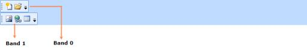
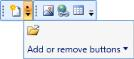
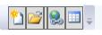
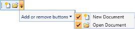
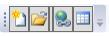

# Dealing with Toolbars in WPF ToolBar

The following sections describe how to position, customize, and populate the items in a `ToolBar`.

## Specifying the position of ToolBar in a ToolBarTrayAdv

The position of the ToolBar in the ToolBarTrayAdv can be specified using the [Band](https://help.syncfusion.com/cr/wpf/Syncfusion.Windows.Tools.Controls.ToolBarAdv.html#Syncfusion_Windows_Tools_Controls_ToolBarAdv_Band) and [BandIndex](https://help.syncfusion.com/cr/wpf/Syncfusion.Windows.Tools.Controls.ToolBarAdv.html#Syncfusion_Windows_Tools_Controls_ToolBarAdv_BandIndex) properties. `Band` indicates the band in the ToolBarTrayAdv where the ToolBar has to be placed. `BandIndex` indicates the order in which the ToolBar is placed within the band.





<syncfusion:ToolBarTrayAdv >

<syncfusion:ToolBarAdv ToolBarName="Standard">

<Button syncfusion:ToolBarAdv.Icon="Images\NewDocumentHS.png">

<Image Source="Images\NewDocumentHS.png" Width="16" Height="16"/>

</Button>

<Button>

<Image Source="Images\openHS.png" Width="16" Height="16"/>

</Button>

</syncfusion:ToolBarAdv>

<syncfusion:ToolBarAdv Band="1" ToolBarName="Extras">

<Button>

<Image Source="Images\InsertPictureHS.png" Width="16" Height="16"/>

</Button>

<Button>

<Image Source="Images\InsertHyperlinkHS.png" Width="16" Height="16"/>

</Button>

<Button>

<Image Source="Images\TableHS.png" Width="16" Height="16"/>

</Button>

</syncfusion:ToolBarAdv>

</syncfusion:ToolBarTrayAdv>




ToolBarTrayAdv tray = new ToolBarTrayAdv();

ToolBarAdv toolBar = new ToolBarAdv();

Button button = new Button();

button.Width = 16;

button.Height = 16;

button.Content = new Image() { Source = new BitmapImage() { UriSource = new Uri("Images/NewDocumentHS.png", UriKind.RelativeOrAbsolute) } };

toolBar.Items.Add(button);

button = new Button();

button.Width = 16;

button.Height = 16;

button.Content = new Image() { Source = new BitmapImage() { UriSource = new Uri("Images/openHS.png", UriKind.RelativeOrAbsolute) } };

toolBar.Items.Add(button);

tray.ToolBars.Add(toolBar);

toolBar = new ToolBarAdv();

toolBar.Band = 1;

button = new Button();

button.Width = 16;

button.Height = 16;

button.Content = new Image() { Source = new BitmapImage() { UriSource = new Uri("Images/InsertPictureHS.png", UriKind.RelativeOrAbsolute) } };

toolBar.Items.Add(button);

button = new Button();

button.Width = 16;

button.Height = 16;

button.Content = new Image() { Source = new BitmapImage() { UriSource = new Uri("Images/InsertHyperlinkHS.png", UriKind.RelativeOrAbsolute) } };

toolBar.Items.Add(button);

button = new Button();

button.Width = 16;

button.Height = 16;

button.Content = new Image() { Source = new BitmapImage() { UriSource = new Uri("Images/TableHS.png", UriKind.RelativeOrAbsolute) } };

toolBar.Items.Add(button);

tray.ToolBars.Add(toolBar);

Grid1.Children.Add(tray);





## ToolBar with overflow items

When a ToolBar control contains more items than can be displayed within its size, the additional items are listed in the overflow popup. On clicking the overflow button, the items are listed.

ToolBar allows you to set the overflow mode for each item.

* `OverflowMode.Always` – the specified item will always be listed in the overflow popup.
* `OverflowMode.Never` – the specified item will never be moved to the overflow popup.
* `OverflowMode.AsNeeded` – the specified item will be listed in the overflow popup if required. This is the default value.

## Show or hide Gripper

The gripper can show and hide in ToolBar using the [GripperVisibility](https://help.syncfusion.com/cr/wpf/Syncfusion.Windows.Tools.Controls.ToolBarAdv.html#Syncfusion_Windows_Tools_Controls_ToolBarAdv_GripperVisibility) property. To collapse the gripper in the ToolBar, set the GripperVisibility as Collapsed. By default its value is visibility.

Following code illustrates how to hide the gripper:




<syncfusion:ToolBarAdv GripperVisibility="Collapsed"/>





ToolBarAdv toolBar = new ToolBarAdv();

toolBar.GripperVisibility = Visibility.Collapsed;





## Orientation of ToolBarTrayAdv

ToolBar provide two different orientation support such as Horizontal and Vertical. The desired orientation for ToolBar can be changed using the [Orientation](https://help.syncfusion.com/cr/wpf/Syncfusion.Windows.Tools.Controls.ToolBarAdv.html#Syncfusion_Windows_Tools_Controls_ToolBarAdv_Orientation) property of ToolBarTrayAdv.





<syncfusion:ToolBarTrayAdv Orientation="Vertical" >

<syncfusion:ToolBarAdv ToolBarName="Standard">

<Button syncfusion:ToolBarAdv.Icon="Images/NewDocumentHS.png">

<Image Source="Images/NewDocumentHS.png" Width="16" Height="16"/>

</Button>

<Button >

<Image Source="Images/openHS.png" Width="16" Height="16"/>

</Button>

</syncfusion:ToolBarAdv>

<syncfusion:ToolBarAdv Band="1" ToolBarName="Extras">

<Button >

<Image Source="Images/InsertPictureHS.png" Width="16" Height="16"/>

</Button>

<Button >

<Image Source="Images/InsertHyperlinkHS.png" Width="16" Height="16"/>

</Button>

<Button >

<Image Source="Images/TableHS.png" Width="16" Height="16"/>

</Button>

</syncfusion:ToolBarAdv>

</syncfusion:ToolBarTrayAdv>





ToolBarTrayAdv tray = new ToolBarTrayAdv();

tray.Orientation = Orientation.Vertical;

ToolBarAdv toolBar = new ToolBarAdv();

Button button = new Button();

button.Content = new Image() { Source = new BitmapImage() { UriSource = new Uri("Images/InsertPictureHS.png", UriKind.RelativeOrAbsolute) } };

toolBar.Items.Add(button);

button = new Button();

button.Content = new Image() { Source = new BitmapImage() { UriSource = new Uri("Images/InsertHyperlinkHS.png", UriKind.RelativeOrAbsolute) } };

toolBar.Items.Add(button);

button = new Button();

button.Content = new Image() { Source = new BitmapImage() { UriSource = new Uri("Images/TableHS.png", UriKind.RelativeOrAbsolute) } };

toolBar.Items.Add(button);

tray.ToolBars.Add(toolBar);

Grid1.Children.Add(tray);





## Add or Remove buttons

ToolBar provides the option to show or hide an item at runtime using the **Add or Remove** button. To enable it, set the [EnableAddRemoveButton](https://help.syncfusion.com/cr/wpf/Syncfusion.Windows.Tools.Controls.ToolBarAdv.html#Syncfusion_Windows_Tools_Controls_ToolBarAdv_EnableAddRemoveButton) property of ToolBar to `True`. The default value is `false`. Users can unselect the checkboxes of items to hide them from the toolbar.

### Adding an item to the Add or Remove button

Following code illustrates how to add an item in Add or Remove Buttons:





<syncfusion:ToolBarTrayAdv>

<syncfusion:ToolBarAdv EnableAddRemoveButton="True" >

<Button syncfusion:ToolBarAdv.Label="New Document"
        syncfusion:ToolBarAdv.Icon="Images/NewDocumentHS.png">

<Image Source="Images/NewDocumentHS.png" Width="16" Height="16"/>

</Button>

<Button syncfusion:ToolBarAdv.Label="Open Document"
        syncfusion:ToolBarAdv.Icon="Images/openHS.png">

<Image Source="Images/openHS.png" Width="16" Height="16"/>

</Button>

</syncfusion:ToolBarAdv>

</syncfusion:ToolBarTrayAdv>




ToolBarTrayAdv tray = new ToolBarTrayAdv();

ToolBarAdv toolBar = new ToolBarAdv();

toolBar.EnableAddRemoveButton = true;

Button button = new Button();

button.Width = 16;

button.Height = 16;

button.Content = new Image() { Source = new BitmapImage() { UriSource = new Uri("Images/NewDocumentHS.png", UriKind.RelativeOrAbsolute) } };

ToolBarAdv.SetLabel(button, "New Document");

ToolBarAdv.SetIcon(button, new BitmapImage() { UriSource = new Uri("Images/NewDocumentHS.png", UriKind.RelativeOrAbsolute) });

toolBar.Items.Add(button);

button = new Button();

button.Width = 16;

button.Height = 16;

button.Content = new Image() { Source = new BitmapImage() { UriSource = new Uri("Images/openHS.png", UriKind.RelativeOrAbsolute) } };

ToolBarAdv.SetLabel(button, "Open Document");

ToolBarAdv.SetIcon(button, new BitmapImage() { UriSource = new Uri("Images/openHS.png", UriKind.RelativeOrAbsolute) });

toolBar.Items.Add(button);

tray.ToolBars.Add(toolBar);

Grid1.Children.Add(tray);





## Hiding the ToolBarItem

To hide a particular ToolBarItem, set the `IsAvailable` attached property of the ToolBar to `False`. The default value is `True`.





<syncfusion:ToolBarTrayAdv >

<syncfusion:ToolBarAdv x:Name="Tooladv" ToolBarName="Standard"    >

<Button syncfusion:ToolBarAdv.Icon="Images\NewDocumentHS.png" >

<Image Source="Images\NewDocumentHS.png" Width="16" Height="16"/>

</Button>

<Button>

<Image Source="Images\openHS.png" Width="16" Height="16"/>

</Button>

<Button>

<Image Source="Images\InsertPictureHS.png" Width="16"
       Height="16"syncfusion:ToolBarAdv.IsAvailable="False"/>

</Button>

<Button>

<Image Source="Images\InsertHyperlinkHS.png" Width="16" Height="16"/>

</Button>

<Button>

<Image Source="Images\TableHS.png" Width="16" Height="16"/>

</Button>

</syncfusion:ToolBarAdv>

</syncfusion:ToolBarTrayAdv>





